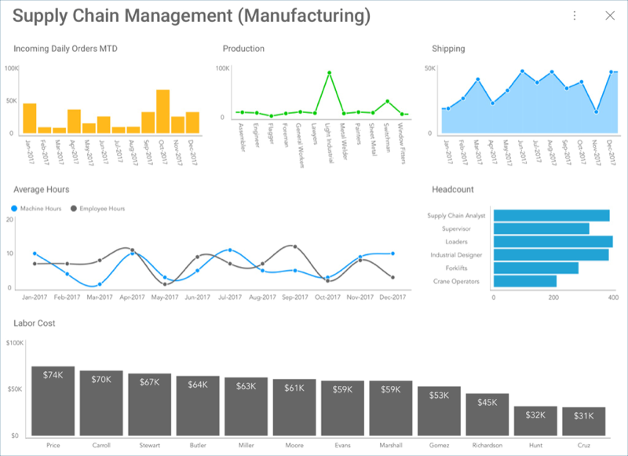

## Manufacturing Dashboard Tutorial 

In this tutorial, you will see how the "Supply Chain Management"
dashboard displayed below was created using a sample spreadsheet with
similar data.

### What's in this dashboard?

  - Key Stats across departments

  - Manufacturing trends

  - Quality and costs

  - Headcount for the workforce

### Sample Datasheet

You can download the sample datasheet
[here](http://download.infragistics.com/reportplus/help/samples/Reveal_Dashboard_Tutorials.xlsx).
All other dashboards [in these tutorials](dashboard-tutorials.md) will use
the same sample spreadsheet.

>[NOTE]
>Excel files as local files are not supported in this release. In order to follow these tutorials, make sure you upload the file to one of the
[supported cloud services](data-sources.md).

### Steps Overview

1.  [Creating the Dashboard and Adding a Data Source](Manufacturing-Starting-Creation-Process.md)

2.  [Selecting the Fields and Visualization for the First Visualization](Manufacturing-Selecting-Data-Visualization.md)

3.  [Applying Formatting to the First Visualization](Manufacturing-Applying-Formatting-Visualization.md)

4.  [Applying a Theme to the Dashboard](Manufacturing-Applying-Theme)

5.  [Adding the other Visualizations](Manufacturing-Adding-Other-Visualizations.md)
    ([Production](Manufacturing-Adding-Other-Visualizations.html#production),
    [Shipping](Manufacturing-Adding-Other-Visualizations.html#shipping),
    [Average Hours](Manufacturing-Adding-Other-Visualizations.html#average-hours),
    [Headcount](Manufacturing-Adding-Other-Visualizations.html#headcount),
    [Labor Cost](Manufacturing-Adding-Other-Visualizations.html#labor-cost))

6.  [Saving your Dashboard](Manufacturing-Saving-Dashboard.md)

<a href="manufacturing-starting-creation-process.md" class="next">Get Started &raquo;</a>
