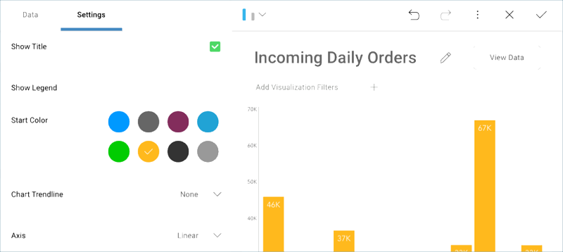

## Applying a Theme to the Dashboard 

By default, the **Mountain Theme** theme will be applied to your
dashboard. You can change it by accessing the **Theme** menu in the
overflow in the top right-hand corner.

In this sample, we will use the **Ocean Theme** theme. Select
**Theme** in the Dashboard editor, and then choose *Ocean Theme* thumbnail.

### Changing the Start Color for the Visualization

For your visualization to match the sample widget's color, go to the
Visualization Editor. Then, go to **Settings** and change the **Start
Color** to the sixth one.

Once you have finished editing the visualization, select the **tick icon** in the top right-hand corner to return to the dashboard editor.

<a href="manufacturing-applying-formatting-visualization.md" class="previous">&laquo; Previous Step</a>
<a href="manufacturing-adding-other-visualizations.md" class="next">Next Step &raquo;</a>