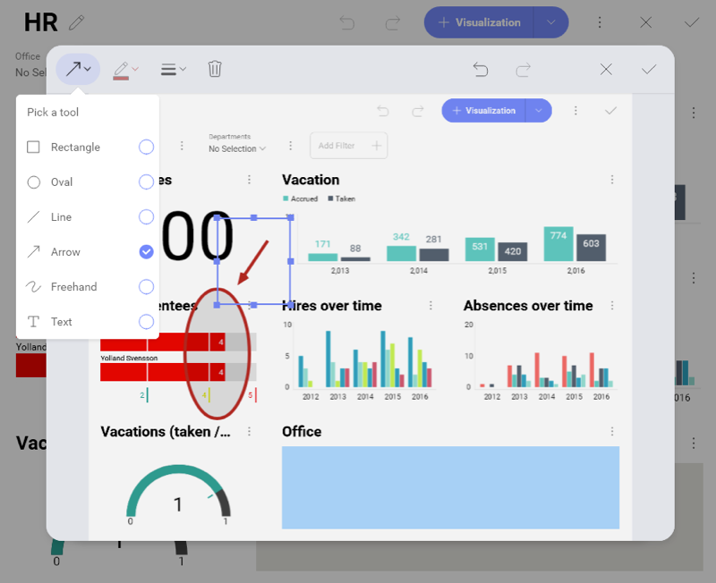
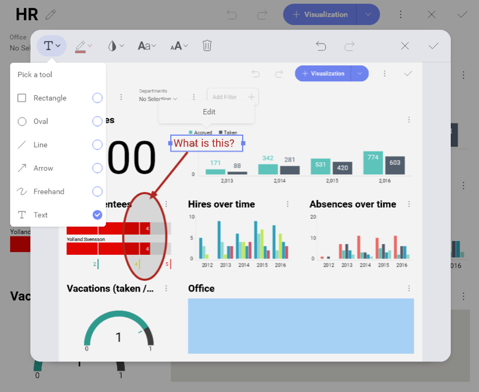

## Exporting Dashboards as Images

Reveal allows you to export a screen capture of your entire dashboard or
individual visualizations from your dashboard. The files delivered to
your local space / mobile device are in the **png format**.

### Exporting an Entire Dashboard as an Image

To export an image of your entire dashboard:

1.  Go to the overflow menu in the upper right-hand corner of the
    dashboard.

2.  Select *Export* ⇒ *Image*.

3.  In the *Export Image* menu choose the *Export Image* blue button.

You can choose the *Copy to clipboard* option to paste the image quickly
wherever you need without downloading it first.

### Exporting Individual Visualizations as Images

To export an image of a particular visualization:

1.  In dashboard *View mode* **maximize** the selected visualization by
    clicking/tapping the arrow in its upper right-hand corner.

2.  Select *Export* in the overflow menu.

3.  Select the *Export Image* blue button.

### Annotating Images

In the *Export Image* menu you can add annotations to your dashboards in
case you want to include notes or highlight specific areas with
different shapes. To **access the annotation section**, select the
pencil icon in the *Export Image* dialog.

In the Annotation menu, you will see a top toolbar with many options
such as adding shapes and freestyle annotations.

The text option allows you to add text on top of the image. It provides
options to customize the text, such as background colors, font weight,
font size, and font color.

For exporting images in **Android and iOS** devices, please refer to the
[Exporting Dashboards](Exporting-Dashboards.html#mobile-devices) topic.
