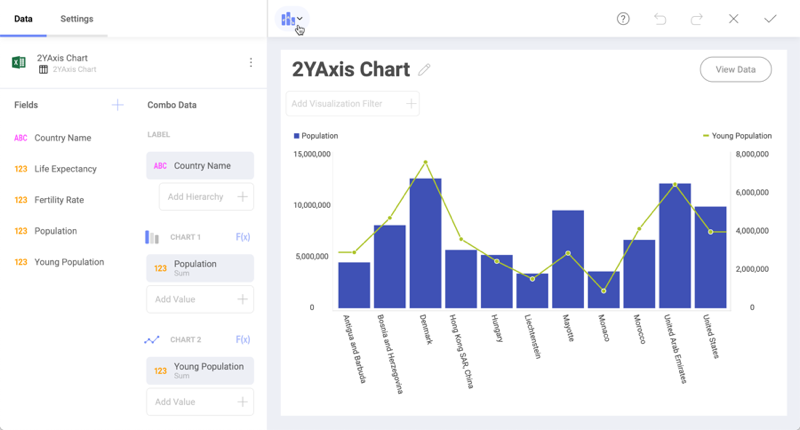
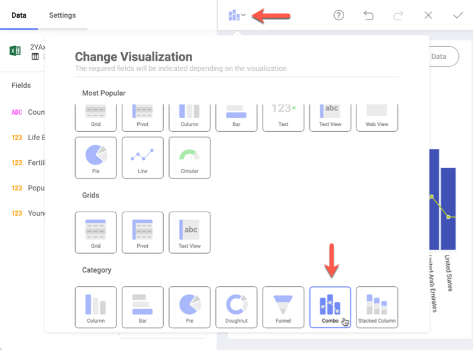
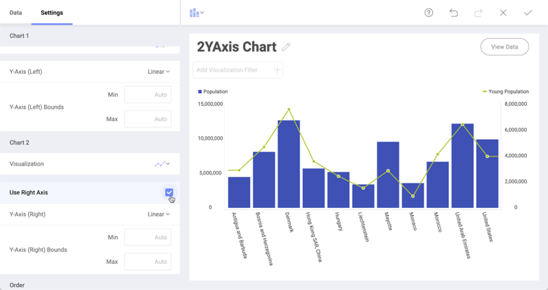

## Combo Charts

This type of chart combines two or more chart types in one single chart.

Regular charts usually have one X-axis and one Y-axis. Combo charts can
have two Y-axis, allowing you to display two different types of data
points in the same chart.

E.g., as shown above, a combo chart can display countries' total
population as well as the young population to show the relationship
between them.

After selecting your data source and the *Combo* visualization, by
default you start with a column chart and a line chart combined. As
shown in the first image, you need to configure the label and values for
both charts.

### Settings for Combo Charts

In *Settings* you can:

  - **Change the visualization type for one or both charts**.

    You can choose between seven available types (Column, Stacked
    Column, Area, Line, Step Area, Step Line, and Spline Area).

  - **Choose between Linear scale or Logarithmic**.

    With Logarithmic, the scale for your values will be calculated with
    a non-linear scale which takes magnitude into account instead of the
    usual linear scale.

  - **Setup the minimum and maximum values for your charts**.

    Minimum is set to 0 by default and maximum is calculated
    automatically depending on your values.

  - **Choose to share the left axis for both charts**.

    A left and right axis are used by default.

  - **Switch the chart on top**.

    Reveal applies opacity to the chart displayed behind, to make it
    visually more transparent.
