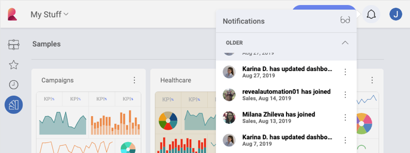
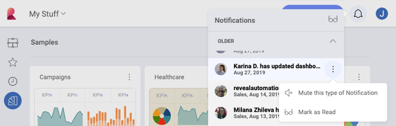

## Notifications Center

The Notifications Center is designed to keep you updated of any team and
dashboard changes. Open it by selecting the **bell icon** in the top
right section of the application.

Whenever you receive a notification, you will see a change in the
notifications' icon. Depending on your notification settings, you might
also see an in-app notification with the specific change.

In the Notification Center you can:

  - Mark all notifications as **Read** or **Unread** by selecting the
    *glasses icon*.

  - **Group** your notifications by **Date** or **Team**.

  - Additionally, you can **turn off notifications** by selecting the
    *Mute this type of notification* option in the overflow menu.

### Notification Preferences

You can easily edit your notification preferences. Тo do that, click/tap the icon with your first name initial (or photo) in the right top corner of the main screen. Then navigate to *Settings* ⇒ *Notifications*.

### Notification Types

You can receive three different types of notifications for both **Team**
and **Dashboard** changes:

  - **Email** notifications, which will be delivered to the e-mail
    address associated with your account.

  - **Push** notifications, which will be displayed as texts under the
    notification icon.

  - **In-App** notifications, displayed with a number inside the
    notifications icon.

To **edit** your notifications preferences, select the *pencil icon*. To
**turn on/off** notifications, click/tap the *toggle button* on the
right.

#### Team Notifications

You can configure your Reveal account to receive notifications when you
are removed from a team, or whenever new members join a team you are
already part of.

For Teams, the following settings are enabled by default:

|                         | Email                                                     | Push | In-App                                                   |
| ----------------------- | --------------------------------------------------------- | ---- | -------------------------------------------------------- |
| I’m removed from a Team |             |      |            |
| New members join        |                                                           |      |            |

#### Dashboard Notifications

You can configure your account to receive notifications whenever dashboards are shared with you or with a team, or when they are updated.

For Dashboards, the following settings are enabled by default:

|                                     | Email                                                     | Push                                                      | In-App                                                    |
| ----------------------------------- | --------------------------------------------------------- | --------------------------------------------------------- | --------------------------------------------------------- |
| Dashboard is shared with me         |             |             |             |
| Dashboard shared with a Team i’m in |                                                           |                                                           |             |
| Dashboard is updated                |                                                           |             |             |
