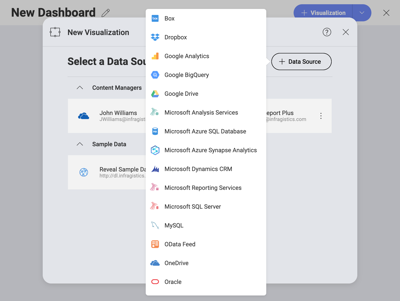

## Welcome to the Reveal Help Center!

 
Reveal is an affordable, true self-service BI tool, enabling you to make
data-driven decisions faster. Built by user experience experts and
designed for the business user, Reveal makes it simple for you to
create, view and share dashboards with your teams. It offers you a
seamless, identical experience no matter what device you are on: Web,
Desktop, iOS, or Android.

Learn how to use Reveal with our easy, step-by-step
[dashboard](~/en-us/dashboard-tutorials/index.md) and
[visualization](visualization-tutorials.md) tutorials.

### You can use Reveal to:

<table class="tg">
  <tr>
    <th class="tg-0pky"></th>
    <th class="tg-0pky"><a href="data-sources.md">Securely connect to your data</a>: Connect to the most popular data sources without setting anything up on the server. Get real-time insights by connecting directly to <a href="sharepoint.md">SharePoint Online</a>, <a href="google-drive.md">Google Drive</a>, <a href="onedrive.md">OneDrive</a>, <a href="microsoft-analysis-services.md">Microsoft Analysis Services</a>, <a href="microsoft-sql-server.md">Microsoft SQL Server</a>, <a href="microsoft-dynamics-crm.md">CRM</a>, and many more.</th>
  </tr>
  <tr>
    <td class="tg-0pky"></td>
    <td class="tg-0pky"><a href="creating-dashboards.md">Easily create dashboards</a>: With an intuitive drag and drop interface, Reveal makes it simple to create dashboards within minutes. Choose from more than 20 different visualizations to present your data and tell your story the best way.</td>
  </tr>
  <tr>
    <td class="tg-0pky"></td>
    <td class="tg-0pky"><a href="visualizations-editor.md">Customize your visualizations</a>: Sort, filter and aggregate your data as you wish! Each chart type provides you with different settings to design your visualizations the way you want.</td>
  </tr>
  <tr>
    <td class="tg-0pky"></td>
    <td class="tg-0pky"><a href="exporting-dashboards.md">Interact with your dashboards</a>: Once your dashboard is created, interact with your visualizations with drill-down support, or even the ability to change visualization on the fly. Create and share annotated images of your visualizations for deeper insights.</td>
  </tr>
  <tr>
    <td class="tg-0pky"></td>
    <td class="tg-0pky"><a href="sharing-dashboards.md">Share insights with your teams</a>: Give everyone the power of data by sharing your dashboards within your <a href="teams-collaboration-privacy.html#organization-team">Organization's repository</a>, teams you are part of or with individual coworkers. Assign different levels of permissions to users to give them the level of access you want them to have to your dashboard.</td>
  </tr>
</table>

### What's New

  - [**Statistical Functions**](statistical-functions.md) - Reveal can now
    process and perform statistical analysis on existing datasets. This
    means you can better analyze data and even forecast performance
    based on historical data.

  - [**Integration with Azure Machine Learning models**](azure-machine-learning-models.md) - You can use data in
    Reveal to evaluate models in Azure and then use the results as
    fields in your visualizations.

  - [**Google Analytics data source**](google-analytics.md) - With this new
    data source, you can create dashboards with information from Google
    Analytics.

  - [**Google Big Query data source**](google-bigquery.md)- You are now
    able to connect to Google's Big Query web service within Reveal and
    have massive datasets processed with zero slowdown.

  - [**Azure Synapse**](microsoft-azure-synapse-analytics.md) and [**Azure
    SQL**](azure-sql) data sources - Connect to Azure analytics service
    and SQL databases, to work with big data and advanced query
    processing features.

  - [**Microsoft Reporting Services (SSRS) data sources**](microsoft-reporting-services.md) - You can now use your
    existing SSRS reports in your visualizations, you can embed them as
    PDF files or get the data for the report and create your own
    visualizations.

  - [**Manage dashboards within folder and Teams**](managing-dashboards.md)
    - You can now move and copy dashboards between folders or Teams.

  - **Export to** [**Excel**](excel-data-format.md) **and**
    [**PowerPoint**](powerpoint-presentation.md) **enhancements** - A new
    robust UI allows you to customize how you export your data to slides
    and spreadsheets.

  - [**Export to PDF**](pdf-documents.md) - You can now export your
    dashboards to the PDF format.

  - [**Tooltips redesign and crosshairs addition**](overview-dashboards.md)
    - Tooltips were improved, they are now slightly smaller and the
    pointer was removed. In addition, crosshairs are now shown to help
    give context to the tooltip.

Still not sure? Try our [**free demo**](https://app.revealbi.io/Login?provider=Demo&_ga=2.197140908.2008019520.1580398635-1419162557.1572354605)
version to discover what Reveal can do for your business\!
