## Adding the other Visualizations

All the remaining visualizations in the dashboards will use the same
[sample spreadsheet](http://download.infragistics.com/reportplus/help/samples/Reveal_Dashboard_Tutorials.xlsx).

>[!NOTE]
>If you want to [change your data source](changing-data-source-visualization.md), you will need to select the **overflow button** next to the data source name or [create a new data source](creating-new-datasource.md) instead. You can also[duplicate](~/en/general/overview.html#view-edit-mode) visualizations to speed up the creation process.

This section will cover the following visualizations:

<table>
<colgroup>
<col style="width: 33%" />
<col style="width: 33%" />
<col style="width: 33%" />
</colgroup>
<tbody>
<tr class="odd">
<td>
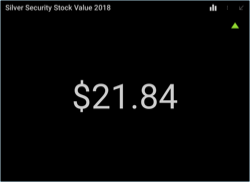 

<a href="#sis-stock-value-2018">Silver Security Stock Value 2018</a> 

</td>
<td>
 

<a href="#glb-fiscal-monthly">GLB Fiscal (Monthly) NYSE + BATS</a> 

</td>
<td>
 

<a href="#forecast-change-bid-offers">Forecast (Chg, Bid &amp; Offers) - 2018 to 2023</a> 

</td>
</tr>
<tr class="even">
<td>
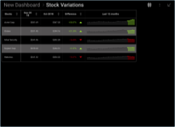 

<a href="#stock-variations">Stock Variations</a> 

</td>
<td>
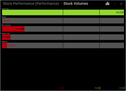 

<a href="#stock-volumes">Stock Volumes</a> 

</td>
<td></td>
</tr>
</tbody>
</table>

### Silver Security Stock Value 2018

The SIS Stock Value 2018 visualization displays the average value for
the Soylent Corp stock during 2018 in a [text gauge](~/en/visualization-tutaorials/gauge-views.html#create-text-gauge). In this case, you can
duplicate the first visualization created during the first steps, as all
that will change is the selected filter.

1.  Open the overflow button in the "Globex Stock Value 2018"
    visualization, and then select **Duplicate**.

    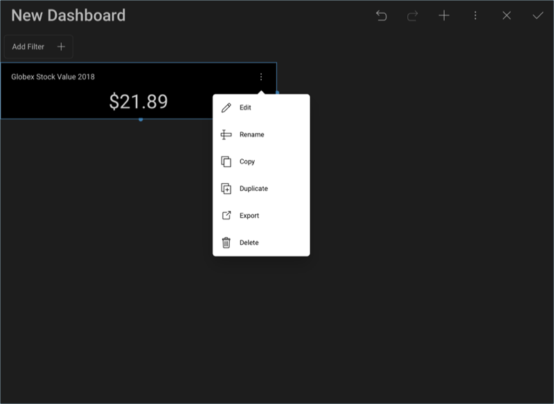

<!-- end list -->

2.  Rename the visualization by opening its overflow button and
    selecting **Rename**.

    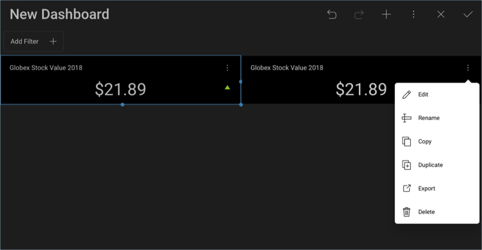

    Set the value to "Silver Security Stock Value 2018"

    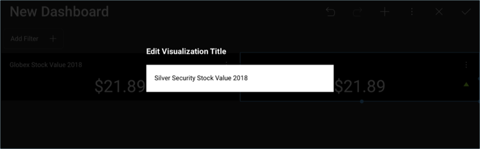

<!-- end list -->

3.  Enter Edit Mode by selecting the overflow button again and selecting
    **Edit**.

    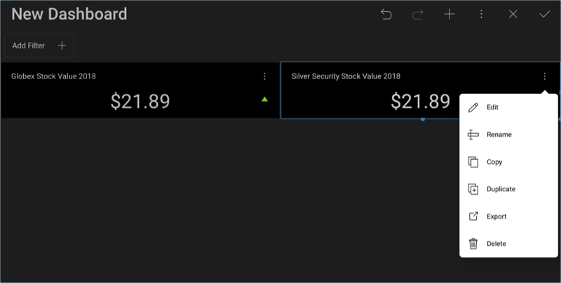

<!-- end list -->

4.  This visualization displays the stock value for **Silver Security
    Corp**, as it is the second highest stock value. Because we choose
    to duplicate the visualization, the number you are seeing in the
    text gauge corresponds to **Globex**. In order to change it, select
    the **Stocks** field in **Data Filters**. Then, change the
    **Selected Value** to **Silver Security Corp** and *unselect
    Globex*.

    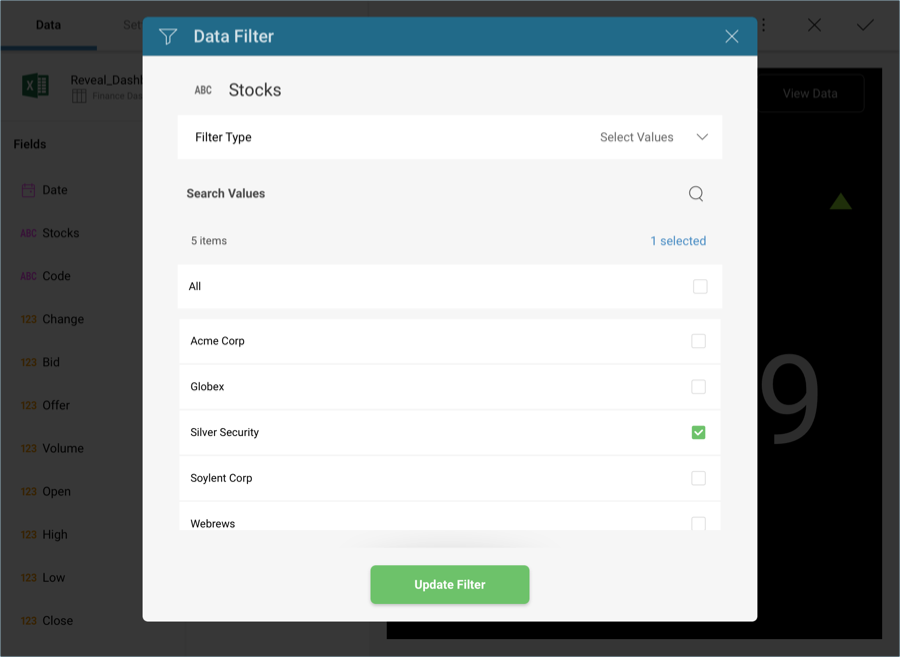

    Then, select **Update Filter**.

Once you are done, go back to the Dashboard Editor by selecting the
**tick icon** in the top right-hand corner.

### GLB Fiscal (Monthly) NYSE + BATS

The GLB Fiscal visualization displays the price movements for the Globex
stock during 2018 considering both the New York Stock Exchange (NYSE)
and the Better Alternative Trading System (BATS) values in a
[Candlestick Chart](~/en/visualization-tutorials/candlestick-chart.md). In order to create it:

1.  Select the + button in the right corner of your dashboard, and
    select the **Finance Dashboard** sheet in the
    **Reveal\_Dashboard\_Tutorials** spreadsheet. Then, select *Load Data*.

    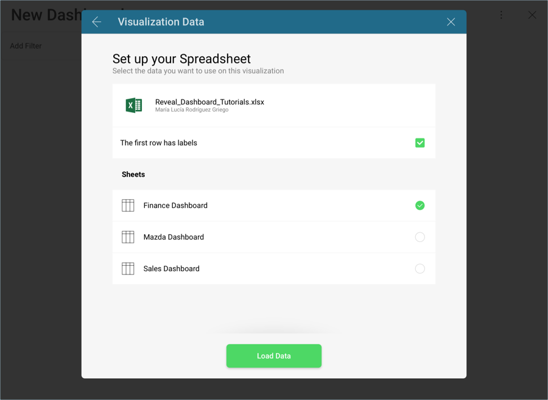

<!-- end list -->

2.  **Open the visualizations picker** by selecting the grid icon in the
    top bar, and select the "Candlestick" chart.

    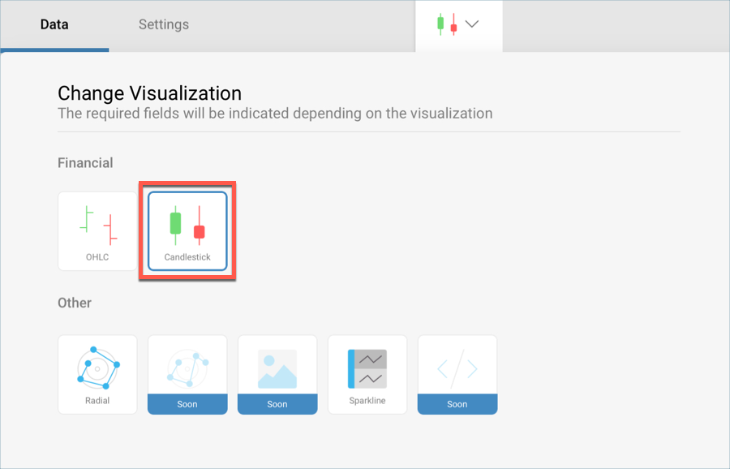

<!-- end list -->

3.  In the Data Editor, drag and drop the **Date** field into the Label
    placeholder of the data editor, **Open** into Open, **High** into
    High, **Low** into Low and **Close** into Close.

    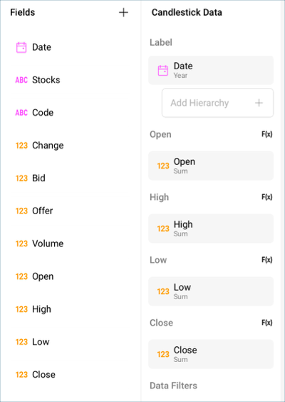

<!-- end list -->

4.  By default, the Date information in Label will be displayed in
    years. In order to change this, select **Date** in the Label
    placeholder of the data editor, and change the **Date Aggregation**
    to **Day**.

    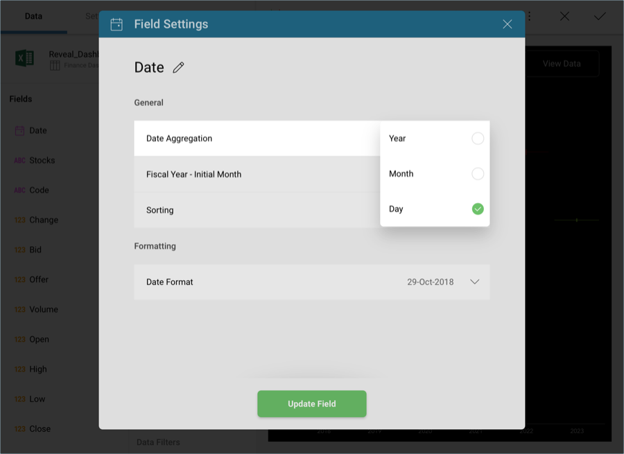

    Then, select **Update Field**.

<!-- end list -->

5.  If needed, you can remove the fraction digits in the Y axis by
    selecting the values in Open, High, Low and Close, and changing
    **Fraction Digits** to **0**.

    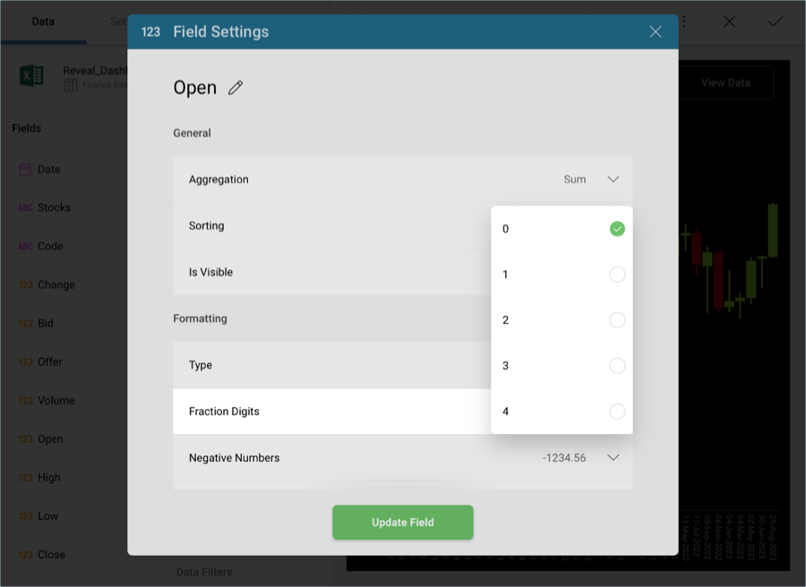

    Then, select **Update Field**.

<!-- end list -->

6.  The visualization displays the GLB stock value, so **you will need
    to introduce a filter** for **Stocks** in order to display that
    particular option. Drag and drop **Stocks** into **Data Filters**
    and then choose **Select Values**.

    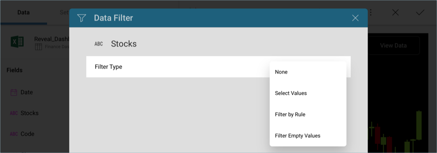

    There, uncheck all options and select only **Globex**.

    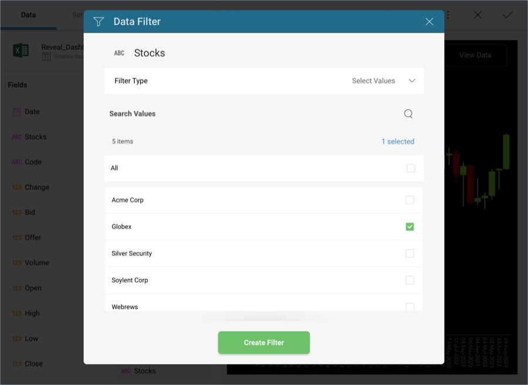

    Then, select **Create Filter**.

<!-- end list -->

7.  You will also need to introduce a filter in order to display
    information only for 2018. To do this, drag and drop **Date** into
    the **Data Filters** placeholder of the data editor and, under
    **Filter Type**, select **Filter by Rule**.

    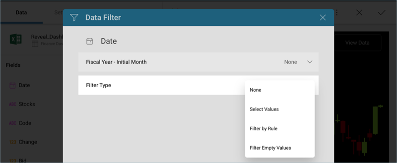

    Select the **Custom Date Range** rule and enter January 1st through
    December 31st.

    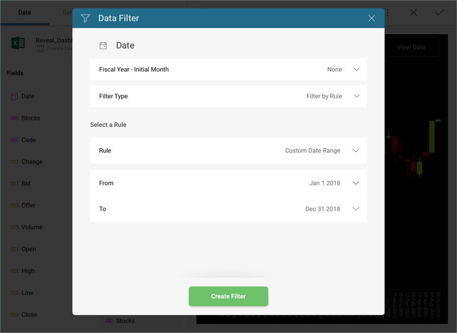

    Then, select **Create Filter**.

<!-- end list -->

8.  **Change the title of your visualization** to "GLB Fiscal (Monthly)
    NYSE + BATS" **by selecting the pencil icon** next to "Finance
    Dashboard".

Once you are done, go back to the Dashboard Editor by selecting the
**tick icon** in the top right-hand corner.

### Forecast (Chg, Bid & Offers) - 2018 to 2023

The Forecast visualization displays the changes, bids and offers for all
stocks for a 5 year period in a [line chart](~/en/visualization-tutorials/simple-charts.md). In
order to create it:

1.  Select the + button in the right corner of your dashboard, and
    select the **Finance Dashboard** sheet in the
    **Reveal\_Dashboard\_Tutorials** spreadsheet. Then, select *Load
    Data*.

    

<!-- end list -->

2.  **Open the visualizations picker** by selecting the grid icon in the
    top bar, and select the "Line" chart.

    

<!-- end list -->

3.  In the Data Editor, drag and drop the **Date** field into Label,
    **Stocks** into the *Add Hierarchy* section of Label, and
    **Change**, **Bid** and **Offer** into **Values**.

    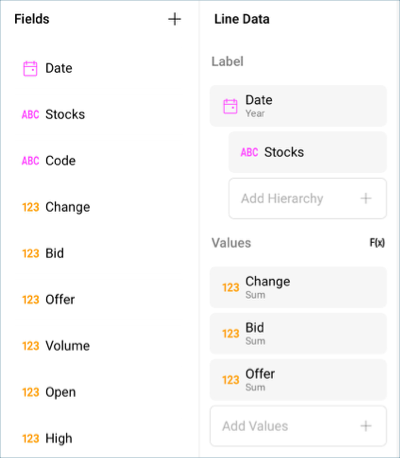

<!-- end list -->

4.  By default, the Date information in Label will be displayed in
    years. In order to change this, select **Date** in the Label
    placeholder of the data editor, and change the **Date Aggregation**
    to **Month**.

    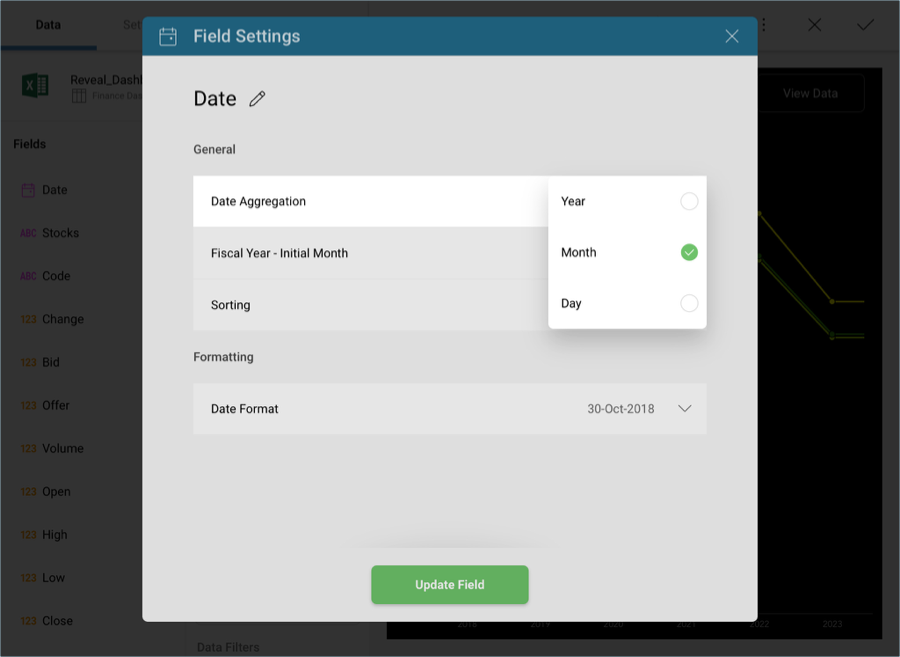

    Then, select **Update Field**.

<!-- end list -->

5.  To remove the fraction digits in the Y axis, select the fields in
    Values, and change **Fraction Digits** to **0**.

    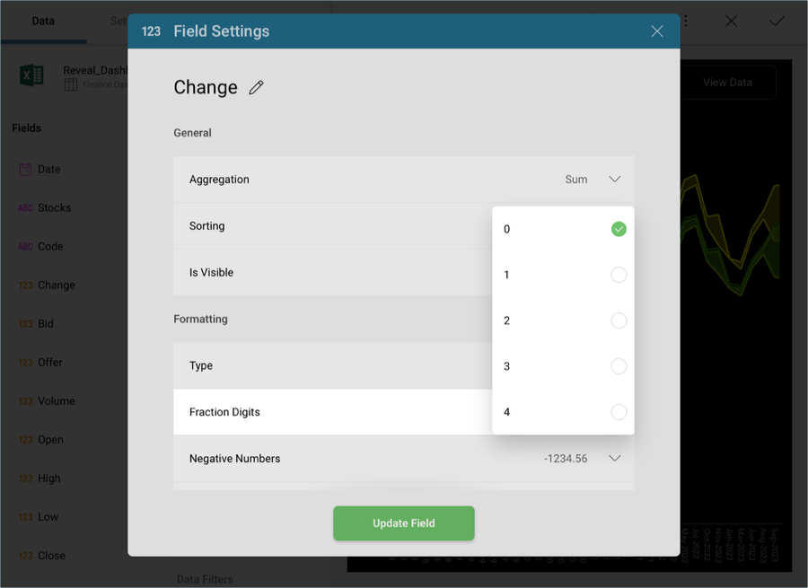

    Then, select **Update Field**.

<!-- end list -->

6.  **Change the title of your visualization** to "Forecast (Chg, Bid &
    Offers) - 2018 to 2023" **by selecting the pencil icon** next to
    "Finance Dashboard".

Once you are done, go back to the Dashboard Editor by selecting the
**tick icon** in the top right-hand corner.

### Stock Variations

The Stock Variations visualization displays the change in stock offers
for a 12 month period in a [sparkline chart](~/en/visualization-tutorials/sparkline-charts.md).
In order to create it:

1.  Select the + button in the right corner of your dashboard, and
    select the **Finance Dashboard** sheet in the
    **Reveal\_Dashboard\_Tutorials** spreadsheet. Then, select *Load
    Data*.

    

<!-- end list -->

2.  **Open the visualizations picker** by selecting the grid icon in the
    top bar, and select the "Sparkline" chart.

    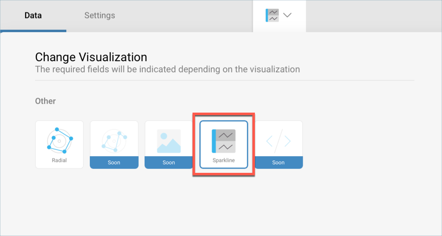

<!-- end list -->

3.  In the Data Editor, drag and drop the **Date** field into Date, the
    **Offer** field into **Value** and **Stocks** into Category.

    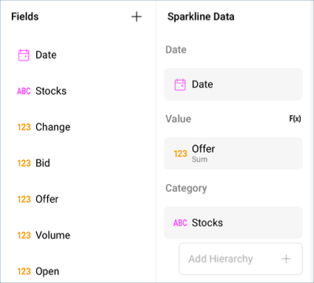

<!-- end list -->

4.  By default, the **Offer** field will be displayed as a number. In
    order to display it as currency, select it in the data editor and
    change **Type** to **Currency**.

    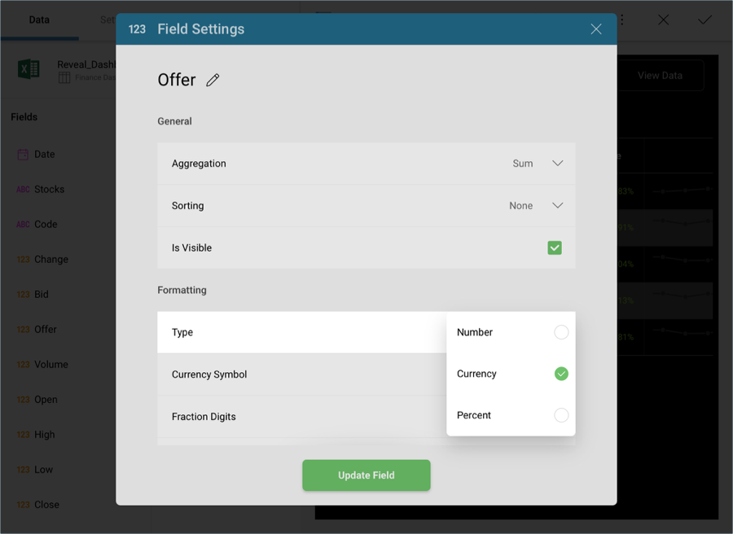

    Then, select **Update Field**

<!-- end list -->

5.  The **Last 12 Months** chart will be displayed using a Line Chart by
    default. In order to match the sample, let's set it to display an
    area chart instead. Go to the **Settings** menu of the
    Visualizations Editor, open the **Chart Type** dropdown, and select
    **Area**.

    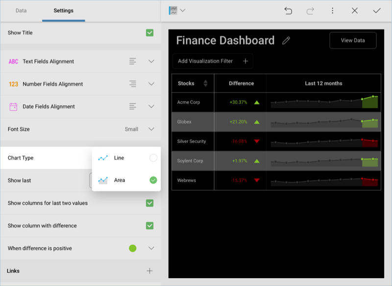

<!-- end list -->

6.  **Change the title of your visualization** to "Stock Variations"
    **by selecting the pencil icon** next to "Finance Dashboard".

Once you are done, go back to the Dashboard Editor by selecting the
**tick icon** in the top right-hand corner.

### Stock Volumes

The Stock Volumes visualization displays the amount of stocks available
during a one year period in a [line gauge](~/en/visualization-tutorials/gauge-views#create-linear-gauge). In order to create it:

1.  Select the + button in the right corner of your dashboard, and
    select the **Finance Dashboard** sheet in the
    **Reveal\_Dashboard\_Tutorials** spreadsheet. Then, select *Load
    Data*.

    

<!-- end list -->

2.  **Open the visualizations picker** by selecting the grid icon in the
    top bar, and select the "Sparkline" chart.

    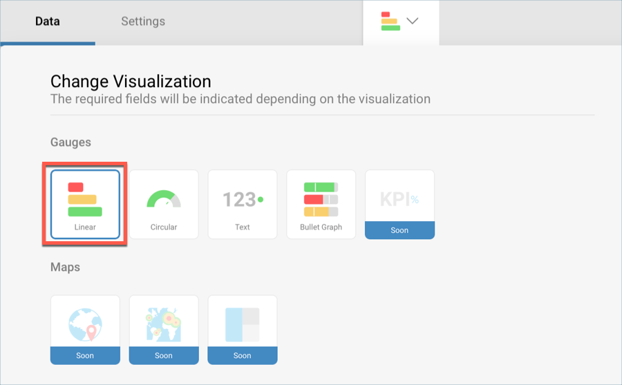

<!-- end list -->

3.  In the Data Editor, drag and drop the **Stocks** field into Label
    and the **Volume** field into the Values placeholder of the data
    editor.

    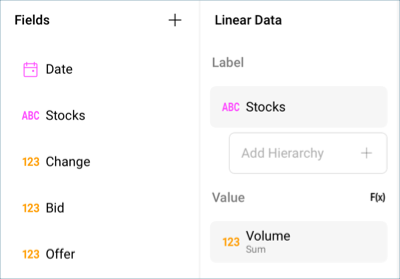

<!-- end list -->

4.  You will also need to introduce a filter in order to display
    information only for 2018. To do this, drag and drop **Date** into
    the **Data Filters** placeholder of the data editor and, under
    **Filter Type**, select **Filter by Rule**.

    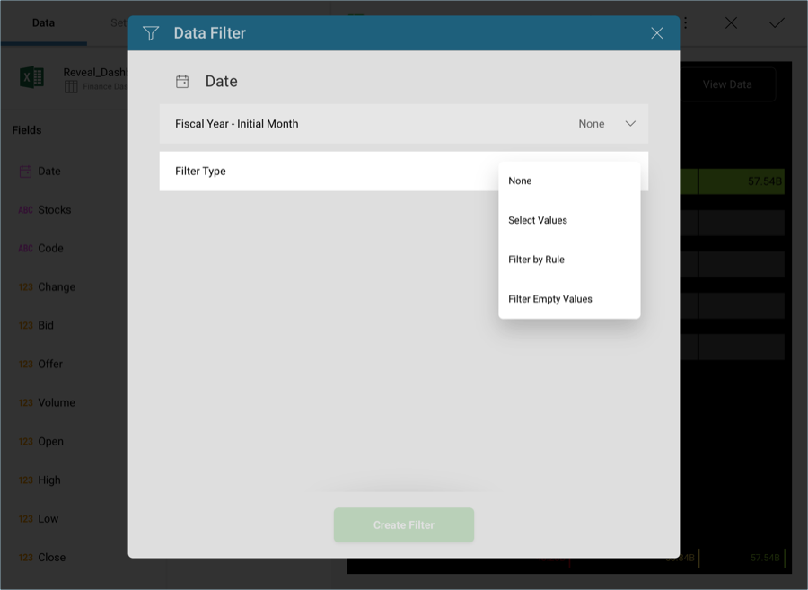

    Select the **Custom Date Range** rule and enter January 1st through
    December 31st.

    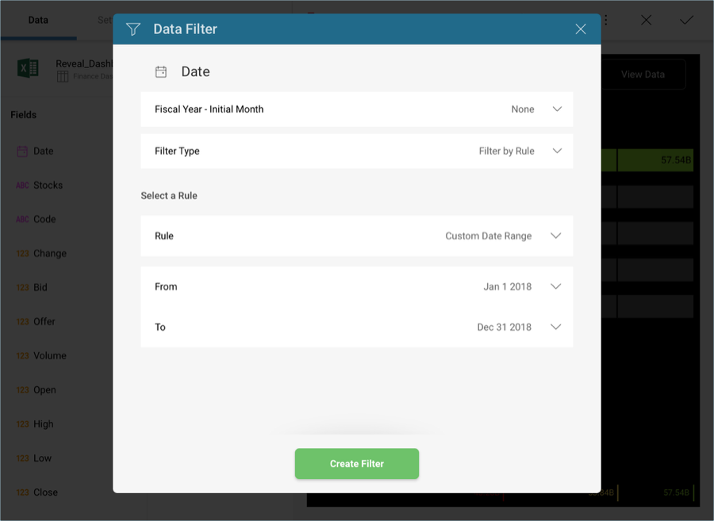

    Then, select **Create Filter**.

<!-- end list -->

5.  **Change the title of your visualization** to "Stock Volumes" **by
    selecting the pencil icon** next to "Finance Dashboard".

Once you are done, go back to the Dashboard Editor by selecting the
**tick icon** in the top right-hand corner.

<a href="finance-applying-theme.md" class="previous">&laquo; Previous Step</a>
<a href="finance-saving-dashboard.md" class="next">Next Step &raquo;</a>
