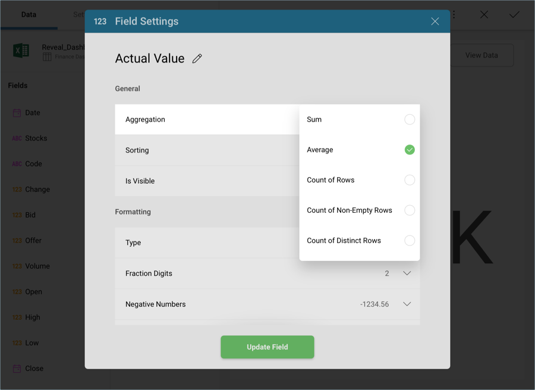
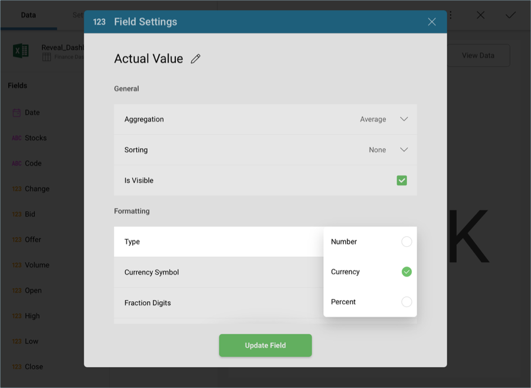
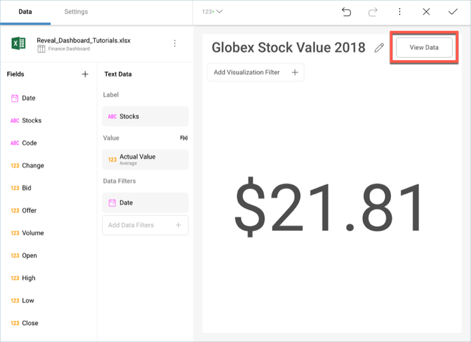
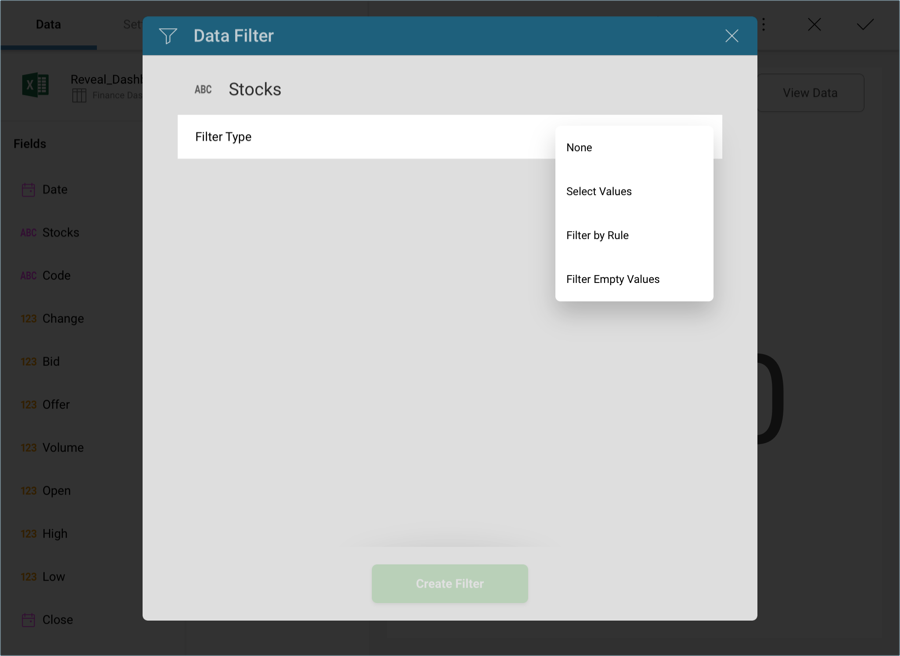
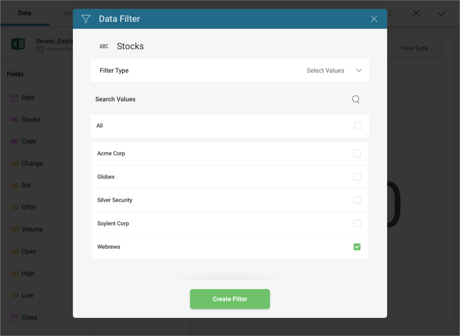
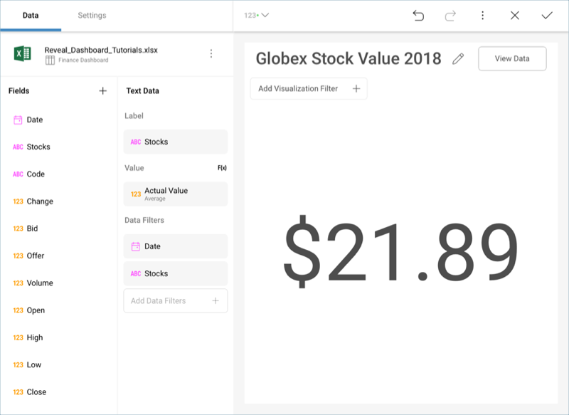
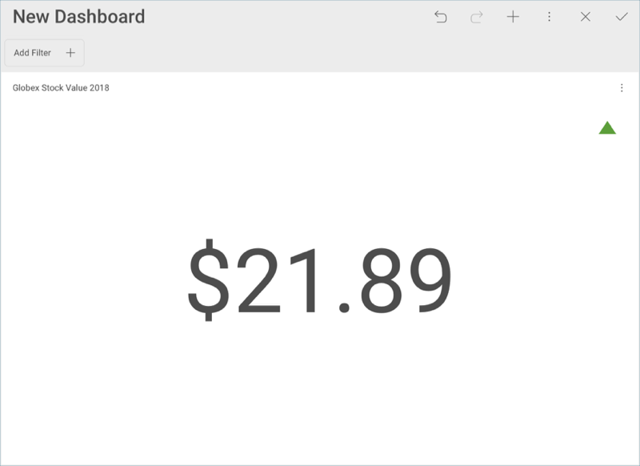

# Applying Formatting to the First Visualization

The raw data that you drag and drop into the data editor placeholders
will not be formatted by default; you will need to modify each field you
have dragged individually. This particular widget displays the average
2018 stock value for the stock with the highest value (in this case, it
will be **Globex**). You will need to introduce additional filters to
select the specific data.

## Changing the Aggregation and Formatting for Actual Values

In order for your visualization to display the **average** actual values
for Soylent Corp, you will need to modify the field in the data editor.
Select **Actual Values** in the **Value** placeholder. Then, change the
**Aggregation** to **Average** in the *General* menu.

Then, change **Type** to **Currency** under *Formatting*.

Then, select **Update Field**.

## Adding a Custom Date Range

For this widget, you want to filter the dates to only display 2018 and
not the complete data range in the original spreadsheet. In order to do
so, drag and drop the **Date** field into **Data Filters** and, under
Filter Type, select **Filter by Rule**.

In the new *Rule* menu, select **Custom Date Range**.

Then, enter January 1st through December 31st and select **Create
Filter**.

By now, your visualization should look like the following one:

## Selecting the Highest Value

Text Gauges only display the value in the first row of your data, but
you can still filter the data behind it to show the specific row you
want. Let's take a look at the data behind this visualization. Select
the **View Data** button in the top right corner of your visualization.

You will see the following table:

In this case, Globex is the stock with the highest average value. In
order to display it, you will need to introduce an additional filter.
Drag and drop **Stocks** into **Data Filters** and, in the *Filter Type*
menu, choose **Select Values**.

Select **Globex** and then **Create Filter**.

Your visualization will now look like the following one.

If you want to verify that the visualization is displaying the correct
data, you can once again select **View Data** in the top right-hand
corner.

Had the list of stocks been longer, you might not have been able to
identify the highest value that easily. You can sort your values in
ascending/descending order to help you out with bigger tables. The
[Labor](~/en/dashboard-tutorials/manufacturing-dashboard/adding-other-visualizations.html#labor-cost)
visualization of the [Manufacturing Dashboard Tutorial](~/en/dashboard-tutorials/manufacturing-dashboard/getting-started.md) has instructions on how to
apply it.

## Adding Conditional Formatting

You can add additional information to the visualization in the form of a
colored indicator, which will indicate where the value of your stock
stands in a three-value data range you can define yourself.

Go to the **Settings** section of the Visualizations Editor. You will
see a **Conditional Formatting** section, which will, by default, have
the following three ranges configured:

Open any of the dropdowns in order to add indicators and colors to your
visualization. In this case, we will add a green up arrow for the
highest range, a yellow line for the mid-range, and a red down arrow for
the lower range. The visualization will be updated to display the
corresponding indicator.

Once you have finished editing the visualization, select the **tick
button** in the top right-hand corner to return to the dashboard editor.

>[!NOTE]
>You can resize any of your visualizations by selecting the visualization and then dragging its corners downwards or to the side.

<a href="selecting-data-visualization.md" class="previous">&laquo; Previous Step</a>
<a href="applying-theme.md" class="next">Next Step &raquo;</a>