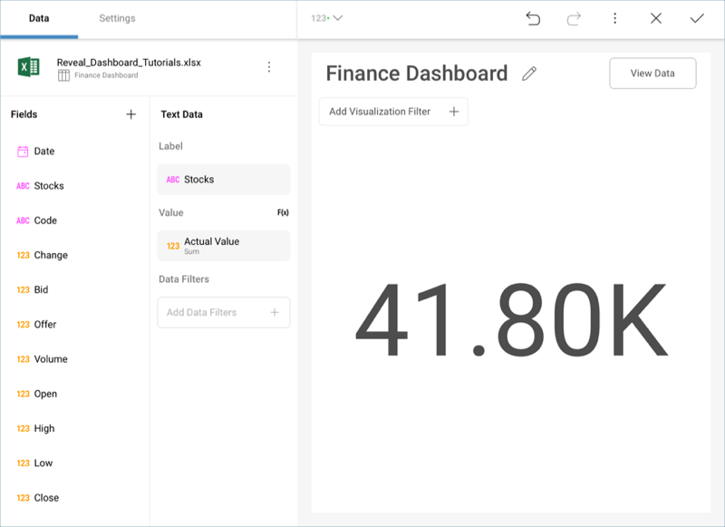
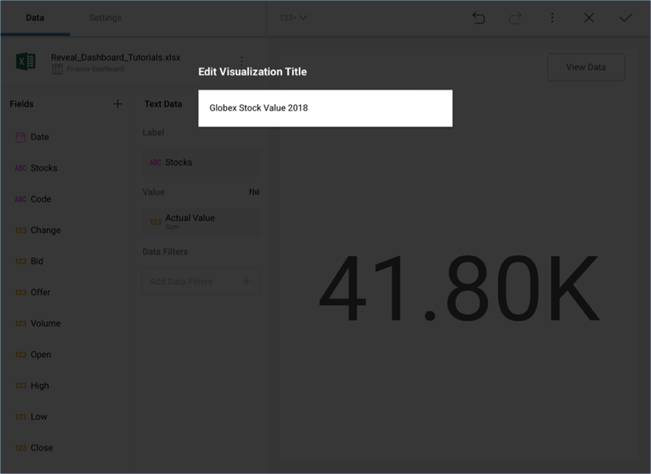
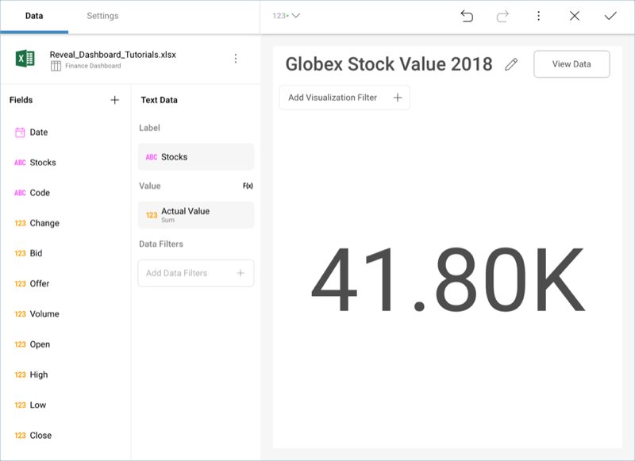

## Creating the First Visualization 

Let's focus on creating the "Globex Stock Value 2018" visualization in
the [sample dashboard](finance-dashboard-tutorial.md) presented at the
beginning of this tutorial. The visualization displays a [Text Gauge](~/en/data-visualizations/gauge-views.md#text-gauge). This particular visualization displays
two fields:

  - Stocks

  - Actual Value

First, **open the visualizations picker** by selecting the grid icon in
the top bar.

**Change your visualization** to "Text Gauge".

Then, **drag and drop**:

  - *Stocks* into the Label placeholder of the data editor.

  - *Actual Value* into the Value placeholder.

Lastly, **change the visualization's title** to "Globex Stock Value
2018" by selecting the pencil icon next to the "Finance Dashboard"
title.

Your visualization should look like the following one:

<a href="finance-starting-creation-process.md" class="previous">&laquo; Previous Step</a>
<a href="finance-applying-formatting-visualization.md" class="next">Next Step &raquo;</a>
