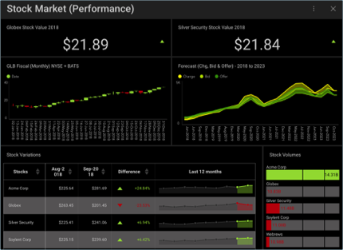

## Dashboard Tutorials

Within this section, you will find step-by-step tutorials on how to
create a variety of Reveal dashboards. For specific information on any
visualization, visit the [Data Visualizations](Data-Visualizations.md)
section. You can also find detailed information on which filters you can
apply to a visualization or dashboard in the [Filters](Filters.md) topic.

<table>
<colgroup>
<col style="width: 50%" />
<col style="width: 50%" />
</colgroup>
<tbody>
<tr class="odd">
<td>
 

<a href="Finance-Dashboard-Tutorial.md">Finance Dashboard</a> 

</td>
<td>
 

<a href="Manufacturing-Dashboard-Tutorial.md">Manufacturing Dashboard</a> 

</td>
</tr>
<tr class="even">
<td>
 

<a href="Sales-Dashboard-Tutorial.md">Sales Dashboard</a> 

</td>
<td>
 

<a href="Social-Dashboard-Tutorial.md">Social Dashboard</a> 

</td>
</tr>
</tbody>
</table>
