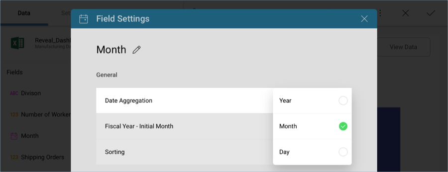
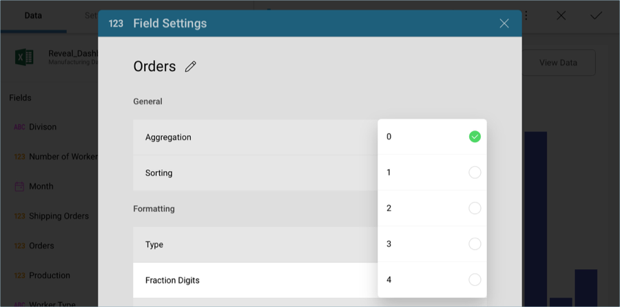
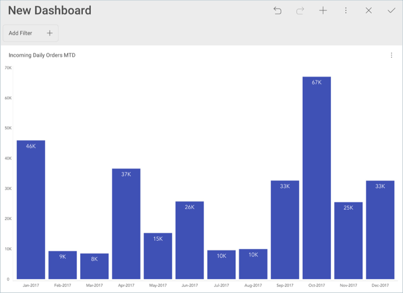

## Applying Formatting to the First Visualization 

The raw data that you drag and drop into the data editor placeholders
will not be formatted by default; you will need to modify each field you
have dragged individually.

### Date Aggregation

In order for your widget to match the sample dashboard's you will need
to select **Month** in the data editor placeholder, and change the
**Date Aggregation** to **Month** in the *Field Settings* menu.

### Formatting for Orders

In order to show numbers with no fractions in the Y axis, you will need
to modify the formatting for the **Orders** field dropped into the
Values placeholder of the data editor. Select it, and change **Fraction
Digits** to 0 under **Formatting** in the *Field Settings* menu.

Once you have finished editing the visualization, select the **tick
button** in the top right-hand corner to return to the dashboard editor.

>NOTE
>You can resize any of your visualizations by selecting the visualization and then dragging its corners downwards or to the side.

<a href="manufacturing-selecting-data-visualization.md" class="previous">&laquo; Previous Step</a>
<a href="manufacturing-applying-theme.md" class="next">Next Step &raquo;</a>