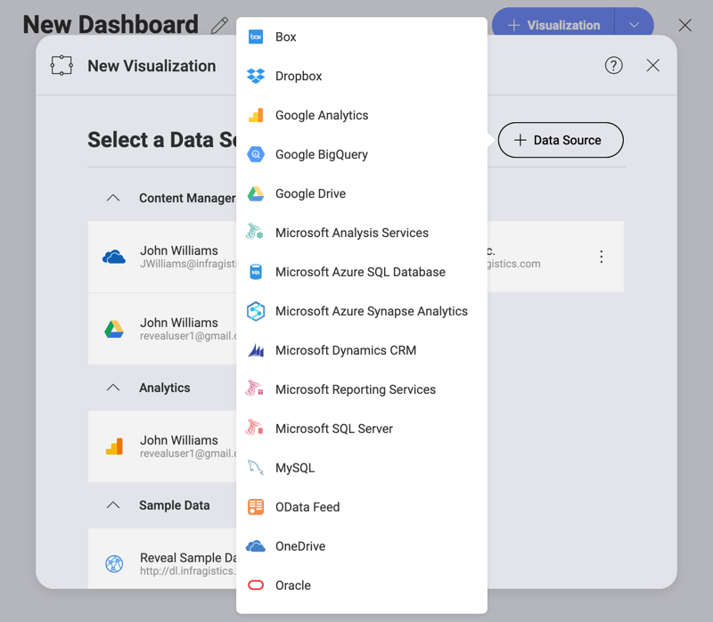

# Creating a Dashboard and Adding a Data Source

In order to create a new dashboard, you need to select the **+ New**
button in the top right-hand corner of the initial view, and select the
**Dashboard** option in the *Create New* menu.

## Adding a Data Source

After you select **Dashboard**, you will see the **New Visualization**
screen pop up. Select the + sign in the top right corner, and then the
data source in which you stored the the sample datasheet mentioned in
[this section](getting-started.html#sample-datasheet).

>[!NOTE]
>For instructions on how to add a data source for each of the providers, refer to [this topic](~/en/datasources/overview.md).

When selecting the file in the **Visualization Data** dialog, make sure you select the **Manufacturing Dashboard** sheet of the sample spreadsheet. Then, select *Load Data*.

After loading your data, the [Grid Chart](~/en/data-visualizations/visualization-types/grid-chart.md) will be selected by default in the [Visualizations Editor](~/en/data-visualizations/visualizations-editor.md).

<a href="getting-started.md" class="previous">&laquo; Manufacturing Dashboard</a>
<a href="selecting-data-visualization.md" class="next">Next Step &raquo;</a>
