## Adding the other Visualizations

All the remaining visualizations in the dashboards will use the same
[sample spreadsheet](http://download.infragistics.com/reportplus/help/samples/Reveal_Dashboard_Tutorials.xlsx)

>[NOTE!]
>If you want to [change your data source](changing-data-source-visualization.md), you will need to select the **overflow button** next to the data source name or [create a new data source](creating-new-datasource.md) instead. You can also [duplicate](Overview.html#view-edit-mode) visualizations to speed up the creation process.

This section will cover the following visualizations:

<table>
<colgroup>
<col style="width: 33%" />
<col style="width: 33%" />
<col style="width: 33%" />
</colgroup>
<tbody>
<tr class="odd">
<td>
 

<a href="#production">Production</a> 

</td>
<td>
 

<a href="#shipping">Shipping</a> 

</td>
<td>
 

<a href="#average-hours">Average Hours</a> 

</td>
</tr>
<tr class="even">
<td>
 

<a href="#headcount">Headcount</a> 

</td>
<td>
 

<a href="#labor-cost">Labor Cost</a> 

</td>
<td></td>
</tr>
</tbody>
</table>

### Production

The Production visualization displays the amount of manufactured goods
for a 12-month period arranged by worker type in a [line chart](Tutorial-Simple-Charts.md). In order to create it:

1.  Select the + button in the right corner of your dashboard, and
    select the **Manufacturing Dashboard** sheet in the
    **Reveal\_Dashboard\_Tutorials** spreadsheet. Then, select *Load
    Data*.
    
    

2.  **Open the visualizations picker** by selecting the grid icon in the
    top bar, and select the "Line" chart.
    
    

3.  In the Data Editor, drag and drop the **Worker Type** field into
    Label, and the **Production** one into Values.
    
    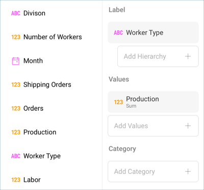

4.  Because the **Production** field has information on goods that were
    manufactured, the fraction digits should be removed. Select
    **Production** in Values, and change **Fraction Digits** to **0**
    under **Formatting**.
    
    
    
    Then, select **Update Field**.

5.  For the line chart to match the color in the sample visualization,
    change the **Start Color** to the fifth one within the **Settings**
    screen of the Visualizations Editor.
    
    

6.  **Change the title of your visualization** to "Production" **by selecting the pencil icon** next to "Manufacturing Dashboard".

Once you are done, go back to the Dashboard Editor by selecting the
**tick icon** in the top right-hand corner.

### Shipping

The Shipping visualization displays the amount of shipped orders for a
12 month period in an [area chart](Tutorial-Simple-Charts). In order to
create it:

1.  Select the + button in the right corner of your dashboard, and
    select the **Manufacturing Dashboard** sheet in the
    **Reveal\_Dashboard\_Tutorials** spreadsheet. Then, select *Load
    Data*.
    
    

2.  **Open the visualizations picker** by selecting the grid icon in the
    top bar, and select the "Area" chart.
    
    

3.  In the Data Editor, drag and drop the **Month** field into Label,
    and the **Shipping Orders** one into Values.
    
    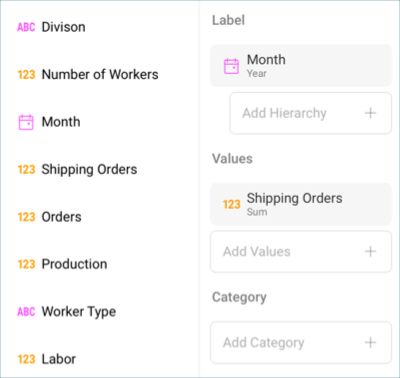

4.  By default, the date aggregation for your information will be set to
    **Year**. To change this, select the **Month** field in the
    **Label** placeholder, and change the **Date Aggregation** to
    **Month**.
    
    
    
    Then, select **Update Field**.

5.  Because the **Shipping Orders** field has information on goods that
    were shipped to clients, the fraction digits should be removed.
    Select **Shipping Orders** in Values, and change **Fraction Digits**
    to **0** under **Formatting**.
    
    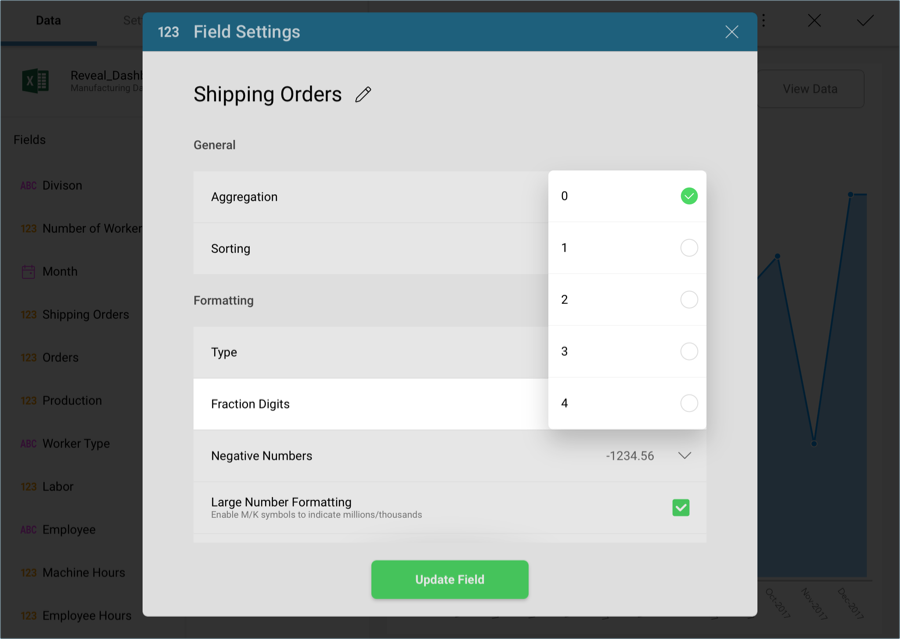
    
    Then, select **Update Field**.

6.  **Change the title of your visualization** to "Shipping" **by
    selecting the pencil icon** next to "Manufacturing Dashboard".

Once you are done, go back to the Dashboard Editor by selecting the
**tick icon** in the top right-hand corner.

### Average Hours

The Average Hours visualization displays hours logged by the company's
employees compared to the hours they spent on the company's machinery
broken down by month in a [spline chart](Tutorial-Simple-Charts). In
order to create it:

1.  Select the + button in the right corner of your dashboard, and
    select the **Manufacturing Dashboard** sheet in the
    **Reveal\_Dashboard\_Tutorials** spreadsheet. Then, select *Load
    Data*.
    
    

2.  **Open the visualizations picker** by selecting the grid icon in the
    top bar, and select the "Area" chart.
    
    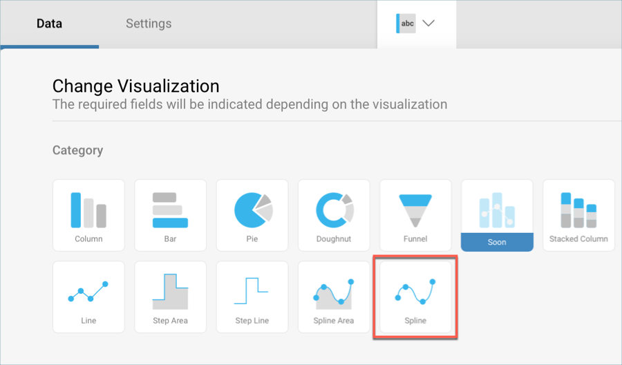

3.  In the Data Editor, drag and drop the **Month** field into Label,
    and both the **Machine Hours** and the **Employee Hours** fields
    into Values.
    
    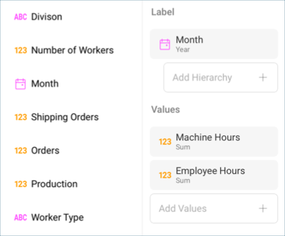

4.  By default, the date aggregation for your information will be set to
    **Year**. To change this, select the **Month** field in the
    **Label** placeholder, and change the **Date Aggregation** to
    **Month**.
    
    
    
    Then, select **Update Field**.

5.  To match the sample visualization, remove the fraction digits for
    hours by selecting *both* **Average Hours** and **Machine Hours**
    from the Values placeholder, and change **Fraction Digits** to **0**
    under **Formatting**.
    
    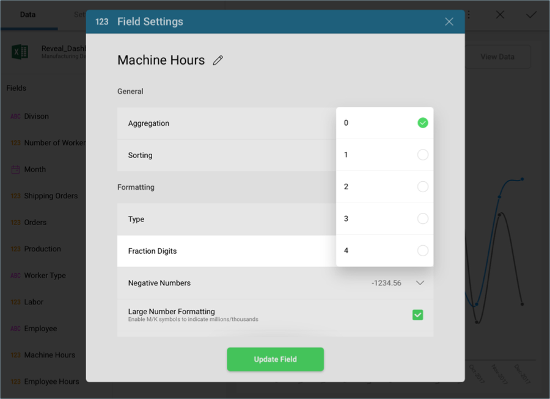
    
    Then, select **Update Field**.

6.  **Change the title of your visualization** to "Average Hours" **by
    selecting the pencil icon** next to "Manufacturing Dashboard".

Once you are done, go back to the Dashboard Editor by selecting the
**tick icon** in the top right-hand corner.

### Headcount

The Headcount visualization displays the amount of workers broken down
by category in a [bar chart](Tutorial-Simple-Charts). In order to create
it:

1.  Select the + button in the right corner of your dashboard, and
    select the **Manufacturing Dashboard** sheet in the
    **Reveal\_Dashboard\_Tutorials** spreadsheet. Then, select *Load
    Data*.
    
    

2.  **Open the visualizations picker** by selecting the grid icon in the
    top bar, and select the "Area" chart.
    
    

3.  In the Data Editor, drag and drop the **Division** field into Label,
    and the **Number of Workers** one into Values.
    
    

4.  The **Number of Workers** field should display no fraction digits
    because of the information it contains refers to people. Select it
    from the Values placeholder, and change **Fraction Digits** to **0**
    under **Formatting**.
    
    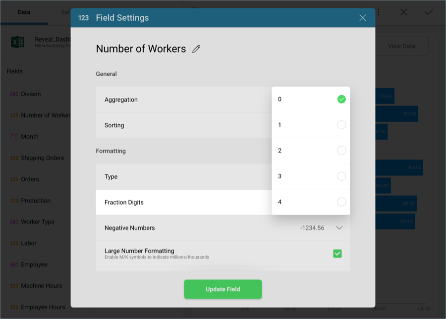
    
    Then, select **Update Field**.

5.  For the bar chart to match the color in the sample visualization,
    change the **Start Color** to the fourth one within the **Settings**
    screen of the Visualizations Editor.
    
    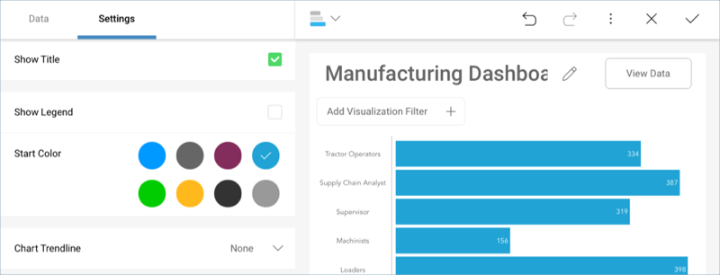

6.  **Change the title of your visualization** to "Headcount" **by
    selecting the pencil icon** next to "Manufacturing Dashboard".

Once you are done, go back to the Dashboard Editor by selecting the
**tick icon** in the top right-hand corner.

### Labor Cost

The Labor Cost visualization displays the wages for each employee from
highest to lowest in a [column chart](Tutorial-Simple-Charts.md). In order
to create it:

1.  Select the + button in the right corner of your dashboard, and
    select the **Manufacturing Dashboard** sheet in the
    **Reveal\_Dashboard\_Tutorials** spreadsheet. Then, select *Load
    Data*.
    
    

2.  **Open the visualizations picker** by selecting the grid icon in the
    top bar, and select the "Area" chart.
    
    

3.  In the Data Editor, drag and drop the **Employee** field into Label,
    and the **Labor** one into Values.
    
    

4.  The Labor figures should be formatted to be shown as currency and
    with no fraction digits. In order to do this, select the **Labor**
    field from the Values placeholder and apply the following changes:
    
    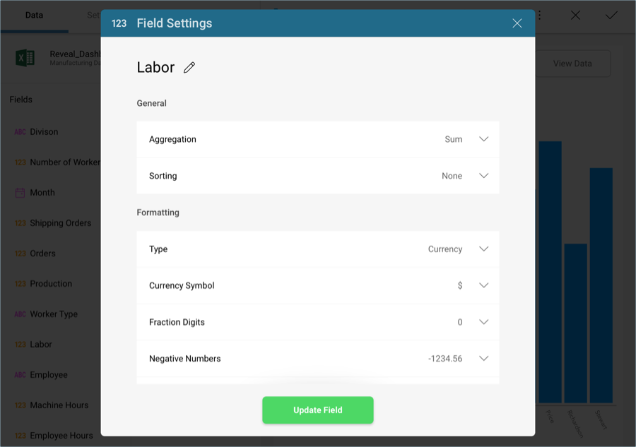
    
      - **Type**: Currency
    
      - **Fraction Digits**: 0
        
        In addition, the visualization displays the wages in descending
        order. In this same dialog, change the **Sorting** from None to
        **Descending**.
        
        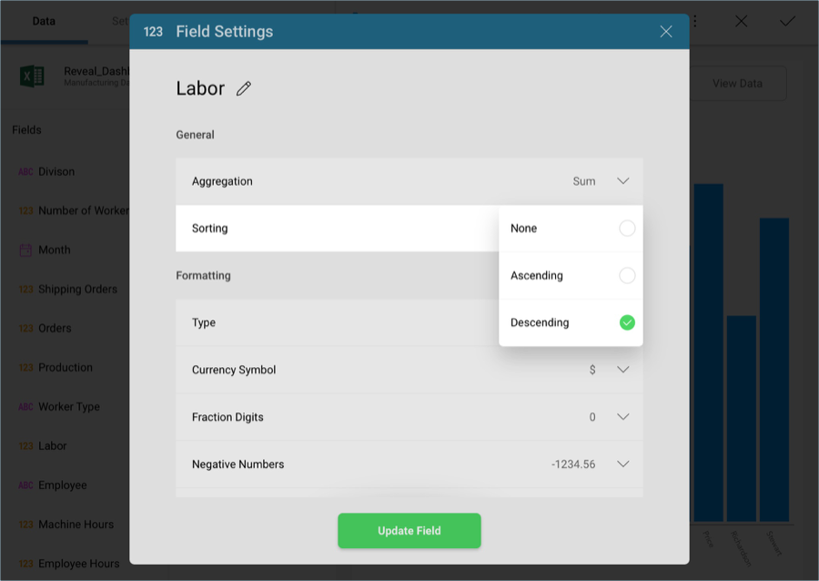
        
        Then, select **Update Field**.

5.  For the column chart to match the color in the sample visualization,
    change the **Start Color** to the second one within the **Settings**
    screen of the Visualizations Editor.
    
    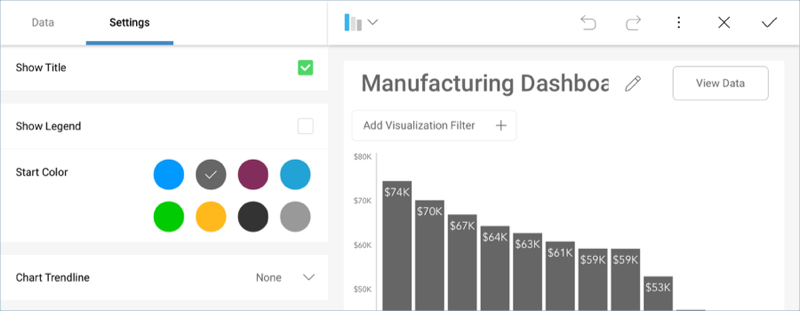

6.  **Change the title of your visualization** to "Labor Cost" **by
    selecting the pencil icon** next to "Manufacturing Dashboard".

Once you are done, go back to the Dashboard Editor by selecting the
**tick icon** in the top right-hand corner.

<a href="manufacturing-applying-theme.md" class="previous">&laquo; Previous Step</a>
<a href="manufacturing-saving-dashboard.md" class="next">Next Step &raquo;</a>