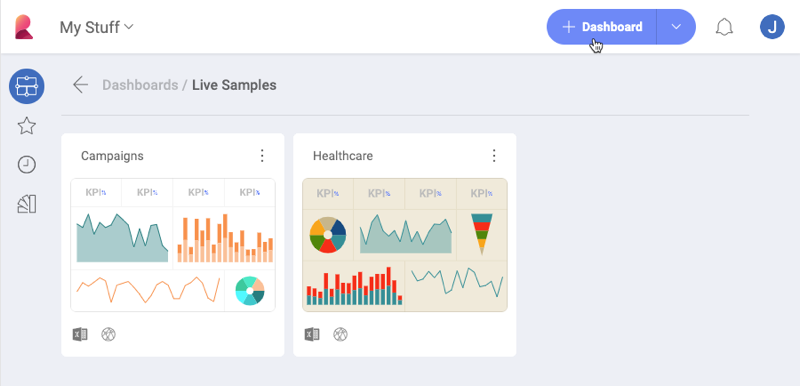
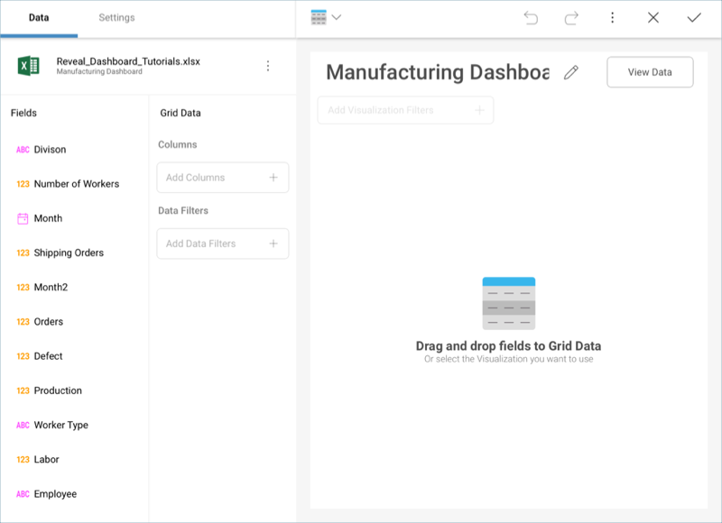

## Creating a Dashboard and Adding a Data Source

In order to create a new dashboard, you need to select the **+ New**
button in the top right-hand corner of the initial view, and select the
**Dashboard** option in the *Create New* menu.

### Adding a Data Source

After you select **Dashboard**, you will see the **New Visualization**
screen pop up. Select the + sign in the top right corner, and then the
data source in which you stored the the sample datasheet mentioned in
[this section](~/en/dashboard-tutorials/finance-dashboard/index.html#sample-datasheet).

>[!NOTE]
>For instructions on how to add a data source for each of the providers, refer to [this topic](~/en/datasources/data-sources.md).

When selecting the file in the **Visualization Data** dialog, make sure you select the **Manufacturing Dashboard** sheet of the sample
spreadsheet. Then, select *Load Data*.

After loading your data, the [Grid View](~/en/data-visualizations/grid-view.md) will be selected by
default in the [Visualizations Editor](~/en/data-visualizations/visualizations-editor.md).

<a href="manufacturing-dashboard-tutorial.md" class="previous">&laquo; Manufacturing Dashboard</a>
<a href="manufacturing-selecting-data-visualization.md" class="next">Next Step &raquo;</a>