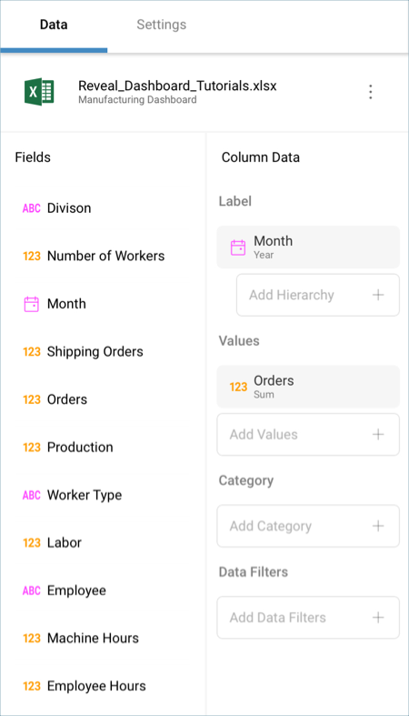
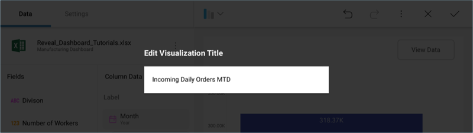
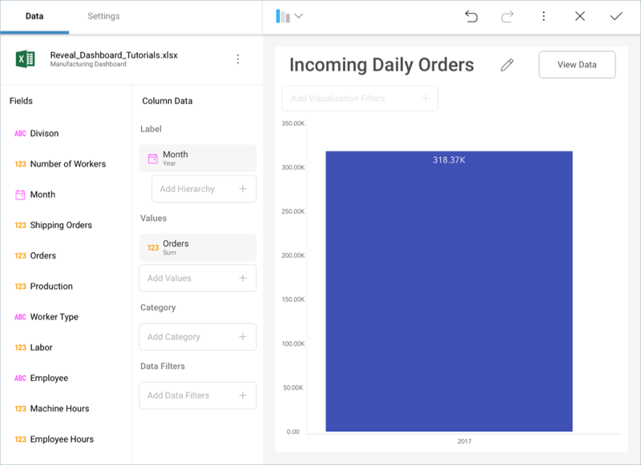

## Creating the First Visualization 

Let's focus on creating the "Incoming Daily Orders MTD" visualization in
the [sample dashboard](manufacturing-dashboard/overview.md) presented at
the beginning of this tutorial. The widget displays a [Column Chart](~/en/data-visualizations/category-charts.md) and, as such, it only requires one field to be
dropped into Label and one to be dropped into Values.

First, **open the visualizations picker** by selecting the grid icon in
the top bar.

**Change your visualization** to "Column".

Then, **drag and drop**:

  - *Month* into the Label placeholder of the data editor.

  - *Orders* into the Values placeholder.

Lastly, **change the visualization's title** to "Incoming Daily Orders
MTD" by selecting the pencil icon next to the "Manufacturing Dashboard"
title.

Your visualization should look like the following one:

<a href="manufacturing-starting-creation-process.md" class="previous">&laquo; Previous Step</a>
<a href="manufacturing-applying-formatting-visualization.md" class="next">Next Step &raquo;</a>
 