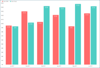
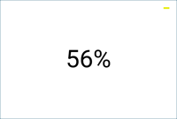
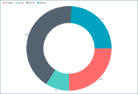
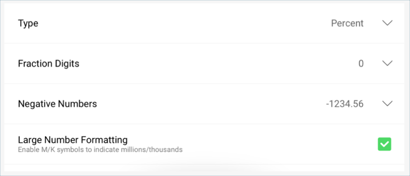
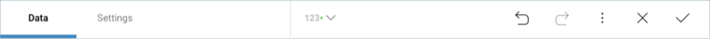
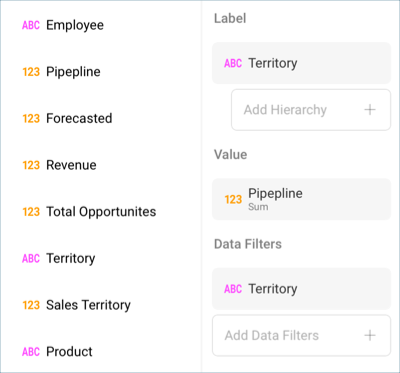

## Adding the other Visualizations 

All the remaining visualizations in the dashboards will use the same
[sample spreadsheet](http://download.infragistics.com/reportplus/help/samples/Reveal_Dashboard_Tutorials.xlsx)

>[!NOTE]
>If you want to [change your data source](changing-data-source-visualization.md), you will need to select the **overflow button** next to the data source name or [create a new data source](creating-new-datasource) instead. You can also [duplicate](overview.html#view-edit-mode) visualizations to speed up the creation process.

This section will cover the following visualizations:

<table>
<colgroup>
<col style="width: 25%" />
<col style="width: 25%" />
<col style="width: 25%" />
<col style="width: 25%" />
</colgroup>
<tbody>
<tr class="odd">
<td>
 

<a href="#win-lost-by-month">Win/Lost by Month</a> 

</td>
<td>
 

<a href="#forecasted">Forecasted</a> 

</td>
<td>
 

<a href="#lost-opportunities">Lost Opportunities</a> 

</td>
<td>
 

<a href="#pipeline-by-territory">Pipeline by Territory</a> 

</td>
</tr>
<tr class="even">
<td>
 

<a href="#total-opportunities">Total Opportunities</a> 

</td>
<td>
 

<a href="#revenue-by-territory">Revenue by Territory</a> 

</td>
<td>
 

<a href="#pipeline-per-employee">Pipeline per Employee</a> 

</td>
<td>
 

<a href="#sales-by-product">Sales by Product</a> 

</td>
</tr>
</tbody>
</table>

### Win/Lost by Month

The Win/Lost by Month visualization displays the amount of won and lost
opportunities for a six-month period in a [column chart](~/en/visualization-tutorials/simple-charts.md). In order to create it:

1.  Select the + button in the right corner of your dashboard. In the
    New Visualization dialog, select the
    **Reveal\_Dashboard\_Tutorials** spreadsheet in the **Data in
    Dashboard** section. Make sure the **Sales Dashboard** option is
    selected, and then press **Load Data**.
    
    

2.  **Open the visualizations picker** by selecting the grid icon in the
    top bar, and select the "Column" chart.
    
    

 

3.  In the Data Editor, drag and drop the **Date** field into Label, and
    the **Win** and **Loss** fields into Values.
    
    

 

4.  The data displayed in this visualization displays data by **month**.
    In order to match this format, select **Date** in the Label
    placeholder, and change the **Date Aggregation** to **Month**.
    
    
    
    Then, select **Update Field**.

 

5.  In order for the visualization to display a six-month period, you
    will need to add a filter. To do this, drop **Date** into Data
    Filters and select it to access the Visualization Filter menu.
    Within it, select **Filter by Rule** under **Filter Type**.
    
    
    
    Then, select **Custom Date Range** under **Rule**, and enter the
    following custom range:
    
    
    
    After this, select **Update Field**.

 

6.  **Change the title of your visualization** to "Win/Lost by Month"
    **by selecting the pencil icon** next to "Sales Dashboard".

Once you are done, go back to the Dashboard Editor by selecting the
**tick icon** in the top right-hand corner.

### Forecasted

The Forecasted visualization displays the forecast for a six month
period in a [bar chart](~/en/visualization-tutorials/simple-charts.md). In order to create it:

1.  Select the + button in the right corner of your dashboard. In the
    New Visualization dialog, select the
    **Reveal\_Dashboard\_Tutorials** spreadsheet in the **Data in
    Dashboard** section. Make sure the **Sales Dashboard** option is
    selected, and then press **Load Data**.
    
    

 

2.  **Open the visualizations picker** by selecting the grid icon in the
    top bar, and select the "Bar" chart.
    
    

 

3.  In the Data Editor, drag and drop the **Date** field into Label, and
    the **Forecasted** field into Values.
    
    

 

4.  The data displayed in this visualization displays data by **month**.
    In order to match this format, select **Date** in the Label
    placeholder, and change the **Date Aggregation** to **Month**. Also,
    change the **Sorting** to **Descending**.
    
    
    
    Then, select **Update Field**.

 

5.  Because the **Forecasted** field has sales information, it should be
    formatted as currency. Select the **Forecasted** field in Values,
    and apply the following changes:
    
    
    
    a.  Change the **Type** to **Currency**.
    
    b.  Change the **Fraction Digits** to **0**.
        Then, select **Update Field**.

 

6.  In order for the visualization to display a six-month period, you
    will need to add a filter. To do this, drop **Date** into Data
    Filters and select it to access the Visualization Filter menu.
    Within it, select **Filter by Rule** under **Filter Type**.
    
    
    
    Then, select **Custom Date Range** under **Rule**, and enter the
    following custom range:
    
    
    
    Then, select **Update Field**.

 

7.  To match the sample visualization's color, go to the **Settings**
    section and change the color to the third one.
    
    

 

8.  **Change the title of your visualization** to "Forecasted" **by
    selecting the pencil icon** next to "Sales Dashboard".

Once you are done, go back to the Dashboard Editor by selecting the
**tick icon** in the top right-hand corner.

### Lost Opportunities

The Lost Opportunities visualization simply displays the percentage of
opportunities which were missed in a [Text Gauge](~/en/visualization-tutorials/Gauge-Views.html#text-gauge). In order to create it:

1.  Select the + button in the right corner of your dashboard. In the
    New Visualization dialog, select the
    **Reveal\_Dashboard\_Tutorials** spreadsheet in the **Data in
    Dashboard** section. Make sure the **Sales Dashboard** option is
    selected, and then press **Load Data**.
    
    

 

2.  **Open the visualizations picker** by selecting the grid icon in the
    top bar, and select the "Text" gauge.
    
    

 

3.  In the Data Editor, drag and drop **Lost Opportunities** field into
    Value.
    
    

 

4.  In the sample dashboard, the lost opportunities are represented as a
    percentage. In order to apply this formatting, select the **Lost
    Opportunities** field in the Value placeholder. In the formatting
    menu:
    
    
    
    a.  Change the **Type** to **Percent**.
    
    b.  Change the **Fraction Digits** to **0**. Then, select **Update Field**.

The yellow dash indicator in the sample is meant to represent that the
figure has remained stable in comparison with the last period. This
marker is created through the bands configurations in the gauge's
settings. In order to add it:

1.  Go to the **Settings** tab in the Visualization Editor.
    
    

 

2.  In the "Sales Dashboard" spreadsheet, "Lost Opportunities" equals
    0.56 as the value, even though the visualization is expressed as a
    percentage. Therefore, scroll down to **Value Comparison Type** and
    set it to "Number".
    
    

 

3.  **Set your bounds**. In this case, the bounds are within 0.7 and
    0.5.
    
    

 

4.  Select each band and **select both the color and the indicator**.
    
    

 

5.  **Change the title of your visualization** to "Lost Opportunities"
    **by selecting the pencil icon** next to "Sales Dashboard".

Once you are done, go back to the Dashboard Editor by selecting the
**tick icon** in the top right-hand corner.

### Pipeline by Territory

The Pipeline by Territory visualizations displays the average sales
prospects and where they are located in a [funnel chart](~/en/visualization-tutorials/simple-charts.md). In order to create it:

1.  Select the + button in the right corner of your dashboard. In the
    New Visualization dialog, select the
    **Reveal\_Dashboard\_Tutorials** spreadsheet in the **Data in
    Dashboard** section. Make sure the **Sales Dashboard** option is
    selected, and then press **Load Data**.
    
    

 

2.  **Open the visualizations picker** by selecting the grid icon in the
    top bar, and select the "Funnel" chart.
    
    

 

3.  In the Data Editor, drag and drop **Territory** into Labels and
    **Pipeline** into Value.
    
    

 

4.  The **Territory** has many empty values because there are only 4
    territories, but more than 1000 values for the other columns in the
    original data source. In order to filter the values, drag and drop
    **Territory** into Data Filters.
    
    
    
    Then, select it to access the **Visualization Filter** dialog. Once
    there, change the **Filter Type** to **Filter Empty Values**, and
    select **Create Filter**.
    
    

 

5.  **Change the title of your visualization** to "Pipeline by
    Territory" **by selecting the pencil icon** next to "Sales
    Dashboard".

Once you are done, go back to the Dashboard Editor by selecting the
**tick icon** in the top right-hand corner.

### Total Opportunities

The Total Opportunities visualization displays the revenue the
opportunities represented for the company for a 12 month period in a
[line chart](~/en/visualization-tutorials/simple-charts). In order to create it:

1.  Select the + button in the right corner of your dashboard. In the
    New Visualization dialog, select the
    **Reveal\_Dashboard\_Tutorials** spreadsheet in the **Data in
    Dashboard** section. Make sure the **Sales Dashboard** option is
    selected, and then press **Load Data**.
    
    

 

2.  **Open the visualizations picker** by selecting the grid icon in the
    top bar, and select the "Line" chart.
    
    

 

3.  In the Data Editor, drag and drop the **Date** into Labels and
    **Total Opportunities** into Values.
    
    

 

4.  The data displayed in this visualization displays data by **month**.
    In order to match this format, select **Date** in the Label
    placeholder, and change the **Date Aggregation** to **Month**.
    
    
    
    Then, select **Update Field**.

 

5.  Because the **Total Opportunities** field has sales information, it
    should be formatted as currency. Select the **Total Opportunities**
    field in Values, and apply the following changes:
    
    
    
    1.  Change the **Type** to **Currency**.
    
    2.  Change the **Fraction Digits** to **0**
        
        Then, select **Update Field**.

 

6.  In order for the visualization to display a 12 month period, you
    will need to add a filter. To do this, drop **Date** into Data
    Filters and select it to access the Visualization Filter menu.
    Within it, select **Filter by Rule** under **Filter Type**.
    
    
    
    Then, select **Custom Date Range** under **Rule**, and enter the
    following custom range:
    
    
    
    Then, select **Update Filter**.

 

7.  To match the sample visualization's color, go to the **Settings**
    section and change the color to the seventh one.
    
    

 

8.  **Change the title of your visualization** to "Total Opportunities"
    **by selecting the pencil icon** next to "Sales Dashboard".

Once you are done, go back to the Dashboard Editor by selecting the
**tick icon** in the top right-hand corner.

### Revenue by Territory

The Revenue by Territory displays the revenue represented by each region
for the company in a [pie chart](~/en/visualization-tutorials/simple-charts.md). In order to
create it:

1.  Select the + button in the right corner of your dashboard. In the
    New Visualization dialog, select the
    **Reveal\_Dashboard\_Tutorials** spreadsheet in the **Data in
    Dashboard** section. Make sure the **Sales Dashboard** option is
    selected, and then press **Load Data**.
    
    

 

2.  **Open the visualizations picker** by selecting the grid icon in the
    top bar, and select the "Pie" chart.
    
    

 

3.  In the Data Editor, drag and drop **Territory** into Label and
    **Sales Territory** into Value.
    
    

 

4.  In the sample visualization, the pie chart has a different start
    position. In order to udpate it, go to the **Settings** tab of the
    Visualizations Editor and change the **Start Position** to **90°**.
    
    

 

5.  **Change the title of your visualization** to "Revenue by Territory"
    **by selecting the pencil icon** next to "Sales Dashboard".

Once you are done, go back to the Dashboard Editor by selecting the
**tick icon** in the top right-hand corner.

### Pipeline per Employee

The Pipeline per Employee visualization displays the top 10 sales
prospects per employee in a [column chart](~/en/visualization-tutorials/simple-charts.md). In
order to create it:

1.  Select the + button in the right corner of your dashboard. In the
    New Visualization dialog, select the
    **Reveal\_Dashboard\_Tutorials** spreadsheet in the **Data in
    Dashboard** section. Make sure the **Sales Dashboard** option is
    selected, and then press **Load Data**.
    
    

 

2.  **Open the visualizations picker** by selecting the grid icon in the
    top bar, and select the "Column" chart.
    
    

 

3.  In the Data Editor, drag and drop **Employee** into Label and
    **Pipeline** into Values.
    
    

 

4.  The **Pipeline** values refer to sales prospects and should,
    therefore, be formatted as currency. Select the **Pipeline** field
    in Values, and apply the following changes:
    
    
    
    1.  Change the **Type** to **Currency**.
    
    2.  Change the **Fraction Digits** to **0**
        
        Then, select **Update Field**.

 

5.  This visualization displays the top 10 prospects, and therefore
    needs a filter. To do this, select the **Add Data Filters** and
    scroll down to the bottom of the list. You will see the aggregated
    **Pipeline** field; select it.
    
    
    
    Then, select **Top Items** under **Rule** and enter **10**.
    
    
    
    Select **Create Filter** to apply the changes.

 

6.  To match the sample visualization's color, go to the **Settings**
    section and change the color to the fifth one.
    
    

 

7.  **Change the title of your visualization** to "Pipeline by Employee"
    **by selecting the pencil icon** next to "Sales Dashboard".

Once you are done, go back to the Dashboard Editor by selecting the
**tick icon** in the top right-hand corner.

### Sales by Product

The Sales by Product visualization displays the different company
products and the percentage of sales for each one in a [doughnut chart](~/en/visualization-tutorials/simple-charts.md). In order to create it:

1.  Select the + button in the right corner of your dashboard. In the
    New Visualization dialog, select the
    **Reveal\_Dashboard\_Tutorials** spreadsheet in the **Data in
    Dashboard** section. Make sure the **Sales Dashboard** option is
    selected, and then press **Load Data**.
    
    

 

2.  **Open the visualizations picker** by selecting the grid icon in the
    top bar, and select the "Doughnut" chart.
    
    

 

3.  In the Data Editor, drag and drop **Product** into Label and **Sales
    Product** into Value.
    
    

 

4.  In the sample visualization, the pie chart has a different start
    position. In order to udpate it, go to the **Settings** tab of the
    Visualizations Editor and change the **Start Position** to **90°**.
    
    

 

5.  **Change the title of your visualization** to "Pipeline by Employee"
    **by selecting the pencil icon** next to "Sales Dashboard".

Once you are done, go back to the Dashboard Editor by selecting the
**tick icon** in the top right-hand corner.

<a href="sales-applying-theme.md" class="previous">&laquo; Previous Step</a>
<a href="sales-saving-dashboard.md" class="next">Next Step &raquo;</a>