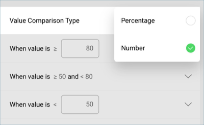
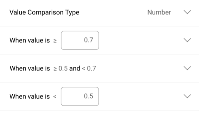
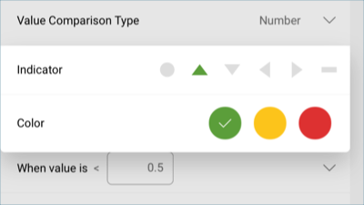
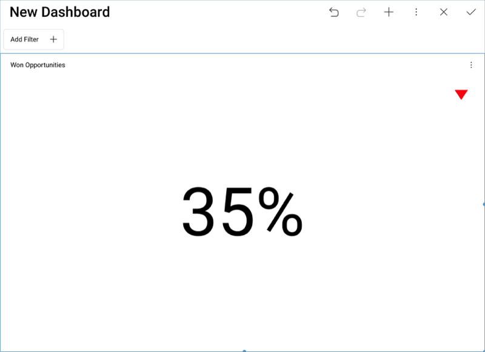

## Applying Formatting to the First Visualization 

The raw data that you drag and drop into the data editor placeholders
will not be formatted by default; you will need to modify each field you
have dragged individually.

### Formatting Opportunities as Percentages and Removing Fraction Digits

In the sample dashboard, the won opportunity figure is represented as a
percentage. In order to apply this formatting:

1.  Select **Won Opportunities** in the Value placeholder of the data
    editor.

2.  In the Formatting menu:
    
    
    
    1.  Change the **Type** to **Percent**.
    
    2.  Change the **Fraction Digits** to **0**

Then, select **Update Field**.

### Adding the Red Indicator

In the sample dashboard, there is a red arrow indicator in the **Won
Opportunities** visualization which is meant to represent that there has
been a decrease in the amount of won opportunities. This marker is
created through the [band configurations](~/en/data-visualizations/gauge-views.html#bands-configuration) in the gauge's
settings.

In order to configure them:

1.  Go to the **Settings** tab in the Visualizations Editor.
    
    

2.  In the "Sales Dashboard" spreadsheet, "Won Opportunities" equals
    0.35 as the value, even though the visualization is expressed as a
    percentage. Therefore, scroll down to **Value Comparison Type** and
    set it to "Number".
    
    

3.  **Set your bounds**. In this case, the bounds are within 0.7 and
    0.5.
    
    

4.  Select each band and **select both the color and the indicator**. By
    default, the highest value will be set to green and the lowest to
    red.
    
    

Once you have finished editing the visualization, select the **tick
button** in the top right-hand corner to return to the dashboard editor.

>[!NOTE]
>You can resize any of your visualizations by selecting the visualization and then dragging its corners downwards or to the side.

<a href="sales-selecting-data-visualization.md" class="previous">&laquo; Previous Step</a>
<a href="sales-applying-theme.md" class="next">Next Step &raquo;</a>
