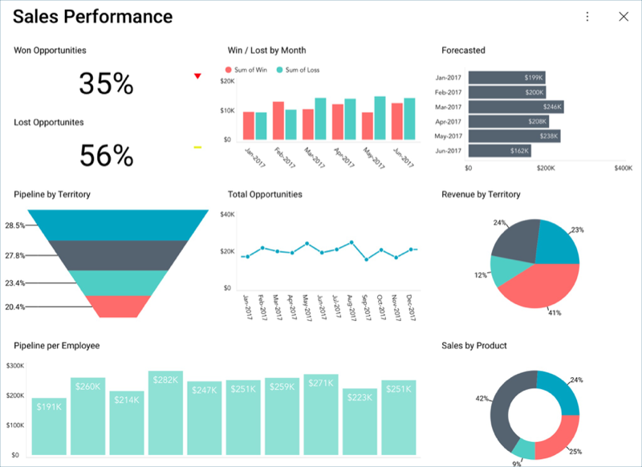

## Sales Dashboard Tutorial 

In this tutorial, you will see how the "Sales Performance" dashboard
displayed below was created using a sample spreadsheet with similar
data.

### What's in this Dashboard?

This dashboard contains information on a sample company's:

  - Current Sales performance across teams and territories

  - Under-achieving and over-performing product lines

  - Win/loss metrics

### Sample Datasheet

You can download the sample datasheet
[here](http://download.infragistics.com/reportplus/help/samples/Reveal_Dashboard_Tutorials.xlsx).
All other dashboards [in these tutorials](dashboard-tutorials.md) will use
the same sample spreadsheet.

>[!NOTE]
>Excel files as local files are not supported in this release. In order to follow these tutorials, make sure you upload the file to one of the
[supported cloud services](data-sources.md).

### Steps Overview

1.  [Creating the Dashboard and Adding a Data Source](sales-starting-creation-process.md)

2.  [Creating the First Visualization](sales-selecting-data-visualization.md)

3.  [Applying Formatting to the First Visualization](sales-applying-formatting-visualization.md)

4.  [Applying a Theme to the Dashboard](sales-applying-theme.md)

5.  [Adding the other Visualizations](sales-adding-other-visualizations.md)
    [Win/Lost by Month](sales-adding-other-visualizations.html#win-lost-by-month),
    [Forecasted](sales-adding-other-visualizations#forecasted), [Lost Opportunities](sales-adding-other-visualizations.html#lost-opportunities),
    [Pipeline by Territory](sales-adding-other-visualizations.html#pipeline-by-territory),
    [Total Opportunities](sales-adding-other-visualizations.html#total-opportunities),
    [Revenue by Territory](sales-adding-other-visualizations.html#revenue-by-territory),
    [Pipeline per Employee](sales-adding-other-visualizations.html#pipeline-per-employee),
    [Sales by Product](sales-adding-other-visualizations.html#sales-by-product))

6.  [Saving your Dashboard](sales-saving-dashboard.md)

<a href="sales-starting-creation-process.md" class="next">Get Started &raquo;</a>