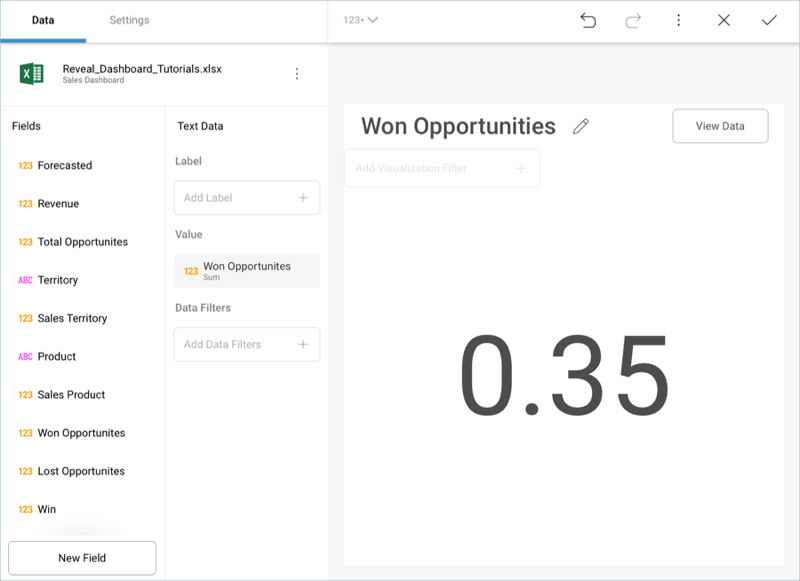

## Creating the First Visualization

Let's focus on creating the "Won Opportunities" visualization in the
[sample dashboard](getting-started.md) presented at the beginning
of this tutorial. The visualization displays a [Text Gauge](~/en/data-visualizations/visualization-types/gauge-charts.html#text-gauge).

First, **open the visualizations picker** by selecting the grid icon in
the top bar.

**Change your visualization** to "Text Gauge".

Then, **drag and drop** the **Won Opportunities** field into the Value
placeholder of the data editor.

Lastly, **change the visualization's title** to "Won Opportunities" by
selecting the pencil next to the "Sales Dashboard" title.

Your visualization should look like the following one:

<a href="creating-the-dashboard.md" class="previous">&laquo; Previous Step</a>
<a href="applying-formatting-visualization.md" class="next">Next Step &raquo;</a>
