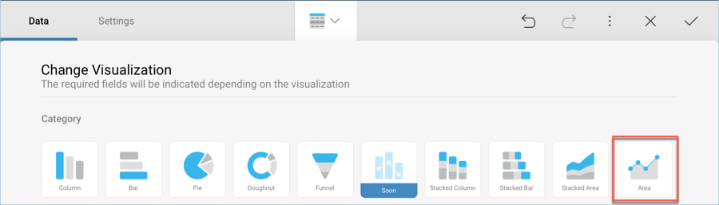
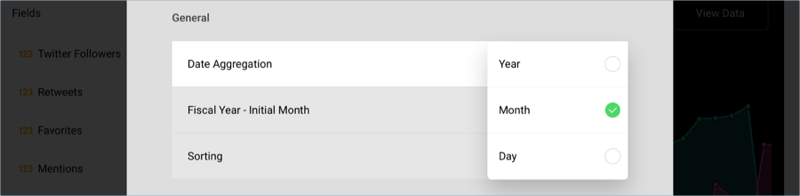

## Adding the Other Visualizations 

All the remaining visualizations in the dashboards will use the same
[sample spreadsheet](http://download.infragistics.com/reportplus/help/samples/Reveal_Dashboard_Tutorials.xlsx).

NOTE

If you want to [change your data source](~/en/datasources/changing-data-source-visualization.md), you will need to select the
**overflow button** next to the data source name or [create a new data source](~/en/datasources/creating-new-datasource.md) instead. You can also
[duplicate](~/en/general/overview.html#view-edit-mode) visualizations to speed up the
creation process.

This section will cover the following visualizations:

<table>
<colgroup>
<col style="width: 33%" />
<col style="width: 33%" />
<col style="width: 33%" />
</colgroup>
<tbody>
<tr class="odd">
<td>
 

<a href="#followers">Followers</a> 

</td>
<td>
 

<a href="#ytd-facebook-followers">YTD Facebook Followers</a> 

</td>
<td>
 

<a href="#monthly-facebook-likes">Monthly Facebook Likes</a> 

</td>
</tr>
<tr class="even">
<td>
 

<a href="#retweets-favorites">Retweets &amp; Favorites</a> 

</td>
<td>
 

<a href="#facebook-reach-impressions">Facebook Reach vs. Impressions</a> 

</td>
<td>
 

<a href="#monthly-twitter-mentions">Monthly Twitter Mentions</a> 

</td>
</tr>
</tbody>
</table>

### Followers

The Followers visualization displays the amount of followers broken down
by social media channel in a [column chart](~/en/visualization-tutorials/simple-charts.md). In
order to create it:

1.  Select the + button in the right corner of your dashboard. In the
    New Visualization dialog, select the
    **Reveal\_Dashboard\_Tutorials** spreadsheet in the **Data in
    Dashboard** section. Make sure the **Social Dashboard** option is
    selected, and then press **Load Data**.
    
    

2.  **Open the visualizations picker** by selecting the grid icon in the
    top bar, and select the "Column" chart.
    
    

3.  In the Data Editor, drag and drop the **Date** field into Label, and
    the **Facebook Followers by Year** and **Twitter Followers by Year**
    fields into Values.
    
    

4.  By default, both the Facebook and Twitter followers will be
    expressed with two fraction digits. In order to change this,
    **select the fields in the data editor**, and, under **Formatting**
    change the **Fraction Digits** to **0** for both fields.
    
    

5.  In the sample Followers visualization, dates are displayed as
    months. Select the **Date** field in Label, and set the **Date
    Aggregation** to **Month**. Then, select **Update Field**.
    
    

6.  Connect your visualization to the existing dashboard filter by
    selecting **Connect** under **Date Filter**. You can find this menu
    above "Social Dashboard".
    
    

7.  **Change the title of your visualization** to "Followers" **by
    selecting the pencil icon** next to "Social Dashboard".

Once you are done, go back to the Dashboard Editor by selecting the
**tick icon** in the top right-hand corner.

### YTD Facebook Followers

The YTD Facebook Followers visualization displays the amount of
followers for that social media channel in a [text gauge](~/en/visualization-tutorials/gauge-views.html#createtextgauge). In order to create it:

1.  Select the + button in the right corner of your dashboard. In the
    New Visualization dialog, select the
    **Reveal\_Dashboard\_Tutorials** spreadsheet in the **Data in
    Dashboard** section. Make sure the **Social Dashboard** option is
    selected, and then press **Load Data**.
    
    

2.  **Open the visualizations picker** by selecting the grid icon in the
    top bar, and select the "Text" gauge.
    
    

3.  In the Data Editor, drag and drop the **Facebook Followers by Year**
    field into the Value placeholder.
    
    

4.  Connect your visualization to the existing dashboard filter by
    selecting **Connect** under **Date Filter**. You can find this menu
    above "Social Dashboard".
    
    

5.  **Change the title of your visualization** to "YTD Facebook
    Followers" **by selecting the pencil icon** next to "Social
    Dashboard".

Once you are done, go back to the Dashboard Editor by selecting the
**tick icon** in the top right-hand corner.

### Monthly Facebook Likes

The Monthly Facebook Likes visualization displays the amount of Facebook
likes per month for the company in a [line chart](~/en/visualization-tutorials/simple-charts.md). In order to create it:

1.  Select the + button in the right corner of your dashboard. In the
    New Visualization dialog, select the
    **Reveal\_Dashboard\_Tutorials** spreadsheet in the **Data in
    Dashboard** section. Make sure the **Social Dashboard** option is
    selected, and then press **Load Data**.
    
    

2.  **Open the visualizations picker** by selecting the grid icon in the
    top bar, and select the "Line" chart.
    
    

3.  In the Data Editor, drag and drop the **Date** field into Label and
    **Likes** into the Values placeholder of the data editor.
    
    

4.  In the sample Monthly Facebook Likes visualization, dates are
    displayed as months. Select the **Date** field in Label, and set the
    **Date Aggregation** to **Month**. Then, select **Update Field**.
    
    

5.  By default, Likes will be expressed with two fraction digits. In
    order to change this, **select the fields in the data editor**, and,
    under **Formatting** change the **Fraction Digits** to **0** for
    both fields.
    
    

6.  To match the sample visualization's color, change the **Start
    Color** to the fourth one within the same **Settings** screen.
    
    

7.  Connect your visualization to the existing dashboard filter by
    selecting **Connect** under **Date Filter**. You can find this menu
    above "Social Dashboard".
    
    

8.  **Change the title of your visualization** to "Monthly Likes" **by
    selecting the pencil icon** next to "Social Dashboard".

Once you are done, go back to the Dashboard Editor by selecting the
**tick icon** in the top right-hand corner.

### Retweets & Favorites

The Retweets & Favorites visualization displays the amount of Twitter
retweets and favorited posts per month for the company in a [column chart](~/en/visualization-tutorials/simple-charts.md). In order to create it:

1.  Select the + button in the right corner of your dashboard. In the
    New Visualization dialog, select the
    **Reveal\_Dashboard\_Tutorials** spreadsheet in the **Data in
    Dashboard** section. Make sure the **Social Dashboard** option is
    selected, and then press **Load Data**.
    
    

2.  **Open the visualizations picker** by selecting the grid icon in the
    top bar, and select the "Column" chart.
    
    

3.  In the Data Editor, drag and drop the **Date** field into Label, and
    both **Retweets** and **Favorites** into the Values placeholder of
    the data editor.
    
    

4.  In the sample Retweets & Favorites visualization, dates are
    displayed as months. Select the **Date** field in Label, and set the
    **Date Aggregation** to **Month**. Then, select **Update Field**.
    
    

5.  By default, Retweets & Favorites will be expressed with two fraction
    digits. In order to change this, **select the fields in the data
    editor**, and, under **Formatting** change the **Fraction Digits**
    to **0** for both fields.
    
    

6.  To match the sample visualization's color, change the **Start
    Color** to the sixth one within the same **Settings** screen.
    
    

7.  Connect your visualization to the existing dashboard filter by
    selecting **Connect** under **Date Filter**. You can find this menu
    above "Social Dashboard".
    
    

8.  **Change the title of your visualization** to "Retweets & Favorites"
    **by selecting the pencil icon** next to "Social Dashboard".

Once you are done, go back to the Dashboard Editor by selecting the
**tick icon** in the top right-hand corner.

### Facebook Reach vs. Impressions

The Facebook Reach vs. Impressions visualization displays the amount of
reaches and impressions through Facebook for the company in an [area chart](~/en/visualization-tutorials/simple-charts.md). In order to create it:

1.  Select the + button in the right corner of your dashboard. In the
    New Visualization dialog, select the
    **Reveal\_Dashboard\_Tutorials** spreadsheet in the **Data in
    Dashboard** section. Make sure the **Social Dashboard** option is
    selected, and then press **Load Data**.
    
    

2.  **Open the visualizations picker** by selecting the grid icon in the
    top bar, and select the "Area" chart.
    
    

3.  In the Data Editor, drag and drop the **Date** field into Label, and
    both **Post Reach** and **Impressions** into the Values placeholder
    of the data editor.
    
    

4.  In the sample Facebook Reach vs. Impressions visualization, dates
    are displayed as months. Select the **Date** field in Label, and set
    the **Date Aggregation** to **Month**. Then, select **Update
    Field**.
    
    

5.  By default, Post Reach and Impressions will be expressed with two
    fraction digits. In order to change this, **select the fields in the
    data editor**, and, under **Formatting** change the **Fraction
    Digits** to **0** for both fields.
    
    

6.  Connect your visualization to the existing dashboard filter by
    selecting **Connect** under **Date Filter**. You can find this menu
    above "Social Dashboard".
    
    

7.  **Change the title of your visualization** to "Facebook Reach vs.
    Impressions" **by selecting the pencil icon** next to "Social
    Dashboard".

Once you are done, go back to the Dashboard Editor by selecting the
**tick icon** in the top right-hand corner.

### Monthly Twitter Mentions

The Monthly Twitter mentions visualization displauys the amount of
mentions through Twitter for the company in a [line chart](~/en/visualization-tutorials/simple-charts.md). In order to create it:

1.  Select the + button in the right corner of your dashboard. In the
    New Visualization dialog, select the
    **Reveal\_Dashboard\_Tutorials** spreadsheet in the **Data in
    Dashboard** section. Make sure the **Social Dashboard** option is
    selected, and then press **Load Data**.
    
    

2.  **Open the visualizations picker** by selecting the grid icon in the
    top bar, and select the "Line" chart.
    
    

3.  In the Data Editor, drag and drop the **Date** field into Label, and
    both **Mentions** into the Values placeholder of the data editor.
    
    

4.  In the sample Monthly Twitter Mentions visualization, dates are
    displayed as months. Select the **Date** field in Label, and set the
    **Date Aggregation** to **Month**. Then, select **Update Field**.
    
    

5.  By default, Mentions will be expressed with two fraction digits. In
    order to change this, **select the fields in the data editor**, and,
    under **Formatting** change the **Fraction Digits** to **0** for
    both fields.
    
    

6.  Connect your visualization to the existing dashboard filter by
    selecting **Connect** under **Date Filter**. You can find this menu
    above "Social Dashboard".
    
    

7.  **Change the title of your visualization** to "Monthly Twitter
    Mentions" **by selecting the pencil icon** next to "Social
    Dashboard".

Once you are done, go back to the Dashboard Editor by selecting the
**tick icon** in the top right-hand corner.

<a href="social-applying-theme.md" class="previous">&laquo; Previous Step</a>
<a href="social-saving-dashboard.md" class="next">Next Step &raquo;</a>