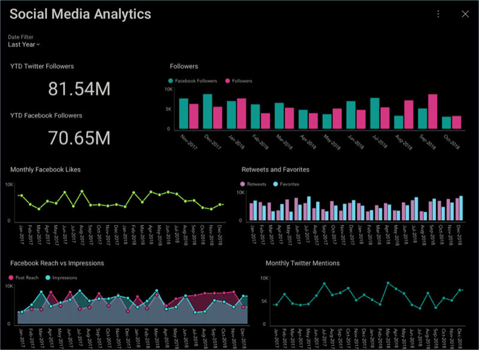

## Social Dashboard Tutorial

In this tutorial, you will see how the "Social Media Analytics"
dashboard displayed below was created using a sample spreadsheet with
similar data.

### What's in this Dashboard?

This dashboard contains information on a sample company's:

  - Followers broken down by social media platform

  - Likes, favorites and customer reaches

  - Mentions and retweets

### Sample Data

You can download the sample datasheet
[here](http://download.infragistics.com/reportplus/help/samples/Reveal_Dashboard_Tutorials.xlsx).
All other dashboards [in these tutorials](~/en/dashboard-tutorials/overview.md) will use
the same sample spreadsheet.

>[!NOTE]
Excel files as local files are not supported in this release. In order
to follow these tutorials, make sure you upload the file to one of the
[supported cloud services](~/en/datasources/overview.md).

### Steps Overview

1.  [Creating the Dashboard and Adding a Data Source](creating-the-dashboard.md)

2.  [Creating the First Visualization](selecting-data-visualization.md)

3.  [Creating the Dashboard Filter and Connecting your Visualization](creating-dashboard-filter-connecting-visualization.md)

4.  [Applying a Theme to the Dashboard](applying-theme.md)

5.  [Adding the other visualizations](adding-other-visualizations.md)
    ([Followers](adding-other-visualizations.html#followers), [YTD Facebook Followers](adding-other-visualizations#ytd-facebook-followers),
    [Monthly Facebook Likes](adding-other-visualizations.html#monthly-facebook-likes),
    [Retweets & Favorites](adding-other-visualizations.html#retweets-favorites),
    [Facebook Reach vs. Impressions](adding-other-visualizations.html#facebook-reach-impressions),
    [Monthly Twitter Mentions](adding-other-visualizations.html#monthly-twitter-mentions))

6.  [Saving your Dashboard](saving-dashboard.md)

[Get Started »](creating-the-dashboard.md)
