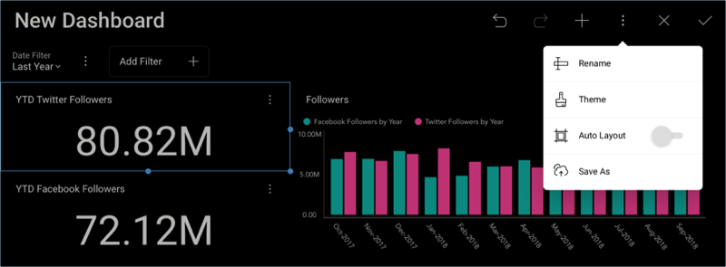

# Saving your Dashboard 

After creating your dashboard, you should save your progress. Select the
**Save As** option in the overflow button from the top-right hand corner
of the dashboard editor.

You can save your dashboard in your personal space (*My Stuff*), or choose any of the workspace you have joined or created.

Select a name for your dashboard, and, when ready, click/tap **Save here**.

<a href="adding-other-visualizations.md" class="previous">&laquo; Previous Step</a>