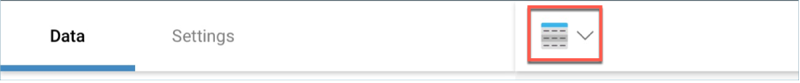
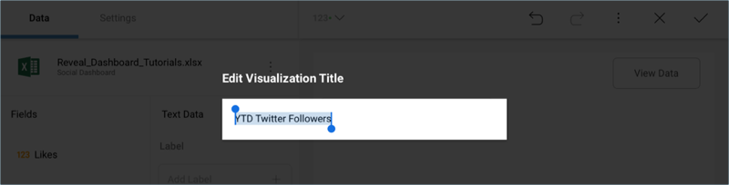

# Creating the First Visualization  

Let's focus on creating the "YTD Twitter Followers" visualization in the
[sample dashboard](getting-started.md) presented at the beginning
of this tutorial. The visualization displays a [Text Gauge](~/en/data-visualizations/visualization-types/gauge-charts.html#text-gauge).

First, **open the visualizations picker** by selecting the grid icon in
the top bar.

**Change your visualization** to "Text Gauge".

Then, **drag and drop** the **Twitter Followers by Year** field into the
Value placeholder of the data editor.

Lastly, **change the visualization's title** to "YTD Twitter Followers"
by selecting the pencil next to the "Social Dashboard" title.

Your visualization should look like the following one:

Once you are done, go back to the Dashboard Editor by selecting the
**tick icon** in the top right-hand corner.

<a href="creating-the-dashboard.md" class="previous">&laquo; Previous Step</a>
<a href="creating-dashboard-filter-connecting-visualization.md" class="next">Next Step &raquo;</a>
