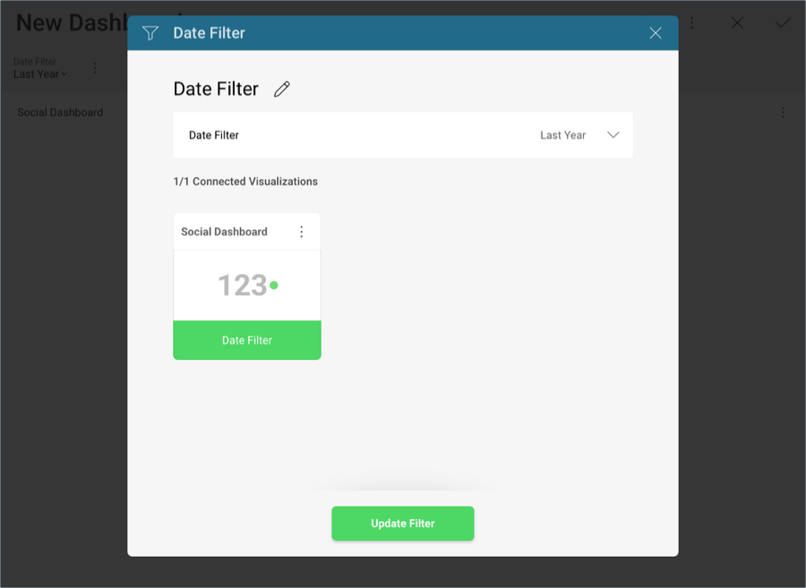
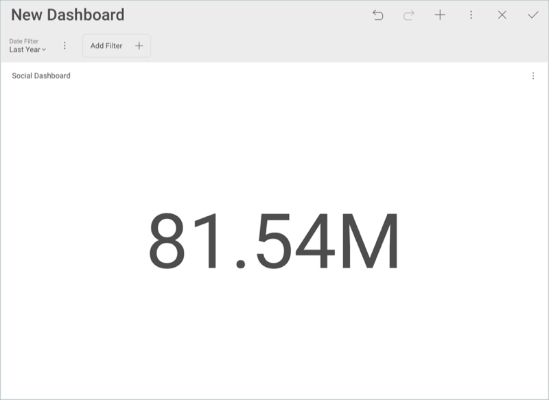

## Creating the Dashboard Filter and Connecting your Visualization 

The dashboard displayed [in the first page of this tutorial](social-dashboard-tutorial.md) is connected to a [date range dashboard filter](date-range-filter.md). These kinds of filters enable a
time-based scenario analysis. When connected to all visualizations, they
allow for users to dynamically filter their whole dashboard.

In order create the filter, you will need to:

1.  Select the **Add Filter** button under your dashbaord's name, and
    then **Add Date Filter**
    
    

2.  Under **Date Filter**, select **Last Year**.
    
    

Once the date filter has been created, you will need to connect it to
your existing visualization. In order to do so:

1.  Select the **Connect** button in the **YTD Twitter Followers**
    visualization. Reveal will attempt to connect the dashboard filter
    to a field in your visualization.
    
    
    
    If you select **Date Filter**, you will be able to edit the
    connection if necessary.
    
    

2.  Select **Update Binding**.

Your visualization will the look like the following one:

<a href="social-selecting-data-visualization.md" class="previous">&laquo; Previous Step</a>
<a href="social-applying-theme.md" class="next">Next Step &raquo;</a>