# Creating Dashboards

The dashboard creation experience in Reveal includes:

1.  [Accessing the Dashboard creation menu](#access-dashboard-creation-menu).

2.  [Adding a Data Source](#add-data-source).

3.  [Changing the Visualization](#modify-visualization) *(optional*).

4.  [Saving the Dashboard](#save-dashboard).

## Access the Dashboard Creation Menu

You can create a dashboard by clicking/tapping on the **+ Dashboard** or **Create Dashboard** *(My Analytics)* blue button.

   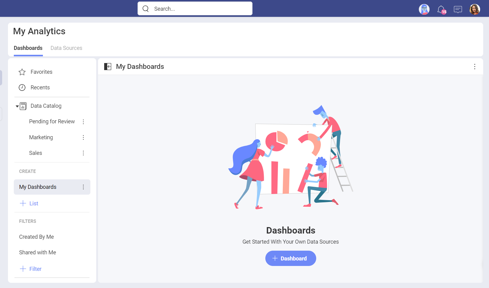

This will prompt the *New Visualization* dialog. Proceed to create a visualization using a data source.

## Add a Data Source

If your data source is not in the data sources list, select
the **+ Data Source** button in the top right-hand corner. A new dialog will appear, displaying all data source categories and the available data sources. Feel free to scroll up and down until you see the data source you need.

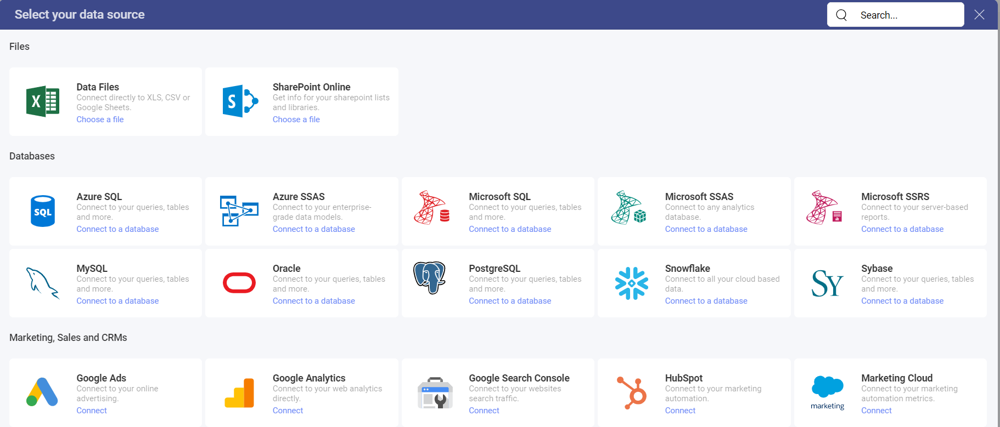

If your data source is a spreadsheet in a content manager, you will be able to select, for example, the specific sheet that you want to use in your visualization.

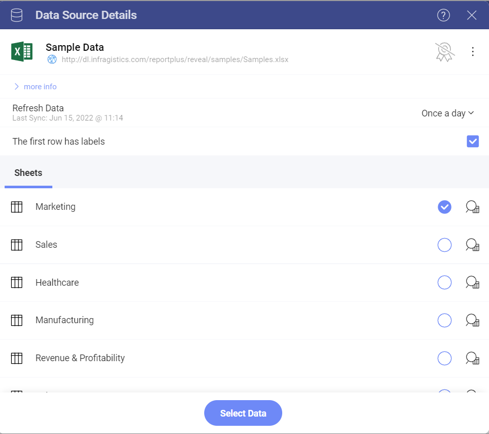

### Available Content

With Reveal, you can add many content sources, including
[Dropbox](~/en/datasources/supported-data-sources/Dropbox.md), [OneDrive](~/en/datasources/supported-data-sources/OneDrive.md), [Box](~/en/datasources/supported-data-sources/Box.md) and [Google Drive](~/en/datasources/supported-data-sources/Google-Drive.md), which will allow you to browse any folders, files
or spreadsheets available in them.

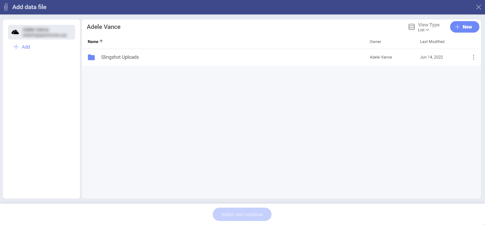

In addition, you can also add [SharePoint](~/en/datasources/supported-data-sources/SharePoint.md) data sources,
which means the ability to access any lists or libraries.

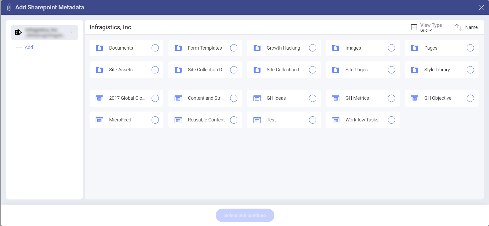

## Changing your Visualization

Once your data source has been added, you will be taken to the *Visualization Editor*. By default, the Column visualization will be selected.

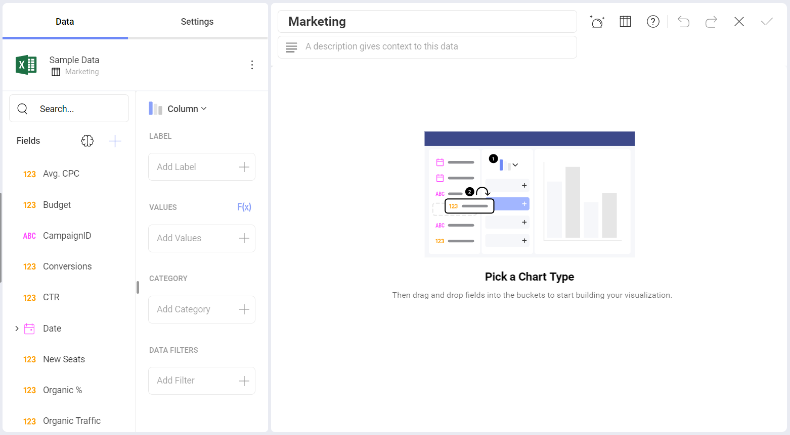

Reveal provides several options to customize the way your information is visualized. You can access the options by selecting the **grid icon** in the top bar.

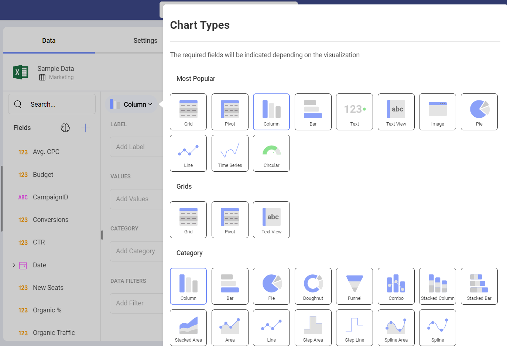

Add labels and values to your visualization and preview them in the right-hand pane. If necessary, you can change your visualization's settings or add filters to it.

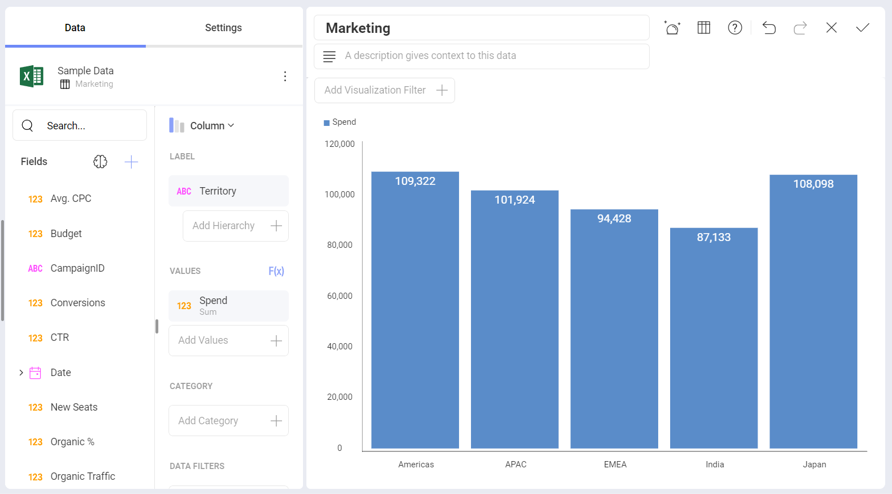

Once you have modified the visualization, you will be taken back to the **Dashboard Editor**. You will see **Undo**, **Redo**, and the **+Visualization** split button on the top right-hand corner. Next to these buttons you will also find the overflow menu of the dashboard where you can choose to change the dashboard theme, refresh the dashboard,paste it, switch on/off **Auto Layout**, **export** or **save** the dashboard.

You can also use the overflow menu in the top right corner of the visualizations to rename, edit, **copy**, **duplicate** or delete them.

>[!NOTE]
>The **difference between copying and duplicating** a visualization is that duplicating works only inside the same dashboard and the copy option allows you to put the visualization in the same or a different dashboard.

After copying a visualization, find the *Paste* option inside the overflow menu of the dashboard you want to paste the visualization in.

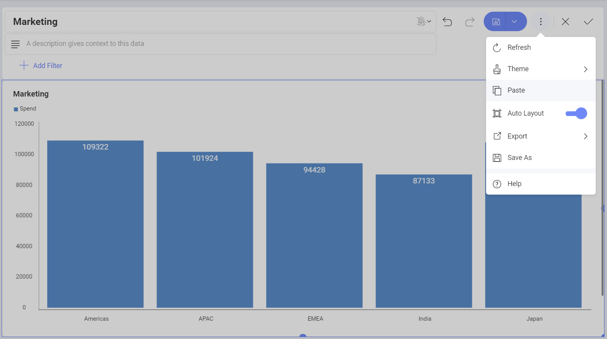

## Applying a Theme

Once you have continued to your dashboard, you can select the overflow menu ⇒ *Theme* and switch between *Mountain Theme*, *Ocean Theme* and *Aurora Theme* as shown below.

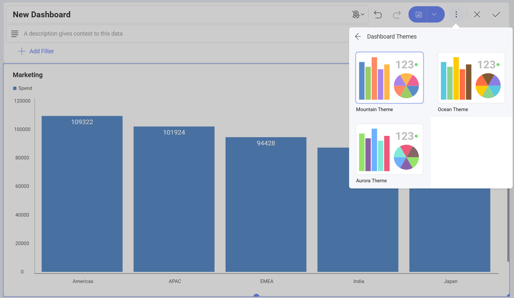

## Save the Dashboard

Once your dashboard is ready, save it by either selecting the **tick icon** in the top right-hand corner or by accessing the **Save As** option in the overflow menu.

You can save your dashboard under **My Analytics** > **My Dashboards** or choose any of the workspaces you have joined or created.

Select a name for your dashboard, and, when ready, click/tap on **Save here**.

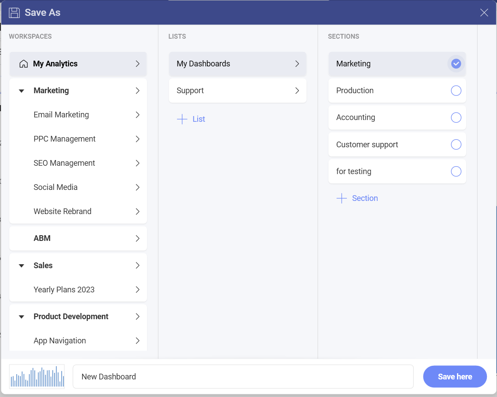

To better organize your space you can create lists and sections by clicking on the *+List* and *+Section* buttons at the top right-hand corner, while in the *Save as* menu.
