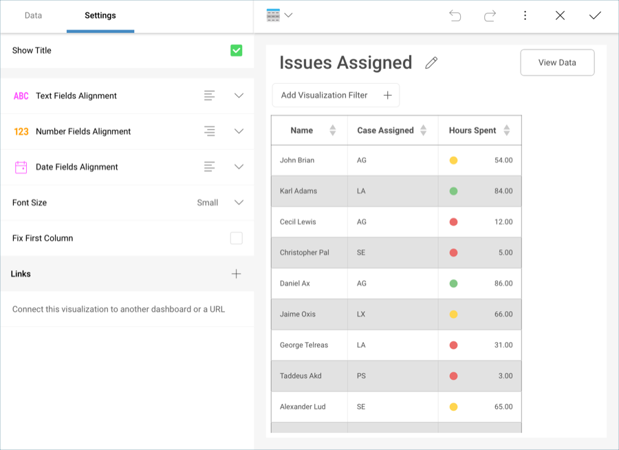

## Linking Dashboards

Reveal supports dashboard linking, which is triggered when a
visualization’s grid row or chart column/bar is selected. This features
takes the concept of drill down navigation to a new level; for instance,
if you want to provide more details on the information displayed in a
visualization, you can use a whole new dashboard to do so. This can be
very useful to establish top-down analysis paths, where you go from a
high level overview of the reality of a business to more detailed views
with the specifics. One example is the implementation of a Company 360,
which provides key performance indicators for each area. Once you select
on any visualizations to maximize it, Reveal opens another dashboard
with more details for all projects.

It’s possible to associate actions to specific events. **Opening another
dashboard** is one of two supported actions. The second one is **opening
a URL**. This enables extensibility scenarios such as interacting with
third-party web applications as part of the dashboard navigation. You
can add links through the **Settings** section of the Visualizations
Editor, under **Links**.

### Events

The control in the **Links** section selects the event or trigger that will be used to fire the action. Possible options are:

  - **Value is Selected**: The event is triggered whenever a user
    selects a row in a grid view. In other visualizations, such as
    charts, it is triggered whenever you select a data item of the
    chart. This might include columns, bar, pie slices, or other
    elements that depend on the chart type used in your visualization.

  - **Visualization is Maximized**. This event is triggered whenever a
    visualization is maximized in the dashboard view.

### Actions

You can have more than one action per event. The possible actions when
an event is fired are:

  - Open **Dashboard**. Enabling will open another dashboard when the
    event takes place. If the selected dashboard happens to have
    dashboard filters, you will need to configure how to populate them
    for each dashboard filter. You will need to configure two
    parameters:

      - The **Dashboard** that will be opened once the event is
        triggered.

      - The **Link Name**, which is the title the users will see if
        they select the grid row or chart element.

If your target dashboard has existing Dashboard Filters, you can also
configure how to get the required value from one of the dashboard
filters in your current dashboard.

  - Open **URL**. Enabling this action will open the configured URL in
    your device’s browser. There are two parameters that you need to
    define:

      - The **URL** the visualization will point to, which users will be
        redirected to once a chart element or table row is selected.

      - The **Link Name**, which is the title the users will see if
        they select the grid row or chart element.

For URLs, you can also include **Variables**, which will dynamically
construct the URL the user will be linked to based on the values in your
visualization fields. For example, let’s take a look at the following
visualization link:

The URL has been set to <http://www.countryreports.org/travel>, and the
selected **Variable** will be **Countries**. Therefore, users who select
the **View Country Reports** link in the visualization will be directed
to:

    http://www.countryreports.org/country/[Country Name].htm

Where `[Country Name]` will vary depending on the values in the **Countries** field.

