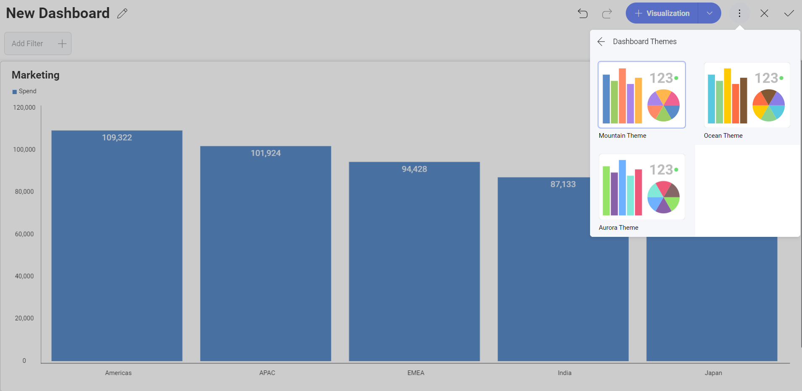
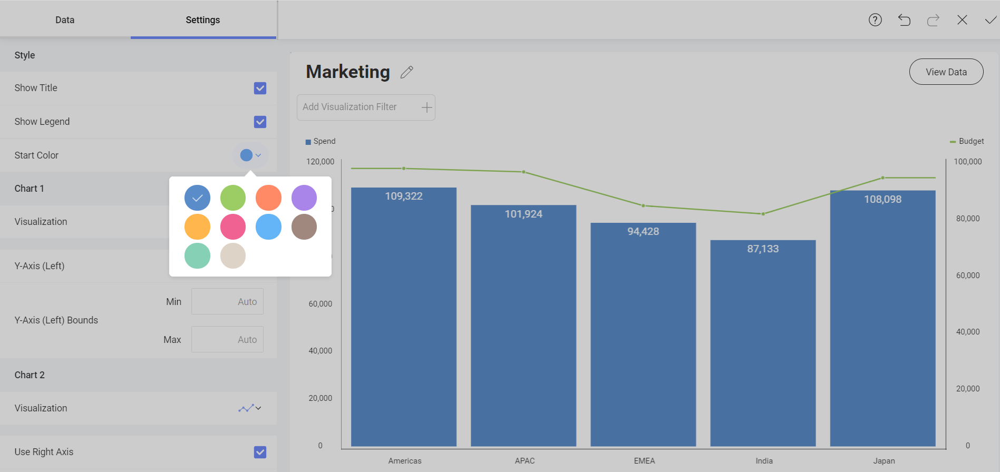

# Styling Dashboards

Reveal makes dashboards styling as easy as choosing a color palette.

In order to change dashboard style settings, switch to *Dashboard Edit*
mode and select *Theme* from the overflow menu. Here you can choose between *Mountain Theme*, *Ocean Theme* and *Aurora Theme*. 

In addition, you can also change the Start Color for chart-based visualizations. The options available will vary according to the dashboard theme you select.

