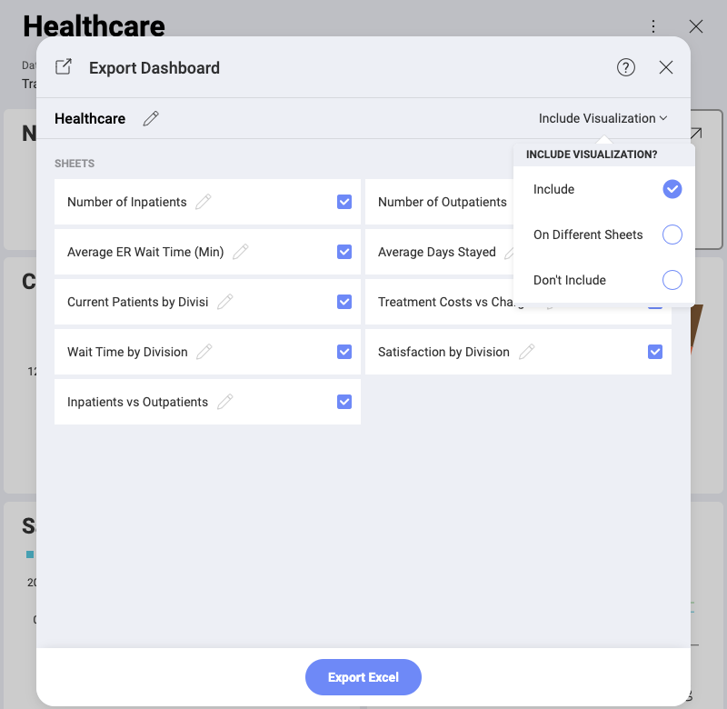

## Exporting Excel 

Reveal allows you to export the data used for your dashboards to the
**Excel format**. Data for every visualization in your dashboard will be
on a separate sheet in the excel file.

>[!NOTE]
> **Export to Excel limitations**. You can export to Excel only **dashboards using table data**, i.e. data sources organizing information into rows and columns (spreadsheets, CSV files, databases). If your dashboard uses images, html, etc. to visualize data, Reveal will not be able to export the information to the Excel format.

To export a dashboard as an Excel spreadsheet, go to *Dashboard View*
mode and select: the overflow menu ⇒ *Export* ⇒ *Excel*. The following
dialog will open:

This *Export Dashboard* dialog allows you to **select** and **rename**
the data sheets to be included in your Excel file. Every data sheet
contains the data for a particular visualization in the dashboard you
export. You can also **include the visualizations** in your Excel
document.

The *Include Visualization* setting gives you the following options:

  - **Include** - include a dashboard's visualizations on the same sheet
    as the data for this visualization;

  - **On Different Sheets** - include visualizations and their
    corresponding data on separate sheets;

  - **Don't Include** - include only the visualizations' data in the
    Excel sheets.

>[!NOTE]
> **Supported visualizations**. The following chart visualizations can be **directly included** in the Excel sheets: Column, Line, Bar, Area, StackedColumn, StackedArea, StackedBar, Pie, Doughnut, Funnel, Composite, Scatter, Bubble, Sparklines. 

> The following visualizations are **converted** to similar types before being included in the Excel sheet: Spline and StepLine ⇒ Line; SplineArea and StepArea ⇒ Area.
