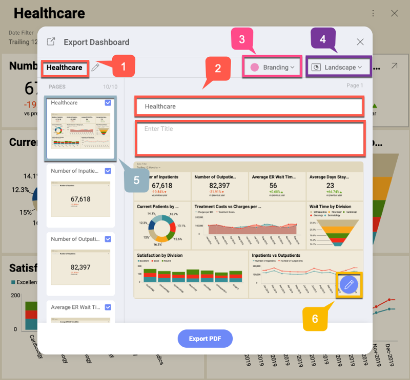

## Exporting Dashboards as PDF Documents

Reveal allows you to export your dashboard as a PDF document. Every
visualization that is part of this dashboard will be displayed on a
separate page of the document.

To export a dashboard as a PDF document, go to dashboard *View mode* and
select: the overflow menu ⇒ *Export* ⇒ *PDF*. The *Export Dashboard*
dialog will open, allowing you to edit your document and annotate
specific pages, so that you can tailor it to your needs.

### Export Settings

In the *Export Dashboard* dialog you can manage the following settings:

1.  Change the **main title** of your PDF document. The default title is
    your dashboard's title.

2.  Change the **page's title** and add a subtitle in the *Enter Title*
    text box (the second box). The default slide's title is the title of
    the visualization displayed on the page.

3.  Manage **Branding** settings options allows you to choose:

    1.  *Author*'s and their *Company*'s name - displayed in the header
        panel of the document's pages;

    2.  company's *logo* displayed in the footer and *color* (the main
        color of the pdf document) - here you can choose one of the
        following options:

          - **Reveal**

          - **User's organization/team** - your organization and all of
            your teams having their branding (logo and color) set up are
            displayed as options. If you want to know how to
            access/change your team's branding settings, please read the
            [Managing Teams](Managing-Your-Team.md) topic.

          - **Custom** - select a color and upload a *logo* image of your choice.

            >[!NOTE] **Requirements for logo images**. The image you upload for a logo must be no bigger than **5 MB** and one of the following formats: jpg, jpeg, png, gif.

4.  Choose between *Landscape* and *Portrait* **document orientation**.

5.  You can **manage your document pages** by selecting a page from the list to modify its title, annotate or delete it (by removing the tick icon in the upper right corner).

6.  **Annotate** the selected page by clicking/tapping the *pencil* icon. For more information about **annotation settings**, please refer to [Annotating images](images.html#annotating) in the *Exporting Dashboards as Images* topic.
