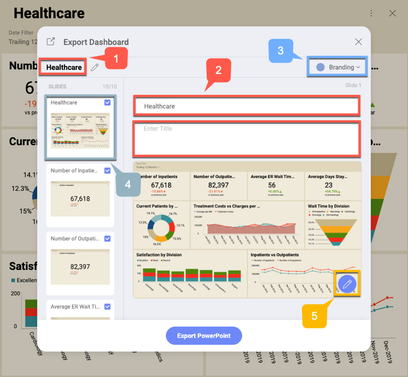

## Exporting Dashboards as PowerPoint Presentations

Reveal allows you to export your dashboard as a PowerPoint presentation.
Every visualization that is part of this dashboard will be displayed on
a separate slide of the presentation.

All the elements of the presentation are editable so that you can tailor
it to your needs.

To export a dashboard as a PowerPoint presentation, go to dashboard
*View mode* and select: the overflow menu ⇒ *Export* ⇒ *PowerPoint*. The
*Export Dashboard* dialog will open, allowing you to set up your
presentation and annotate specific slides.

### Export Settings

In the *Export Dashboard* dialog you can manage the following settings:

1.  Change the **main title** of your PowerPoint presentation. The
    default title is your dashboard's title.

2.  Change the **slide's title** and add a subtitle in the *Enter Title*
    text box (the second box). The default slide's title is the title of
    the visualization displayed on the slide.

3.  Manage **Branding** settings options allows you to choose:

    1.  *Author*'s and their *Company*'s name - displayed in the header
        panel of the slide;

    2.  company's *logo* displayed in the footer and *color* (the main
        color of the PowerPoint presentation) - here you can choose one
        of the following options:

          - **Reveal**

          - **User's organization/team** - your organization and all of
            your teams having their branding (logo and color) set up are
            displayed as options. If you want to know how to
            access/change your team's branding settings, please read the
            [Managing Teams](Managing-Your-Team.md) topic.

          - **Custom** - select a color and upload a *logo* image of
            your choice.

            >[!NOTE]**Requirements for logo images**.The image you upload for a logo must be no bigger than **5
            MB** and one of the following formats: jpg, jpeg, png, gif.

4.  You can **manage your PowerPoint slides** by selecting a slide from
    the list to modify its title, annotate or delete it (by removing the
    tick icon in the upper right corner).

5.  **Annotate** the selected slide by clicking/tapping the *pencil*
    icon. For more information about **annotation settings**, please
    refer to [Annotating images](images.html#annotating) in the *Exporting Dashboards as Images* topic.
