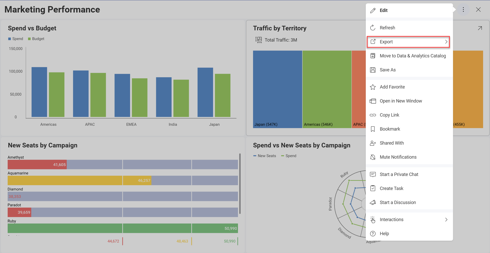
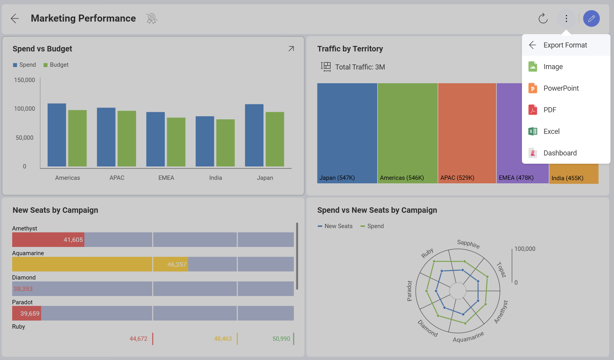
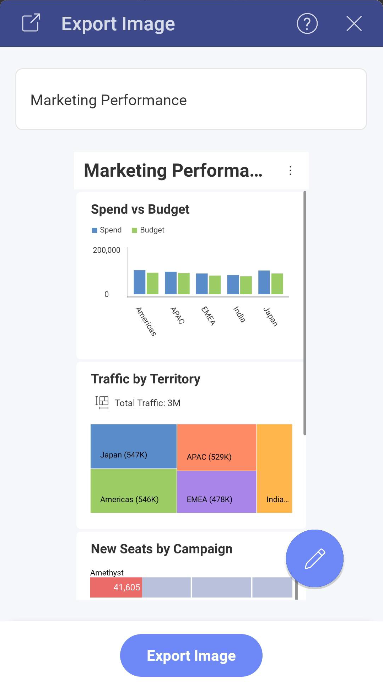

# Export Dashboards

The information displayed in dashboards will change over time as the
data changes in the data source, but there will be scenarios where you
can benefit from sharing a snapshot of the data at that specific moment
in time. For instance, to highlight an unexpected value that may provide
some business insight and requires attention right away.

In order to **access the export feature**, select the overflow button in
the top right-hand corner and click/tap *Export*.

## Export Format

You can easily export dashboards by using the available Export options.

  - [**Export Image**](export-as-images.md) - export a screen capture of the entire
    dashboard or individual visualizations.

  - [**Export PowerPoint**](export-as-powerpoint-presentation.md) - export your
    dashboard as a PowerPoint presentation.

  - [**Export PDF**](export-as-pdf-document.md) - export your dashboard as a PDF
    document.

  - [**Export Excel**](export-as-excel-data-format.md) - you can export the data used for your dashboards to the **Excel format** and choose if you want to also export the visualization to your spreadsheet.

  - **Export Dashboard** - export the dashboard through email for Android and iOS, or as a file (.rdash) on your computer for both Desktop and Web.

## Exporting Images and Dashboards in Mobile Devices

When using Reveal on an Android or iOS mobile device, you can email,
print, or send the document to a third-party app. After you choose the
export format, the following action menu prompts you to choose your
saving/sharing preferences:

For image exports, you can find these same options in the **Export
Image** dialog before or after you annotate images:

