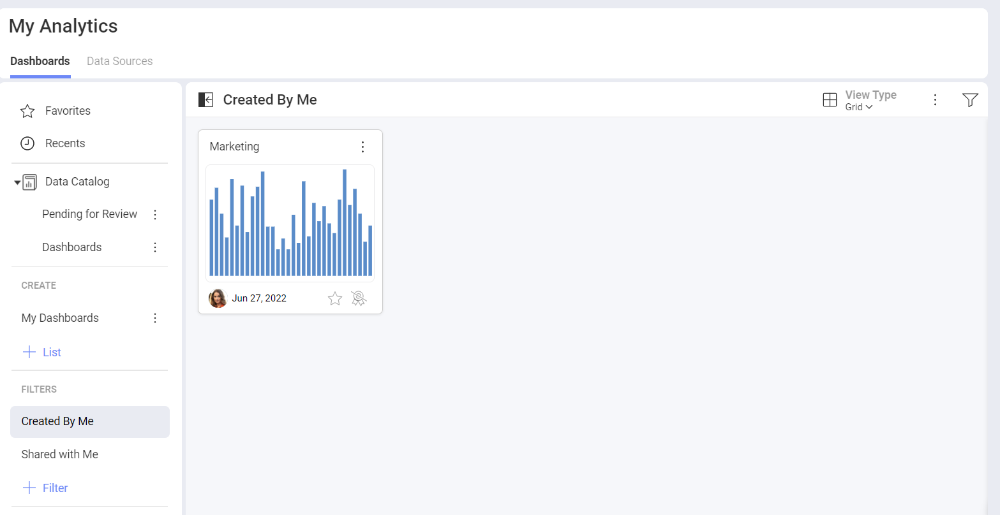
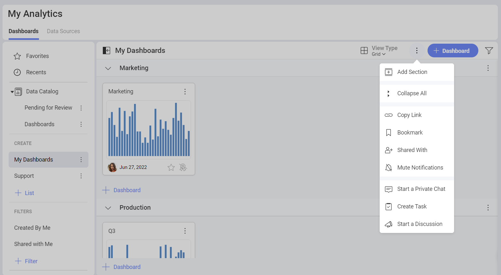
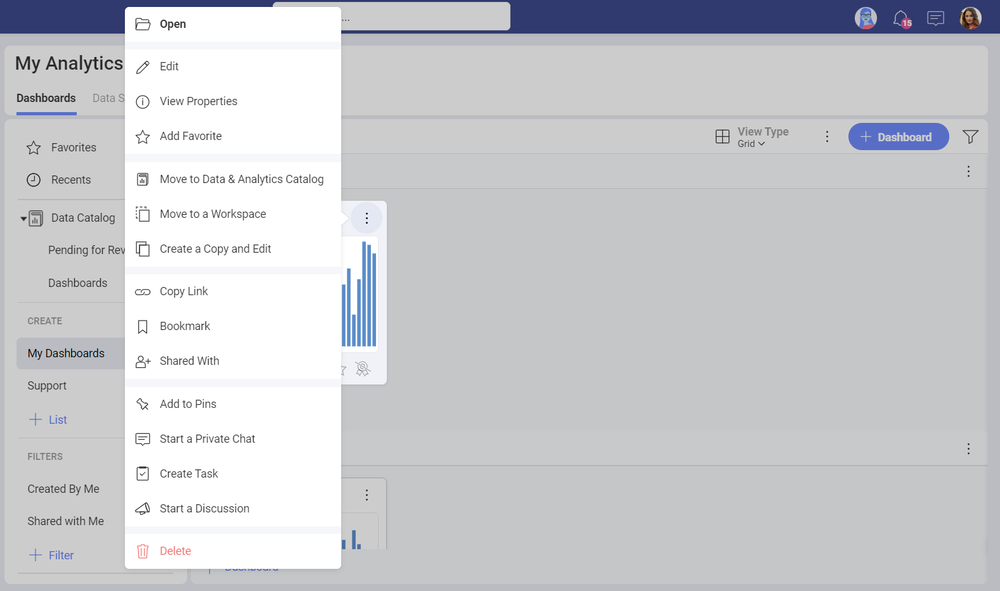
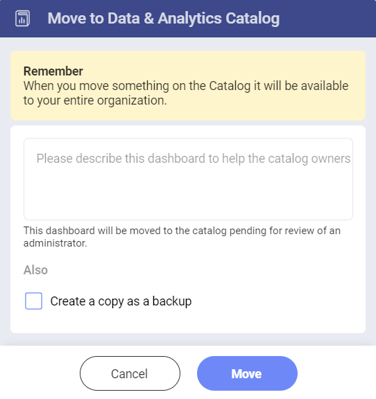

# Managing Your Dashboards

Whether you are trying to manage dashboards in your personal space or in
a Workspace, you will always be able to choose between: *dashboards created by you* or *dashboards shared with you*.

## Organizing your Dashboards

Reveal allows you to store and organize your dashboards in different *Lists* and *Sections*. Sections are simply divisions of a list. A list can have one or more sections.

You can create a section with the following steps:

1. Open the *overflow* menu of **My Dashboards**.
2. Choose **Add Section**. 
3. Name it and click/tap on **Create**.
4. Once you have named your section, you can start adding dashboards to it with the **+Dashboard** button.

You can create a list with the following steps:

1. Click/tap on on the **+List** button.
2. Give a name to the list.
3. Click/tap on **Create**.
4. Once you have named your list, you can start adding dashboards with the **+Dashboard** button.

## Moving or Copying Dashboards

Open the dashboard’s overflow menu actions and choose to copy the dashboard or move it between **sections** and/or **workspaces**.

You can also move the dashboard to the *Data and Analytics Catalog*. The administrator will decide if the dashboard can be moved in order for the entire organization to be able to see it.

