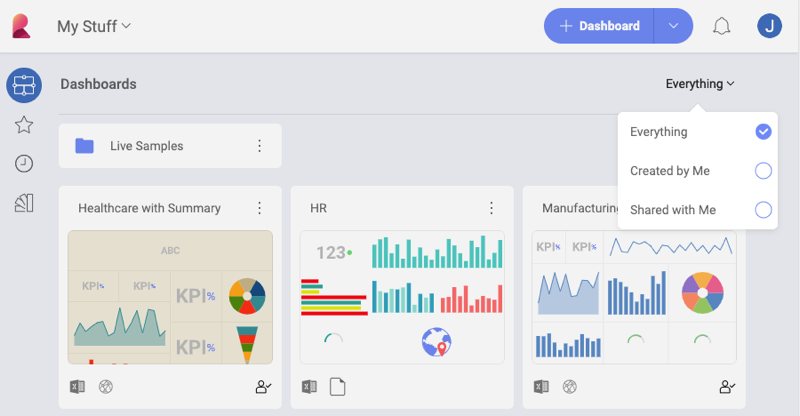
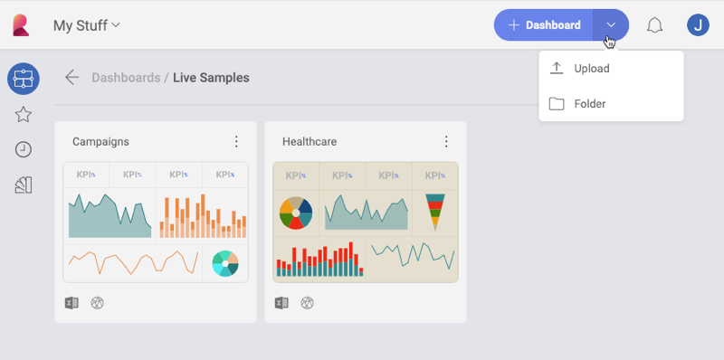
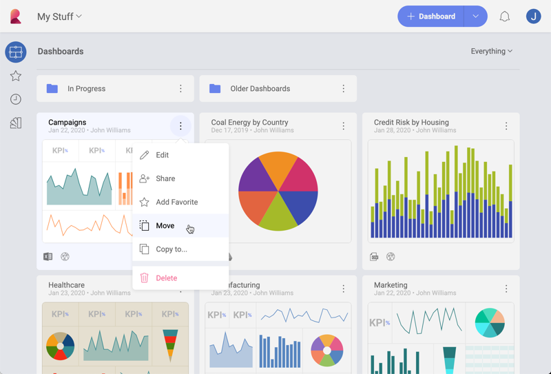

## Managing Your Dashboards

Whether you are trying to manage dashboards in your personal space or in
a Workspace, you will always be able to choose between: *dashboards created by you*, *dashboards shared with you*, or *everything*.

### Organizing your Dashboards

Reveal allows you to store and organize your dashboards in different
**folders** and **workspaces**. You can keep them at the one level, or you can nest them within each other in case you want to group them. In order
to create your first folder, select the arrow of the *+New* button (see below) and then choose **Folder**.

You will only need to name your folder and click/tap *+ Create* to start adding dashboards in your new folder.  

### Moving or Copying Dashboards

Open the dashboard’s overflow menu actions and choose to move or copy
the dashboard between **folders** and/or **workspaces**.

In the **Move Dashboard** and **Copy Dashboard To** screens, you can choose two types of destinations for your dashboards to move/copy to:
  - a workspace (on the left)
  - a folder (top center).

