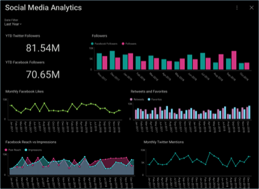

## Dashboards

Dashboards are a quick and simple way to display minimal information at
first sight. It is a data visualization composed of a collection of
visualizations which are laid out to communicate the status, metrics,
or performance of a business. Each visualization is meant to have
different pieces of related information, enabling users to make sense of their data.

### The Dashboard Creation Process

  - **Discover the KPI**: decide what you or your analysts want to show
    in your dashboard, and what it needs to revolve around.

  - **Plan the Dashboard**: how will you represent your information
    graphically? Will you use a [grid](~/en/data-visualizations/grid-view.md), a map
    [gauges](~/en/data-visualizations/gauge-views.md), [category charts](~/en/data-visualizations/category-charts.md), or even a
    [pyramid chart](https://www.infragistics.com/community/blogs/b/infragistics/posts/creating-a-population-pyramid-chart-using-stacked-bar-charts-with-Reveal)?
    Will you use any [filters](~/en/filters/overview.md)? If you want to see how to
    improve your data visualizations with any of the advanced Reveal features, [check out this blog post](https://www.infragistics.com/community/blogs/b/infragistics/posts/8-ways-to-improve-your-data-visualizations)\!

  - **Prepare the data** to be used in Reveal. Here is a quick overview
    of [how to work with spreadsheets](~/en/datasources/working-with-spreadsheets.md) in Reveal.

  - **Create the dashboard**: for a complete walkthrough, read [this topic](creating-dashboards.md).

  - **Review and iterate**: once your dashboard is ready, you can review
    it and make any changes you or your analysts deem necessary.

### Topics Overview

Within Reveal, you will be able to:

  - [Create Dashboards](creating-dashboards.md)

  - [Style your Dashboards](dashboard-styling.md)

  - [Link Dashboards to other Dashboards or to URLs](dashboard-linking.md)

  - [Share your Dashboards](sharing-dashboards/sharing-dashboards.md)

  - [Manage your existing Dashboards](managing-dashboards.md)

You can also import any [dashboards created with previous versions of ReportPlus](Uploading-Dashboards.md).

### Dashboard Tutorials

Learn the basics or refine your dashboard creation skills with tutorials
designed to get you started and headed in the right direction.

<table>
<colgroup>
<col style="width: 30%" />
<col style="width: 30%" />
</colgroup>
<tbody>
<tr class="odd">
<td>
 

<a href="~/en/dashboard-tutorials/finance-dashboard/overview.md">Finance Dashboard</a> 

</td>
<td>
 

<a href="~/en/dashboard-tutorials/manufacturing-dashboard/overview.md">Manufacturing Dashboard</a> 

</td>
</tr>
<tr class="even">
<td>
 

<a href="~/en/dashboard-tutorials/sales-dashboard/overview.md">Sales Dashboard</a> 

</td>
<td>
 

<a href="~/en/dashboard-tutorials/social-dashboard/overview.md">Social Dashboard</a> 

</td>
</tr>
</tbody>
</table>
