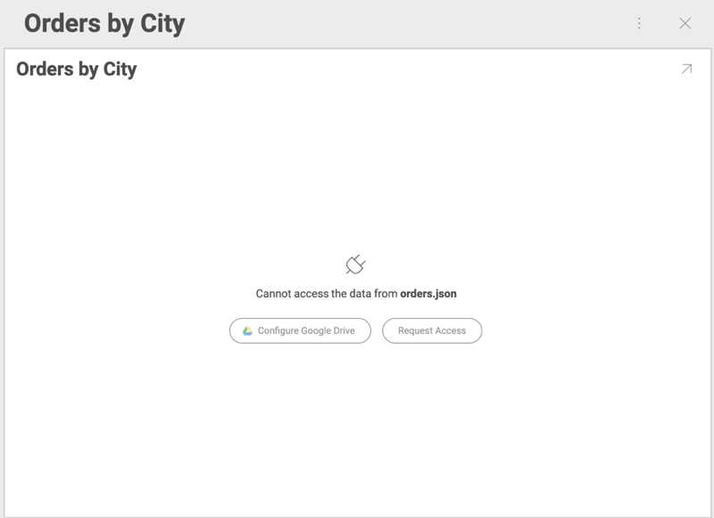

## Requesting Access to Shared Dashboards with Cloud Files

When trying to open а dashboard, which has been shared with you, you
might be unable to see its content due to one of the following reasons:

  - cloud file used as data source has been **deleted** from the cloud service;

  - the owner of the dashboard has **revoked the permissions** they had given you to the cloud file used as data source.

If the file has been **deleted**, Reveal will show you the following
message when you click the shared dashboard:

If your permissions to the file have been **revoked**, you will see:

### Granting Access to Data Source Files with Revoked Permissions

Click the *Request Access* button to notify the owner of the dashboard
about your denied access. They will also receive an email notification.

When **the owner** opens the notification (through the app or email message), they will see the following dialog, prompting them to update
the connection to the data source:

After the owner clicks *Update* they will see a message notifying them
whether the access has been successfully fixed.

### Alternative Solutions to Revoked Permissions Issue

You can always **contact the owner** personally to help you solve the
denied access issue.

There are two alternative solutions, depending on the scenarios for
revoked permissions:

  - The owner has revoked the permissions **through Reveal**.

    To grant access to the data source again, they need to click/tap the
    overflow button of the shared dashboard → select *Share* → *Allow
    Access*.

  - The owner has revoked the access to the file **through the cloud provider** or **through Reveal**.

    The owner can re-enable access without exiting Reveal. They need to:

    1.  Select *Dashboard Edit* mode of the shared dashboard.

    2.  Select *Check File Access* button in the overflow menu.

        

    3.  Select *Update* in the dialog that opens.

        The owner will see a message informing them whether the
        connections have been restored.

        If **access to the file could not be restored**, the file could
        have been deleted from the cloud.

    4. If **access to the file has been restored**, select the *tick icon* to save the change, otherwise, the access to the file will still be denied to other users. 