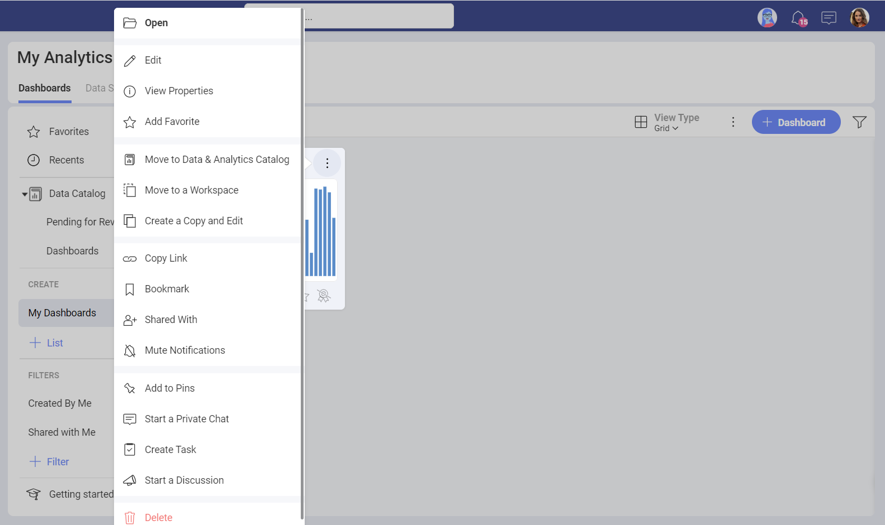
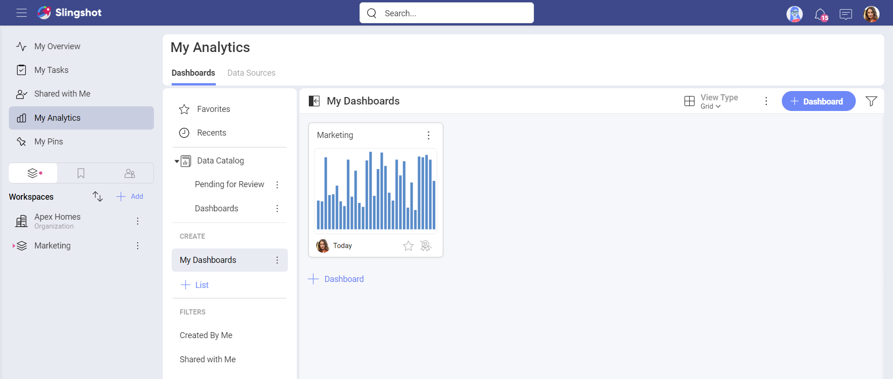
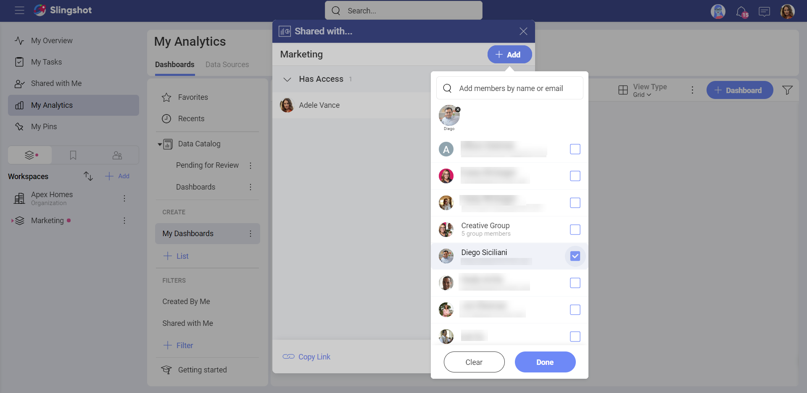
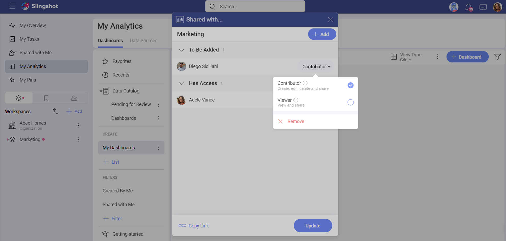
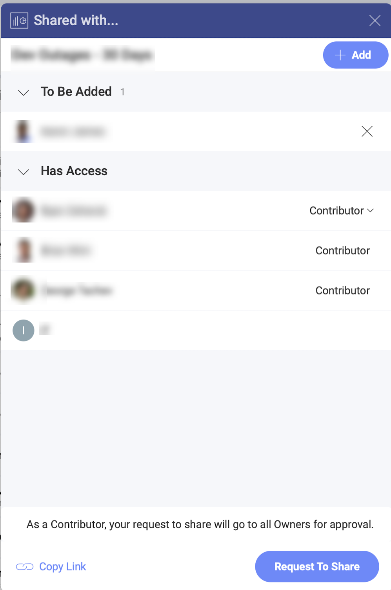

# Sharing Dashboards

Shared dashboards are ideal for cross-team collaboration. There are so
many possibilities when it comes to sharing in Reveal. 

Here you will find more information about the permission roles and the available sharing scenarios:

  - [sharing dashboards created by you with other users](#sharing-dashboards-users),

  - [sharing your workspace's dashboards with other users](#sharing-workspace-dashboard),

  - [sharing a dashboard with a whole workspace](#sharing-dashboard-with-workspace).

> [!NOTE]
> **Sharing Folders**. Rules for dashboards sharing in this article also apply to sharing folders.

## Sharing Your Own Dashboards with Other Users

To share a dashboard created by you with individual users you need to:

1.  Access the *Share dialog* - Open the overflow menu and choose **Shared With**.

  

  Once you have shared a folder with other people, the files will appear under the **Shared with Me** section in the left panel. Alternatively they can find the files when they open **My Analytics** and click/tap on **Shared with Me** that is under **Filters**.

  

2.  **Choose the users** you want to share the dashboard with - Enter the e-mail addresses or the names of the people you want to invite and click/tap on **Done**.

3.  After selecting the users, click/tap on **Update**. The dashboard will be shared automatically with the selected users if they are part of your [Organization](~/en/workspaces/overview.html#organization-workspace). Other users will be able to see the dashboard in the **Shared with Me** section after they have accepted the invitation.

  

**You can change the access level for users at any time when you are the owner of the dashboard** by accessing
the *Share* menu. You will see a list of all users you have shared the
dashboard with and their access level. You can change their access level
by selecting a new one from the dropdown menu next to their name.

**When you are the owner of the dashboard, you can also unshare it at any time** by accessing the
*Share* dialog and selecting **Remove** from the dropdown menu next to any
member's name.

In general, a user can have one of the following permissions:

  - **Owner** permissions - the user can create, edit, share and delete.

  - **Contributor** permissions - the user can create, edit, share, and delete. Keep in mind that the user cannot delete the item that was shared with them (Dashboard/Dashboard List).

   

  - **Viewer** permissions - the user can view a dashboard. They can also share it with another user after the approval of the owner.

## Sharing a Workspace's Dashboard with Other Users

Any member of a workspace can share the workspace's dashboards with other users. To do this, go to the *Workspaces* tab and choose a dashboard from the *Dashboards* section. Then, follow the steps in [Sharing your Own Dashboard with Other Users](#sharing-dashboards-users). Keep in mind that the owner of the workspace needs to approve the request first in order for a member to share a dashboard with another member.

## Sharing a Dashboard with a Whole Workspace

You can share a dashboard you have access to with a workspace instead of individually with every workspace member.

 To do this, choose
a dashboard from the *Dashboards* section in *My Analytics* or *Workspaces* tab.
Then follow the steps in [Sharing your Own Dashboards with Other Users](#sharing-dashboards-users).

>[!NOTE]
>You can share a dashboard with any public workspace that is part of the [Organization](~/en/workspaces/overview.html#organization-workspace), whether you are a member of it or not. You can also share with private workspaces that you are a member of.

## See Also

When you have used a data source file located on a cloud service to build a dashboard, you will need to grant access to this file to successfully share your dashboard. To learn more, read [Sharing Dashboards with Cloud Files as a Data Source](sharing-dashboards-datasource-files-cloud-provider.md).
