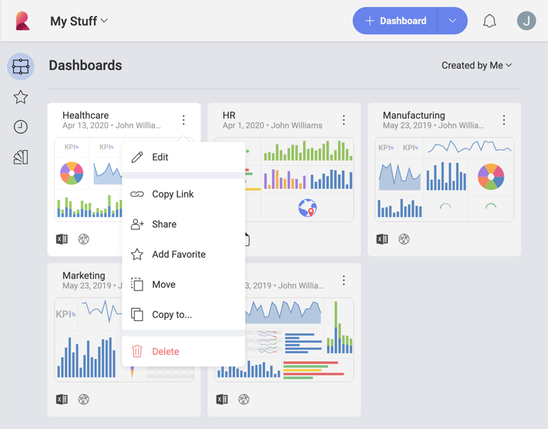

## Sharing Dashboards

Shared dashboards are ideal for cross-team collaboration. There are so
many possibilities when it comes to sharing in Reveal. Depending on your
own sharing rights you can give other users and workspaces different [access permissions](#access-permissions) to the content you share with them.

Below you will find the specifics of access permissions in the three available sharing scenarios:

  - [sharing dashboards created by you with other users](#sharing-dashboards-users),

  - [sharing your workspace's dashboards with other users](#sharing-workspace-dashboard),

  - [sharing a dashboard with a whole workspace](#sharing-dashboard-with-workspace).

> [!NOTE]
> **Sharing Folders**. Rules for dashboards sharing in this article also apply to sharing folders.

### Sharing Your Own Dashboards with Other Users

To share a dashboard created by you with individual users you need to:

1.  Access the **Share dialog** - Select the overflow button in the top right-hand corner of a dashboard or a folder and choose *Share*.

  

  Once you share a folder with other people, the new files will appear in their accounts as well under the *Shared with Me* section.

  

2.  **Choose the users** you want to share the dashboard with - Enter the e-mail addresses of the people you want to invite and **set the level of access** those people will have over the shared dashboard.

The available options are:

  - **Owner** permissions - the user can create, edit, share and delete.

  - **Modify** permissions - the user can create, edit and share but cannot delete the dashboard or folder.

  - **Viewer** permissions - the user can view and share dashboards and folders for view only.

3.  After setting the access level, click/tap *Send Invites*. The dashboard is shared automatically with members of your [Organization](~/en/workspaces/overview.html#organization-workspace). Other users will have the dashboard shared with them only after they accept the invitation.

  

**You can change the access level for users at any time** by accessing
the Share menu. You will see a list of all users you have shared the
dashboard with and their access level. You can change their access level
by selecting a new one from the dropdown menu next to their name.

**You can also unshare any dashboard at any time** by accessing the
Share dialog and selecting *Remove* from the dropdown menu next to any
member's name.

### Sharing a Workspace's Dashboard with Other Users

Any member of a workspace can share the workspace's dashboards with other users. To do this, go to the *Workspaces* tab and choose a dashboard from the *Dashboards* section. Then, follow the steps in [Sharing your Own Dashboard with Other Users](#sharing-dashboards-users).

The main difference between sharing a workspace's dashboard and a dashboard created by you is the [access permissions](#access-permissions) you can
give. Depending on your role in the workspace you can have one, two or all the access permissions options available when sharing.

Your role in the workspace can be:

  - **Owner** - have full access to the workspace's dashboards, including
    editing, sharing and deleting them.

  - **Member** - can create, edit and share dashboards and folders
    but cannot delete them.

  - **Viewer** - can view and share dashboards for view only.

Here you can see the access permissions options every workspace member can give when sharing a dashboard:

<table class="tg">
 <tr>
    <th class="tg-oav7" rowspan="2">Workspace Roles</th>
    <th class="tg-t96r" colspan="3">Access Permissions</th>
  </tr>
  <tr>
    <td class="tg-baqh">Owner</td>
    <td class="tg-baqh">Modify</td>
    <td class="tg-baqh">Viewer</td>
  </tr>
  <tr>
    <td>Owner</td>
    <td>Yes</td>
    <td>Yes</td>
    <td>Yes</td>
  </tr>
  <tr>
    <td>Member</td>
    <td>No</td>
    <td>Yes</td>
    <td>Yes</td>
  </tr>
  <tr>
    <td>Viewer</td>
    <td>No</td>
    <td>No</td>
    <td>Yes</td>
  </tr>
</table>

### Sharing a Dashboard with a Whole Workspace

You can share a dashboard you created or a workspace's dashboard with a whole
workspace instead of individually with every workspace member. To do this, choose
a dashboard from the *Dashboards* section in *My Stuff* or *Workspaces* tab.
Then follow the steps in [Sharing your Own Dashboards with Other Users](#sharing-dashboards-users).

>[!NOTE]
>You can share a dashboard with any public workspace that is part of the [Organization](~/en/workspaces/overview.html#organization-workspace), whether you are a member of it or not. You can also share with private workspaces that you are a member of.

When setting access permissions for the whole workspace, you must take into
account that these permissions will not be available for everybody in the workspace. Individual members will receive only the highest permissions possible for their role in the workspace.

Look at the table below for a quick reference of the permissions
every workspace member can get depending on their role in the workspace. For example, if you give *Modify* permissions to the whole workspace, its *Owners* and *Members* will be able to modify the dashboard, but *Viewers* will only receive permissions to view and share the dashboard. This is the highest level of permissions possible for their role in general.   

<table class="tg">
  <tr>
    <th class="tg-9wq8" rowspan="3">Workspace Roles</th>
    <th class="tg-7btt" colspan="3">Access Permissions Given to the Whole Workspace</th>
  </tr>
  <tr>
    <td class="tg-c3ow">Owner</td>
    <td class="tg-c3ow">Modify</td>
    <td class="tg-c3ow">Viewer</td>
  </tr>
  <tr>
    <td class="tg-7btt" style="text-align: center !important" colspan="3"> Permissions Received by Users Depending on Their Role</td>
  </tr>
  <tr>
    <td class="tg-0pky">Owner</td>
    <td class="tg-c3ow">Owner</td>
    <td class="tg-c3ow">Modify</td>
    <td class="tg-c3ow">Viewer</td>
  </tr>
  <tr>
    <td class="tg-0pky">Member</td>
    <td class="tg-c3ow">Modify</td>
    <td class="tg-c3ow">Modify</td>
    <td class="tg-c3ow">Viewer</td>
  </tr>
  <tr>
    <td class="tg-0lax">Viewer</td>
    <td class="tg-baqh">Viewer</td>
    <td class="tg-baqh">Viewer</td>
    <td class="tg-baqh">Viewer</td>
  </tr>
</table>

>[!NOTE]
>**Giving Exclusive Access to a Workspace Member**. If you want to give a member of a workspace higher access level to the dashboard than its membership role allows, add their email individually to the list of invitations and set the access permissions you want them to have.

### See Also

When you have used a data source file located on a cloud service to build a dashboard, you will need to grant access to this file to successfully share your dashboard. To learn more, read [Sharing Dashboards with Cloud Files as a Data Source](sharing-dashboards-datasource-files-cloud-provider.md).
