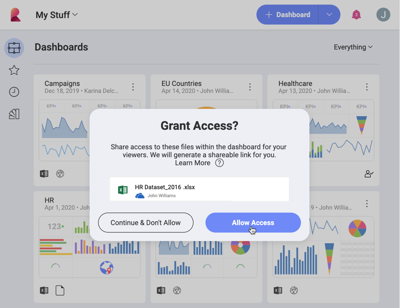

## Sharing Dashboards with Cloud Files as a Data Source

When you share dashboards with other Reveal users, you need to take into
account the data sources you used to build the visualizations in the
dashboard. If your data source is a file uploaded on a cloud provider,
users you share your dashboard with may not be able to open it unless
you grant them access to the file.

When you choose to allow access to a data source file on a cloud
provider, a **shareable link** to this file is created. Dashboards that
use this file as a data source will be properly viewed when shared with
other users. The link itself will not be shared with Reveal users but is
stored encrypted on our servers.

You can create a shareable link when:

  - [choosing a file uploaded on a cloud provider](#cloud-data-source-file) as a data source for a
    visualization;

  - [sharing a dashboard](#grant-access-shared-dashboard), which uses a
    cloud file data source;

  - saving a dashboard [in a team](#save-dashboard-team).

### Supported Cloud Providers

You can grant access to dashboards, which use files uploaded on the
following cloud providers:

  - Google Drive

  - One Drive

  - Dropbox

>[!NOTE] **File Share Support for Box:**
>Coming soon!

### Granting Access when Choosing a Cloud File as a Data Source

You can allow access to a cloud file at the point of selecting your data source to build a visualization. After choosing a file uploaded on one of the [supported cloud providers](#cloud-providers), you will be prompted to the following dialog:

Make sure the *Allow Access* checkbox is selected, otherwise the
shareable link will be disabled.

### Granting Access when Sharing a Dashboard

You can grant access to dashboards that use cloud files with a disabled
shareable link, when sharing them with other users.

1.  Click/tap the *overflow button* of a dashboard.

2.  Select *Share*.

3.  The following dialog opens:

    

    Click/Tap *Allow Access* and proceed with selecting users to [share your dashboard](sharing-dashboards.md) with.

>[!NOTE] **Access Not Allowed.**
>If you continue sharing without allowing access, users will not be able to view your dashboard's data. *Request access* feature will be supported in a future version of Reveal.

### Saving a Dashboard with a Cloud File Data Source in a Team

You may want to save in your team's space a dashboard, which contains
one or more visualizations using cloud files as data source. If a
shareable link to these data source files hasn't been created (has been
disabled), Reveal will prompt you to allow access:

This way you make sure all team members can view the dashboard you saved
in your team.

### See Also

If you can't see the contents of a dashboard, shared with you, please
read: [Requesting Access to Shared Dashboards with Cloud Files](request-access-shared-dashboards-cloud-files.md)
