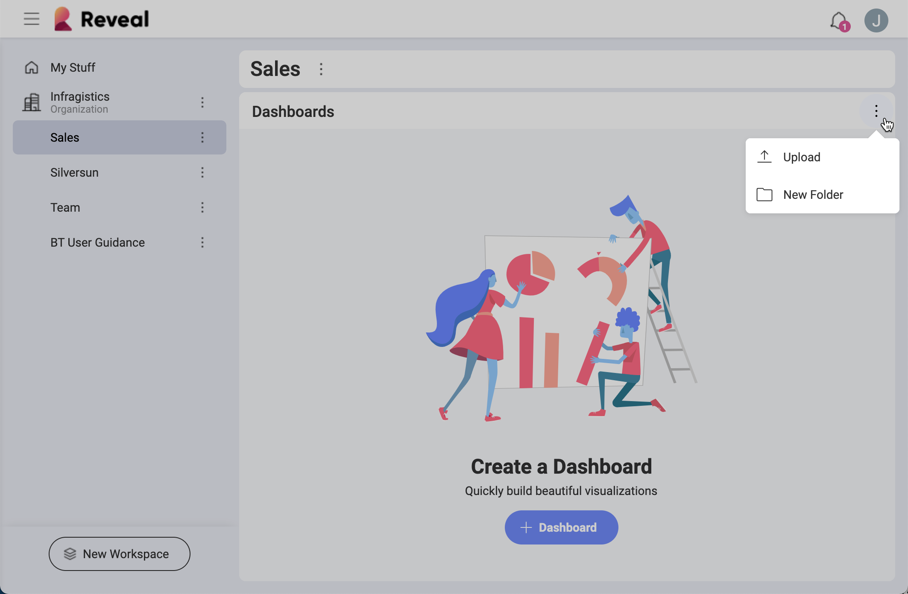

## Uploading Dashboards

In Reveal, you can also work with dashboards saved on your computer/device by directly uploading them. To do that, perform the following steps:

1.  Select the arrow on the right of the *+ Dashboard* split button and then *Upload*.

    

2.  A dialog showing your local files will open. Double click/tap the
    dashboard you want to upload. Reveal dashboards' file extension is
    **.rdash**.
    >[!NOTE]
    >**Uploading ReportPlus Dashboards** Reveal also allows you to upload and work with dashboards created in ReportPlus. ReportPlus dashboards' file extension is **.rplus**.

Your dashboard is now uploaded and ready to be edited and shared with others.
