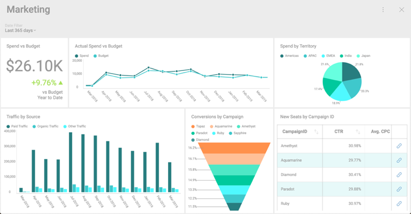

## What is a Dashboard?

A dashboard, in essence, is a quick and simple way to display minimal information at first sight. It is a data visualization composed of a collection of visualizations which are layed out to communicate the status, metrics, or performance of a business. Each visualization is meant to have different pieces of related information, enabling users to make sense of their data.

The following example is a Marketing dashboard made of a [collection of visualizations](~/en/data-visualizations/What-is-Visualization.md), which show the efforts involved in a marketing campaign.

