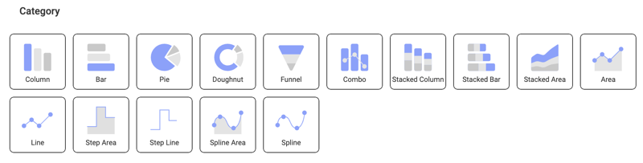
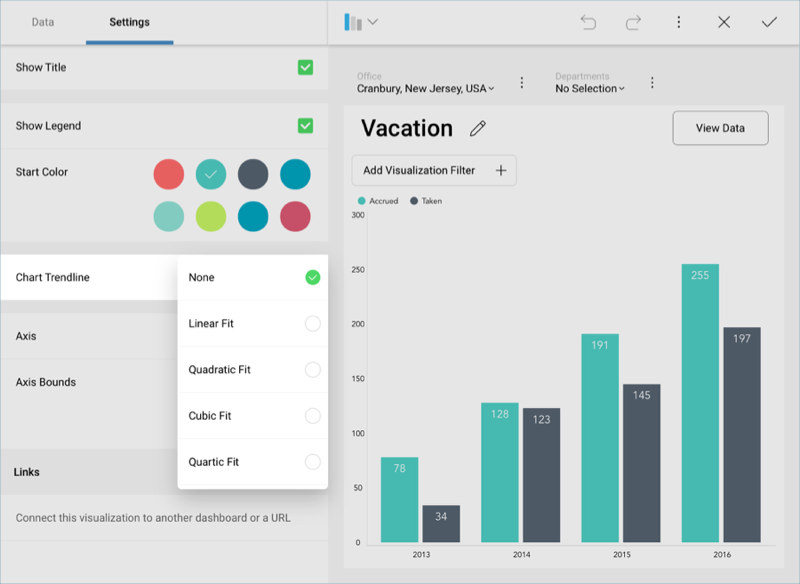
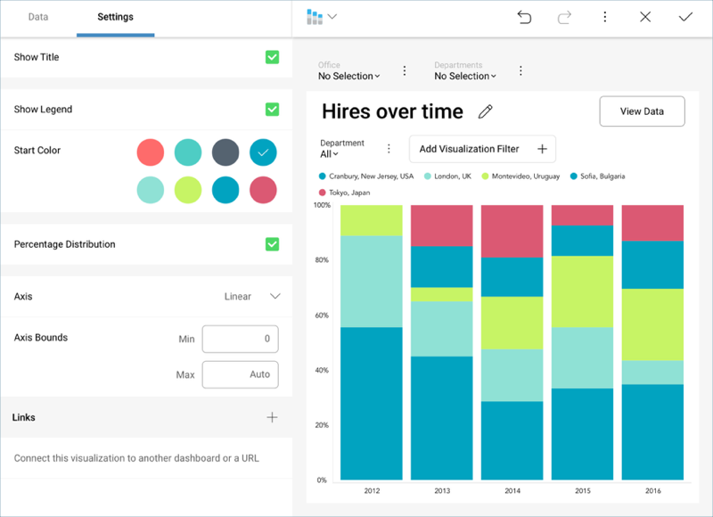
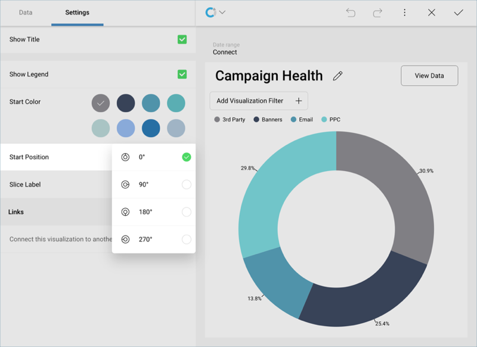
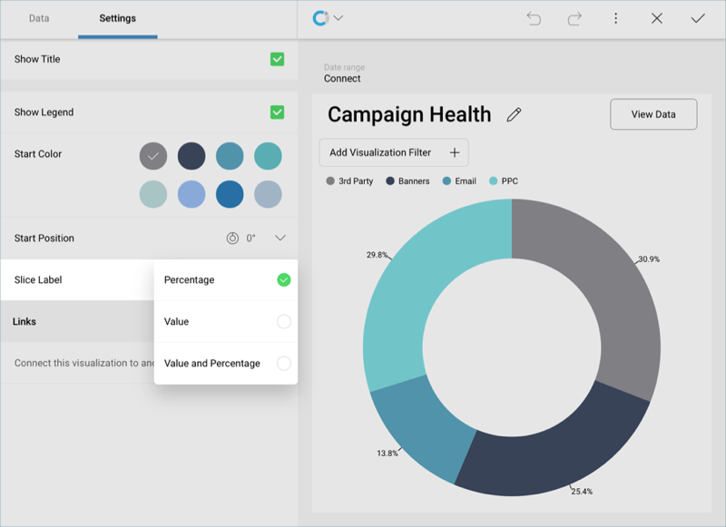
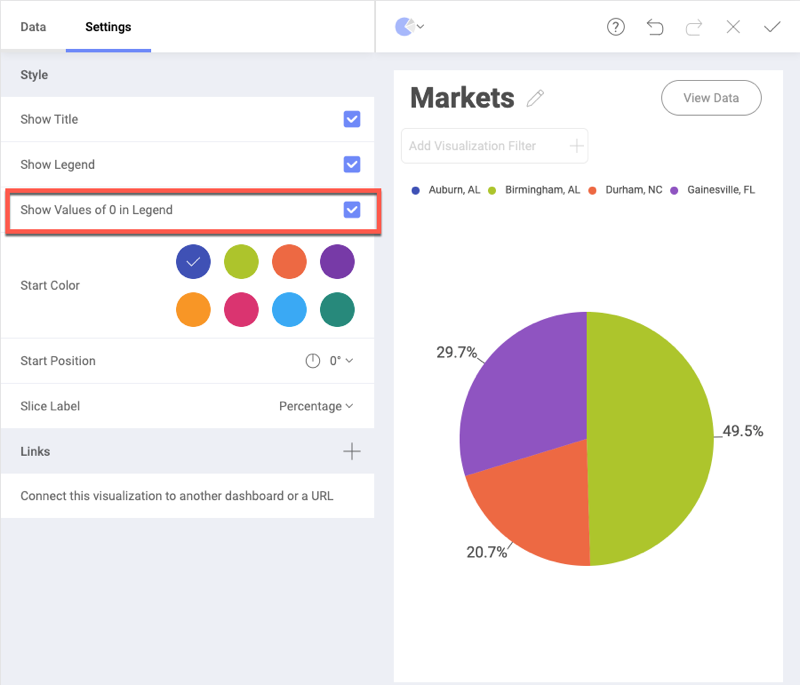

## Category Charts

These charts are used to associate categories with quantitative
information.

You can select any of the chart icons displayed in the Visualizations
options menu as long as it is suitable for your data. Reveal will select
the first numeric columns in the dataset and attempts to match the
selected chart type data series requirements.

For instance, in a Column Chart, all numeric columns are added to the
chart. The automatic selection of columns done by Reveal can be modified
in the Chart Settings configuration.

### Chart Trendlines

Chart settings enable the display of trend lines, which are lines that
are painted across a chart, based on an algorithm. Trendlines are a very
simple, yet powerful tool to help you determine trends in datasets, and
define thresholds for taking action. The supported algorithms are Linear
Fit, Quadratic Fit, Cubic Fit, Quartic Fit, Logarithmic Fit, Exponential
Fit, Power Law Fit, Simple Average, Exponential Average, Modified
Average, Cumulative Average, Weighted Average.

### Percentage Distribution

You can also configure this feature for the *stacked series charts*. It
will override the 0-100 default scale and allow you to visualize the
percentage distribution of the values in the chart.

### Start Position and Slice Labels

For *Pie* and *Doughnut* charts, you can configure the start position
for the chart to rotate the slices and change the order in which your
data is presented.

For *Funnel*, *Pie*, and *Doughnut* charts, you can configure slice
labels in order for the visualization to display values, percentages, or
both at the same time.

### Enabling Pie and Doughnut Charts Legends to Show Elements with Value 0

The pie and doughnut visualization legends give you the option to see
all the data in the field selected for *Label*, including elements with
value zero.

To enable this setting, go to *Settings* in the Visualization editor and
select *Show Values of 0 in Legend*, as shown in the screenshot below:

You can see in the example above that the *Auburn, Al* label is included
in the pie chart legend, but is not displayed in the visualization
itself, since its value is 0.
