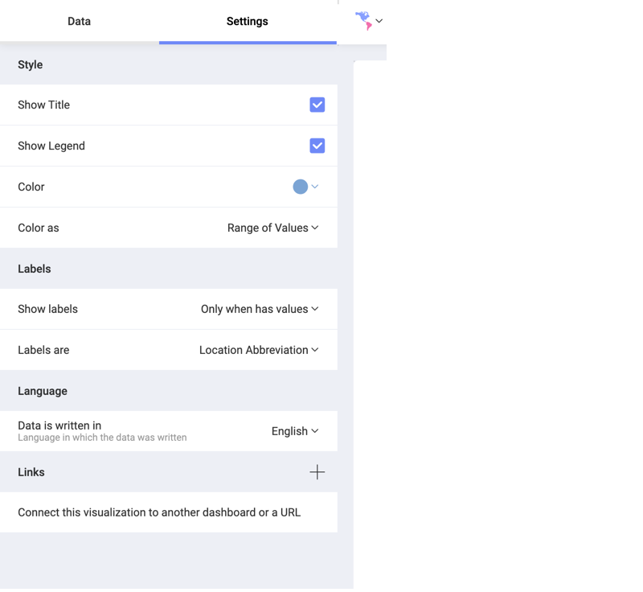
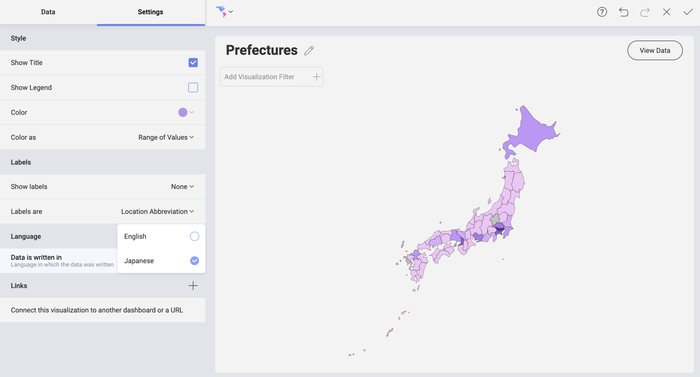

## Working With the Choropleth Map Settings

In the _Settings_ section of the Choropleth map visualization you can configure the following:

  - *Show Title* - choose whether to show the visualization’s title;
  - *Show Legend* - choose whether to show the color scale range above the map;
  - *Color* - select which color to be picked as a base of the color scheme. Areas with average data values will be filled with this color. In contrast, regions on the map with lower and higher data values will be displayed in lighter and darker shades,  respectively.
  - *Color as* - here you can choose between:
      * _Range of Values_ - use a range of seven colors as a color scheme and fill the regions depending on the data value;
      * _Single Color_ - use one color to display all regions that contain data. Regions, where information is missing, are grey.

    >[!NOTE]
    >If you have added a field in the _Map Color_ placeholder, then the _Color as_ setting will change to _Color based on_ settings. Find more about using the Map Color to create choropleth maps [here](choropleth-map.html#map-color).

  - *Show labels* - IF the selected map supports labels, you can choose whether to put them on _all_ regions, only on regions that contain information (_Only when has value_), or turn them off (_None_).
  - *Labels are* - You can use labels to indicate the geographical names (abbreviated) of the regions by selecting _Location Abbreviation_. Alternatively, your labels can show _Values_ for each area. Value labels can be displayed on the map as numbers, percent, or currency, depending on what formatting you chose for your _Value_ field.

### Localization Settings

Currently, you can provide your dataset in English and Japanese.

When your location data is in Japanese, Reveal translates it in English to connect it to the desired map.

If you use a Japanese dataset in Reveal, and your Language and Regional settings are not set to Japanese, then you need to use the *Data is written in* setting to help Reveal recognize the language of your dataset by switching to Japanese (_ja_):

#### Language of Labels

The language of labels on the choropleth map is defined by the language and regional settings configured in your OS and/or browser. So if you are running Reveal on a machine with its locale/language set to [a language Reveal supports](themes-localization.html#languages), the app will attempt to localize the labels to that language. This has nothing to do with the _Data is written in_ setting.

If a Japanese employee's machine, for example, is set to use their native language (Japanese), but the data given to them is in English, Reveal will still display the labels in Japanese. Then, if they share the dashboard with a German contractor, the German will see the labels in the language their machine is set to use (the German language is supported in Reveal).
