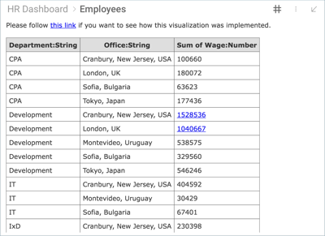
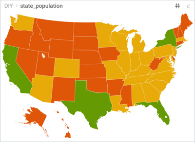
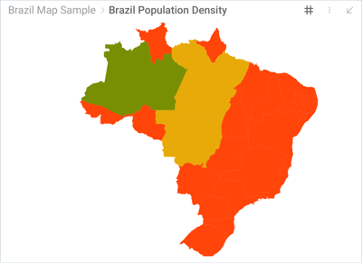
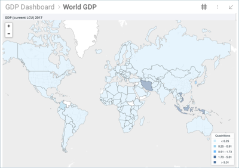

## Do-It-Yourself Visualizations

Reveal offers multiple components for visualizing data, including the
grid view, gauge view, map view and several chart types. There are some
cases, though, where you would like to have another visualization
method, not supported out of the box, that you feel would be a better
fit for your scenario. It is for these cases that Reveal introduces the
ability to do your own custom visualization component and display it in
a visualization as part of a Reveal dashboard.

### Sample DIY visualizations

<table>
<colgroup>
<col style="width: 50%" />
<col style="width: 50%" />
</colgroup>
<tbody>
<tr class="odd">
<td>
 

Table with custom fonts, titles, and widths 

</td>
<td>
 

Choropleth map of the population for United States by state 

</td>
</tr>
<tr class="even">
<td>
 

Choropleth map of the population for Brazil by state 

</td>
<td>
 

Choropleth map of worldwide GDP 

</td>
</tr>
</tbody>
</table>
