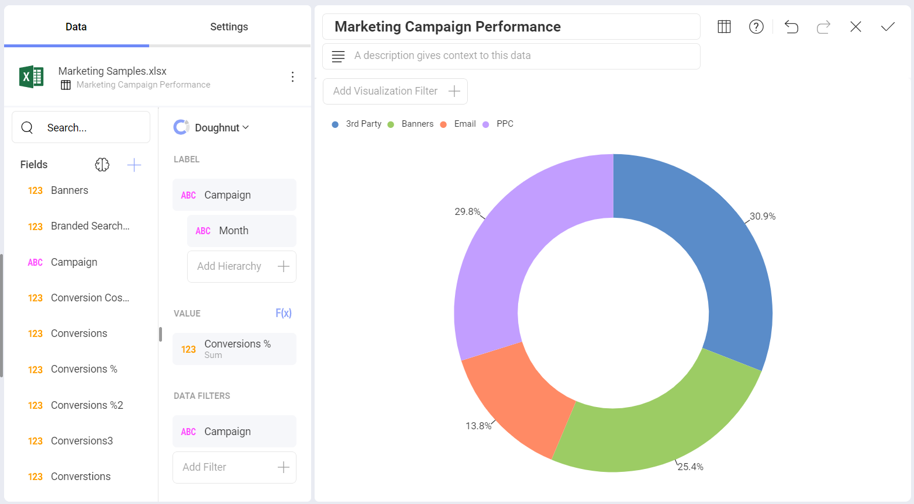
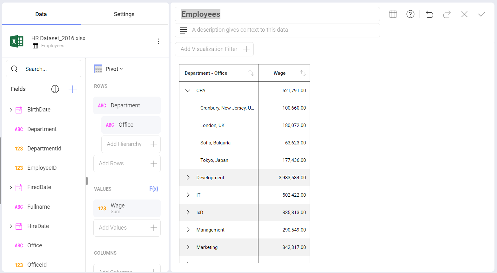

# Ad-Hoc Hierarchies

While Reveal creates hierarchies for Year-Month-Date date fields
automatically, this does not happen for other types of fields. Ad-hoc
hierarchies allow users to analyze the data in charts, gauges, and grid
views, allowing users to create new hierarchies with the fields located
in the **Rows** placeholder of the data editor.

This feature applies to plain data sources (for example, SQL tables,
Excel spreadsheets or CSV files) and not to multidimensional data
sources like Analysis Services. For those cases, the hierarchies are
defined on the server side, and Reveal supports the expand and drill
operations.

>[!NOTE]
>Ad-hoc hierarchies are **not supported** in *Text*,  *Circular* *Image*, *Grid* and *Text View* charts.

## Enabling Ad-Hoc Hierarchies

To enable ad-hoc hierarchies, just drag and drop a field in the **Add Hierarchy** section of the *Rows* placeholder in the data editor. When you do this, the structure and behavior of the data table will change.

As seen in the screenshot above, a single column will replace multiple
columns. In the example presented in the screenshot, you not only can
drill up and down, but you can also expand each *Department* to show the
*Office*.

## Supported Visualizations

Ad-hoc hierarchies can be added to all visualizations ***except*** for
the following ones:

  - Circular Gauges

  - Grid Charts

  - Text Gauges

  - Text Views

  - Image Charts
