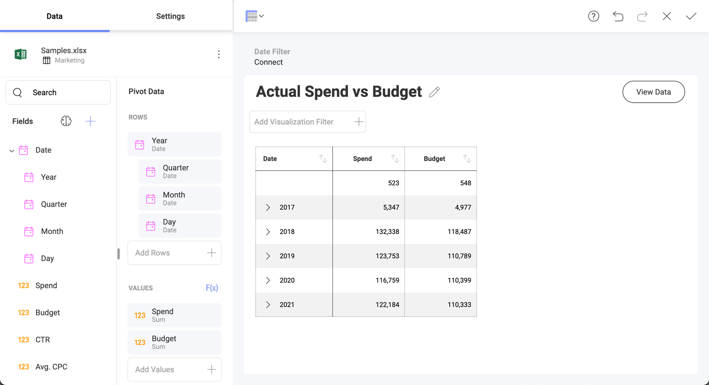
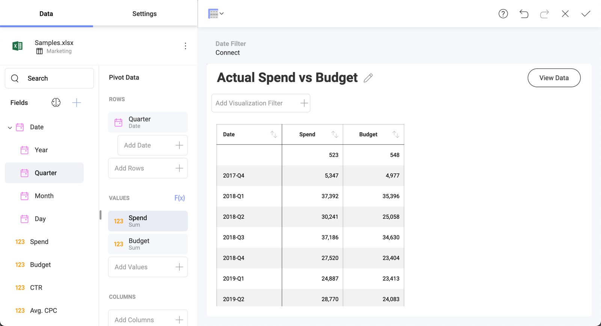

## Field Settings

This section describes the different options for applying
transformations to datasets, such as sorting, filtering, and aggregating
data.

In order to apply formatting or filter to your data, you must select the
specific field you want to modify in the corresponding placeholder
(*Category*, *Columns*, *Label*, *Rows* and *Values*. There are three
types of fields, each of which has their own formatting and filter
options:

  - [Date Fields](#date-fields)

  - [Numeric Fields](#numeric-fields)

  - [String Fields](#abc-fields)

>[!NOTE] All fields dropped in the **Values** placeholder of the data editor will be formatted as numbers.

### Date Fields

  - **Label renaming**: rename your fields for display purposes only.
    Fields are always referenced by their original name in calculated
    field expressions. Once renamed, erase the label completely to go
    back to the original value.

  - **Fiscal year initial month**: if your 12-month period is not the
    same as a calendar year, you can use Fiscal Years and select the
    initial month for your period.

  - **Sorting**: sort your dates in either ascending or descending
    order.

  - **Date Format**: select from a predefined list of date and time
    formats to display your date/time values.

#### Date Fields Hierarchies

Date Fields aggregation is displayed as a hierarchical list in the Fields section. You can find Year, Quarter, Month, Day, and Minutes, depending on the level of granularity of your Date field.

When you drag and drop a Date field in the Pivot Editor, all the hierarchy is automatically displayed (see below).

In addition, dragging a specific hierarchy level will show data for that level only, as shown below.

### Numeric Fields

  - **Label renaming**: rename your fields for display purposes only.
    Fields are always referenced by their original name in calculated
    field expressions. Once renamed, erase the label completely to go
    back to the original value.

  - **Aggregation**: configure how you want your numbers to be processed
    by Reveal (sum, count, average, etc.).

  - **Sorting**: sort your numbers in either ascending or descending
    order.

  - **Is Visible**: choose whether the data in this field will be used
    in the current visualization.

  - **Type**: define whether your number should be formatted as
    percentage, currency, or a simple number. If you select
    **Currency**, you will have the option to choose the type of
    currency (dollar, euro, pounds, and yens).

  - **Fraction digits**: select the number of decimal places you want to
    display.

  - **Negative Numbers**: select between enclosing negative numbers in
    parenthesis or prefixing with the minus (-) sign.

  - **Large Numbers Formatting**: display M for millions and K for
    thousands within the visualization preview in the central pane.

  - **1000 Separator**: configure whether or not to display the
    thousands separator.

  - [**Conditional Formatting**](conditional-formatting.md): when enabled,
    this allows you to provide different formats to each of your cells
    depending on their values. For instance, values in the lower 50%
    range of a field can be colored with a red adorner to signal a
    problem. You can establish styling rules up to three ranges
    (typically used for upper, middle, and lower ranges), but you can
    customize your limits, type of comparison, colors, and indicator
    symbols. 

### String Fields

  - **Label renaming**: rename your fields for display purposes only.
    Fields are always referenced by their original name in calculated
    field expressions. Once renamed, erase the label completely to go
    back to the original value.

  - **Sorting**: sort your dates in either ascending or descending
    order.
