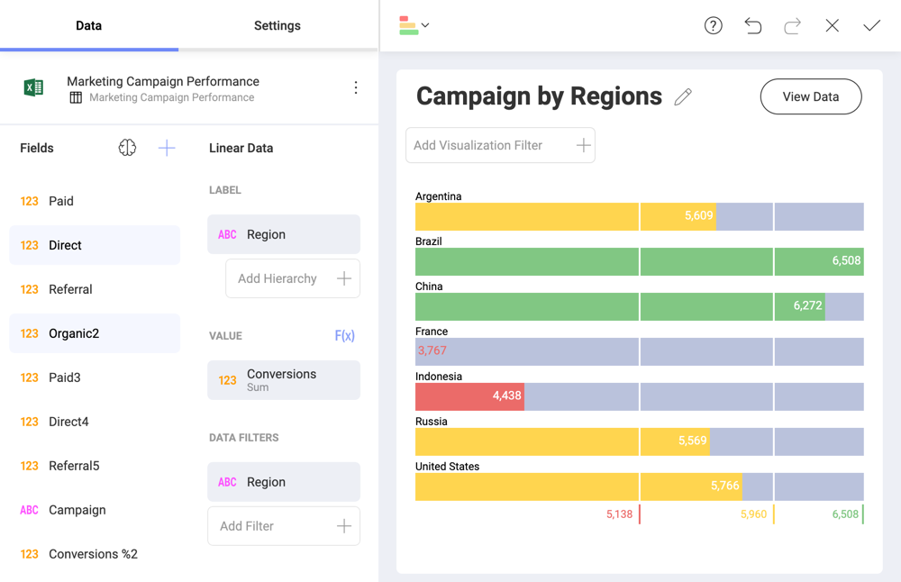
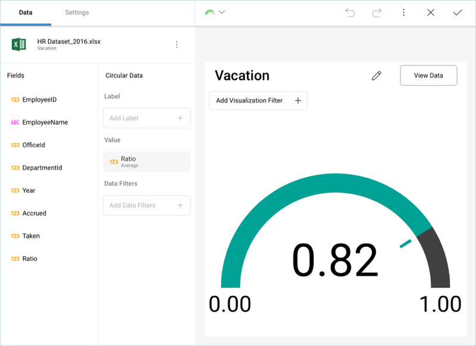
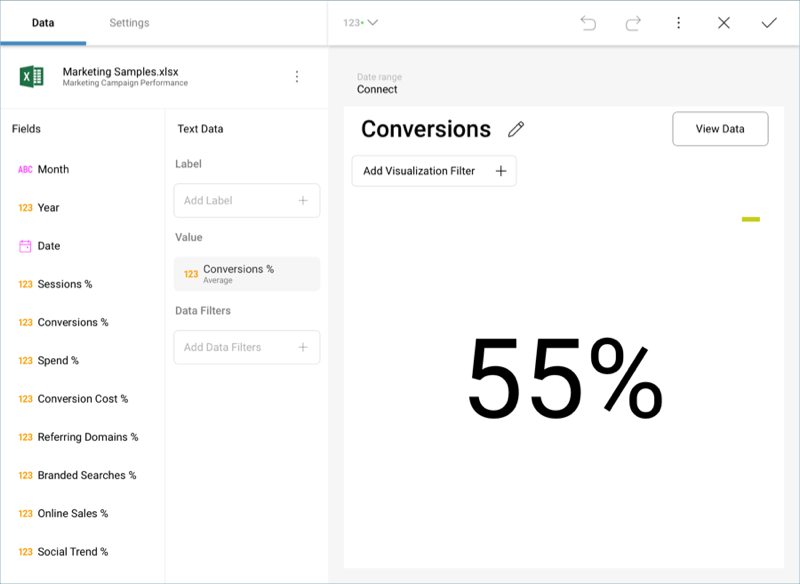
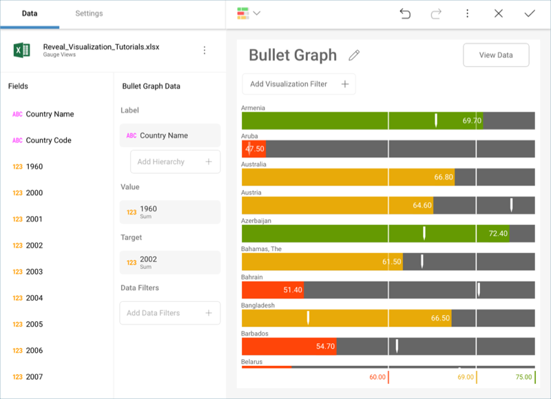
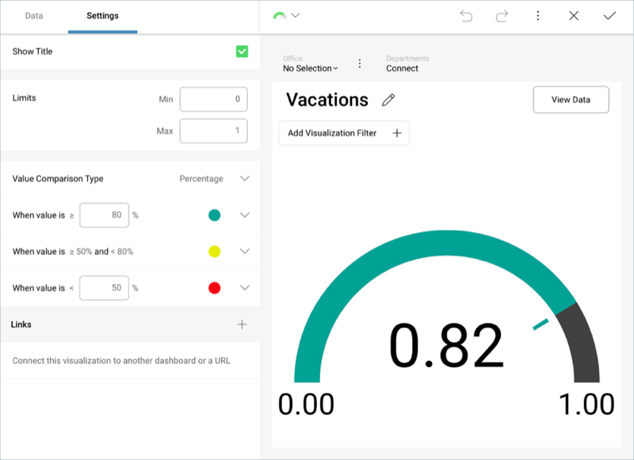

## Gauge Views

The Gauge View displays a single value, or a list of values, comparing
them with range thresholds. The gauge also allows for conditional
formatting of the different ranges. There are four different flavors:
[Linear](linear-gauge.md), [Circular](circular-gauge.md),
[Text](text-gauge.md), [KPI](kpi-gauge.md) and [Bullet Graph](bullet-graph.md)
gauges.

### Linear Gauge

The Linear gauge displays a label, the value of which is taken from the
*Label* placeholder configuration, and a value that comes from the
configured *Value* placeholder. The value is charted as a rectangle, and
is also displayed in a numeric format within its bounds or next to it.

This gauge type is suitable to compare the values of different rows side
by side.

### Circular Gauge

The Radial Gauge displays the band's minimum and maximum thresholds, and
the current value. It also paints the background with the color of the
current range.

### Text Gauge

The Text Gauge displays the Value column data in a large font. This
flavor is suitable for very high priority metrics. By default, the gauge
will visualize the data from the Value column for the first data row
unless any filters are applied so that the chosen data row is different.

### Bullet Graph

The Bullet is very similar to a Linear gauge; it displays a label from
the *Label* placeholder and a value from the *Value* placeholder. The
value is charted as a horizontal line, and it is also displayed on the
right in a numeric format.

The Bullet Graph adds a new visual indicator to the Linear gauge, a
vertical mark that is based on a target value from the *Target*
placeholder. This new indicator is retrieved from a numeric column,
meaning that **you need two numeric columns and a text column to configure this view**.

The Bullet is useful for comparing values side by side, while also
evaluating the performance from the value (horizontal line) against the
target value (vertical mark).

#### Bands Configuration

Each gauge type has a common band range configuration, which is similar
to the one used in conditional formatting. The configuration dialog
requires:

  - **Limits**. These values are automatically set as the lowest and
    highest values in the dataset for the specified value column, but
    can also be overriden manually with constant values.

  - **Bands configuration**. This section requires you to establish two
    thresholds to split the range in thee spaces. The thresholds can be
    defined as percentage or constant values. Additionally, the
    definition of the color to associate to each band is configured
    here. By default, the upper band is colored green, the middle
    yellow, and the lower in red.

**Band Configurations are based on your original data**, *not on the
formatting applied through Reveal*. In the circular gauge above, the
original data is expressed in percentages, even though the visualization
was formatted to display a number. Therefore, the selected **Value Comparison Type** is **Percentage**, and the ranges are defined as
percentages and not numbers.
