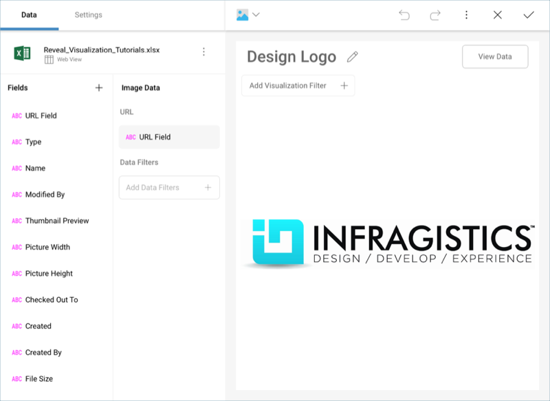

## Web View

The web view displays information in an embedded browser by making a request to a URL and displaying the results. It works **only with the first row in the data set**, and **displays the contents of the column set as URL** in the data editor.

This view is a very versatile visualization option which can be used to
display images, HTML pages, or even text content. If the URL Field
setting is configured to a text column, it will display the text; if
it's a valid URL, it will retrieve the contents of that URL and
display the page.
