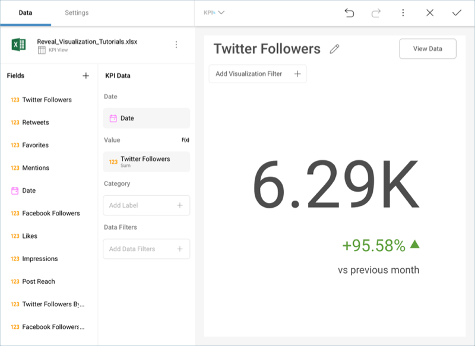
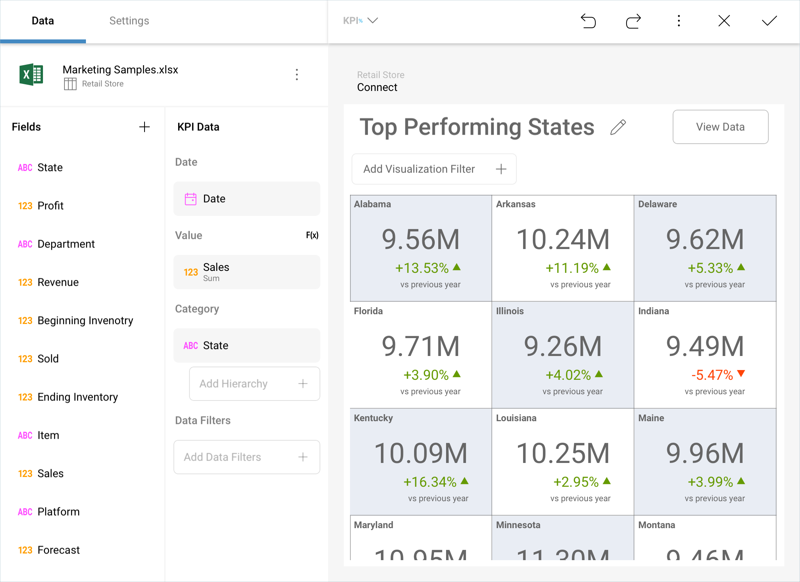
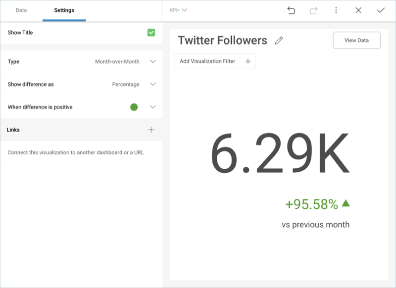

## KPI Gauge

Key Performance Indicators (KPIs) are a type of visualization used to
denote a certain type of performance management. The indicators vary
depending on the specific needs of the viewer, but they always provide
information over metrics important for the organization, such as the
progress towards goals and over-time trends.

Similarly to the [Text Gauge](Gauge-Views.html#text-gauge), the KPI gauge
displays the Value column in a large font. However, the value in the KPI
is also evaluated against the same value for a previous time period.

You can also have multiple KPI's in one visualization if you add a
Category.

### Indicator Settings

The KPI gauge has similar settings to the [sparkline](Sparkline-Charts.md)
visualization, through which you can configure:

  - **Type**: the time period you will use to compare both values.

  - **Show difference as**: whether you will display the difference as a
    value, percentage, or both value and percentage.

  - **When difference is positive**: the color for the difference
    indicator.
