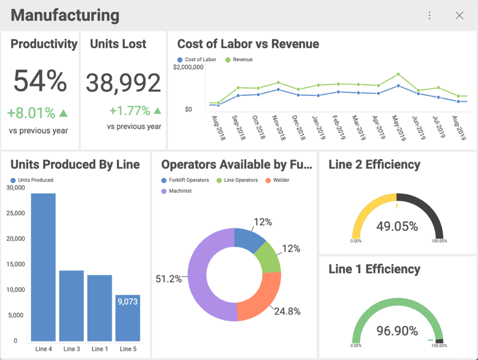

## Data Visualizations

In order for users to get the most insight possible out of business
data, Reveal provides several options to customize the way information
is visualized.

### Topics Overview

There are several visualization types:

  - [Grid View](grid-view.md)

  - [Pivot Table](pivot-table.md)

  - [Text View](text-view.md)

  - [Image View](image-view.md)

  - [Gauge Views](gauge-views.md), including the [Bullet Graph](gauge-views.html#bullet-graph), [Circular](gauge-views.html#circular-gauge), [KPI](kpi-gauge.md), [Linear](gauge-views.html#linear-gauge) and [Text](gauge-views.html#text-gauge) gauges.

  - Several chart types, including [Category](category-charts.md), [Combo](combo-charts.md), [Financial](financial-charts.md), [Radial](radial-charts.md), [Scatter and Bubble](scatter-bubble-charts.md), and [Sparkline](sparkline-charts.md) charts.

  - [Do-It-Yourself Visualizations](diy-visualizations.md)
  
  - [Text Box Visualizations](text-box.md)

### Visualization Tutorials

Within this section, you will find basic, step-by-step tutorials for the
Reveal visualizations. All sections use the Data Visualizations data
source, which you can download using [this link](http://download.infragistics.com/reportplus/help/samples/Reveal_Visualization_Tutorials.xlsx).
For specific information on what each visualization supports, visit the **Data Visualizations** section of the documentation.

<table>
<colgroup>
<col style="width: 20%" />
<col style="width: 20%" />
<col style="width: 20%" />
<col style="width: 20%" />
<col style="width: 20%" />
</colgroup>
<tbody>
<tr class="odd">
<td>
 

<a href="~/en/visualization-tutorials/simple-charts.md">Area</a> 

</td>
<td>
 

<a href="~/en/visualization-tutorials/simple-charts.md">Bar</a> 

</td>
<td>
 

<a href="~/en/visualization-tutorials/gauge-views.md">Bullet Graph</a> 

</td>
<td>
 

<a href="~/en/visualization-tutorials/candlestick-chart.md">Candlestick</a> 

</td>
<td>
 

<a href="~/en/visualization-tutorials/gauge-views.md">Circular</a> 

</td>
</tr>
<tr class="even">
<td>
 

<a href="~/en/visualization-tutorials/simple-charts.md">Column</a> 

</td>
<td>
 

<a href="~/en/visualization-tutorials/simple-charts.md">Doughnut</a> 

</td>
<td>
 

<a href="~/en/visualization-tutorials/simple-charts.md">Funnel</a> 

</td>
<td>
 

<a href="~/en/visualization-tutorials/image-view.md">Image</a> 

</td>
<td>
 

<a href="~/en/visualization-tutorials/kpi-gauge.md">KPI</a> 

</td>
</tr>
<tr class="odd">
<td>
 

<a href="~/en/visualization-tutorials/simple-charts.md">Line</a> 

</td>
<td>
 

<a href="~/en/visualization-tutorials/gauge-views.md">Linear</a> 

</td>
<td>
 

<a href="~/en/visualization-tutorials/ohlc-chart.md">OHLC</a> 

</td>
<td>
 

<a href="~/en/visualization-tutorials/simple-charts.md">Pie</a> 

</td>
<td>
 

<a href="~/en/visualization-tutorials/simple-charts.md">Radial</a> 

</td>
</tr>
<tr class="even">
<td>
 

<a href="~/en/visualization-tutorials/sparkline-charts.md">Sparkline</a> 

</td>
<td>
 

<a href="~/en/visualization-tutorials/simple-charts.md">Spline</a> 

</td>
<td>
 

<a href="~/en/visualization-tutorials/simple-charts.md">Spline with Area</a> 

</td>
<td>
 

<a href="~/en/visualization-tutorials/stacked-charts.md">Stacked Area</a> 

</td>
<td>
 

<a href="~/en/visualization-tutorials/stacked-charts.md">Stacked Bar</a> 

</td>
</tr>
<tr class="odd">
<td>
 

<a href="~/en/visualization-tutorials/stacked-charts.md">Stacked Column</a> 

</td>
<td>
 

<a href="~/en/visualization-tutorials/simple-charts.md">Step Area</a> 

</td>
<td>
 

<a href="~/en/visualization-tutorials/simple-charts.md">Step Line</a> 

</td>
<td>
 

<a href="~/en/visualization-tutorials/gauge-views.md">Text</a> 

</td>
<td>
 

<a href="~/en/visualization-tutorials/text-view.md">Text View</a> 

</td>
</tr>
</tbody>
</table>
