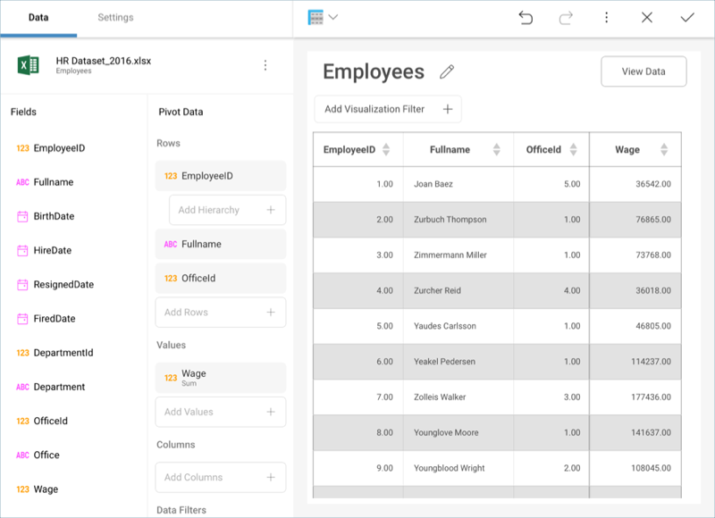

## Pivot Table

The Pivot Table visualization allows users to aggregate information by
dropping fields in the corresponding placeholders of the *Data*
sections.

When a field is added to the rows, columns, or values data editor
placeholders, selecting the field displays the summarized settings of
that field:

  - For the fields in the **Values** placeholder, this means the ability
    to configure the summarization function used (average, count, sum,
    etc.).

  - For date fields dropped in the **Rows** placeholder, it means the
    ability to choose the level of detail in the summarization (day,
    month, year).

### What is a Pivot Table?

A Pivot Table is a data summarization tool, which among other functions
allows you to automatically count, average and total the data stored in
a table like format, typically grouped by values. For instance if you
have the following table:

| Salesman | Region    | Product  | OrderID | OrderTotal |
| -------- | --------- | -------- | ------- | ---------- |
| JOHN A.  | Americas  | ProductX | 1001    | 10         |
| ERICK B. | Americas  | ProductY | 1002    | 20         |
| PETE C.  | EMEA      | ProductX | 1003    | 30         |
| DAVID D. | China     | ProductZ | 1004    | 10         |
| JORGE E. | Australia | ProductY | 1005    | 5          |

And you need to do the following type of analysis:

|          | Americas | EMEA | China | Australia | Total |
| -------- | -------- | ---- | ----- | --------- | ----- |
| PRODUCTX | 10       | 30   |       |           | 40    |
| PRODUCTY | 20       |      |       | 5         | 25    |
| PRODUCTZ |          |      | 10    |           | 10    |

You can achieve it by using a Pivot Table where:

  - The *Product* field is dragged and dropped in the **Rows**
    placeholder so that all products are listed as rows.

  - The *Region* field is dragged and dropped in the **Columns**
    placeholder so that columns are created in a dynamic table for every
    value in the *Region* field.
